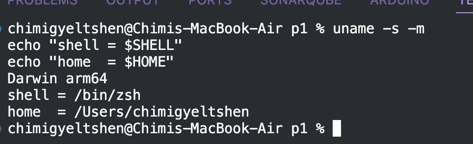
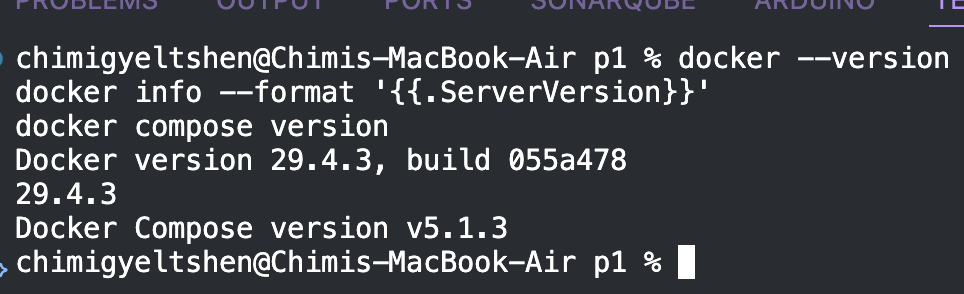
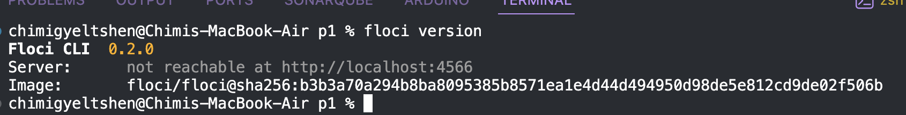
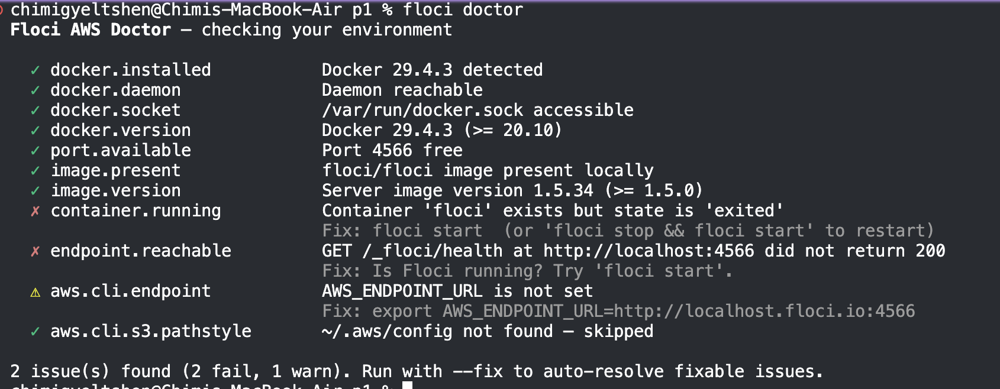
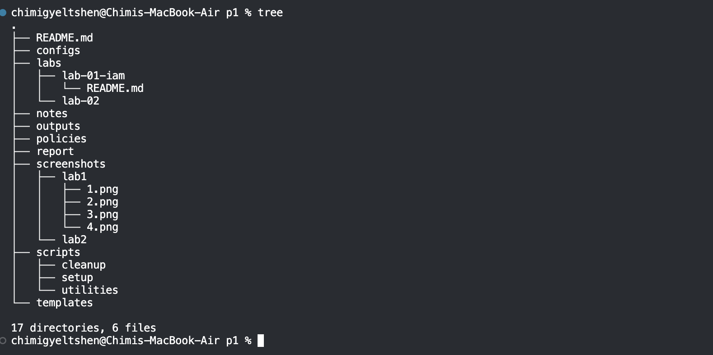

# **Lab 1 - Identity and Access Management**

## **PART A — Environment Setup**

### Step 1 — Open a terminal and identify your system

```bash
uname -s -m
echo "shell = $SHELL"
echo "home  = $HOME"
```


`echo "shell = $SHELL"
echo "home  = $HOME"
Darwin arm64
shell = /bin/zsh
home  = /Users/chimigyeltshen
`

### Step 2 — Verify Docker and Docker Compose

```bash
docker --version
docker info --format '{{.ServerVersion}}'
docker compose version
```


### Step 3 — Install the Floci CLI 

```bash
floci version
```


### Step 4 — Run Floci's environment diagnostics¶

```bash
floci doctor
```


### Step 5 — Create the course directory structure

```bash
tree
```


### Write .gitignore and initialise Git — before any secret exists


