# Lab 1 — Identity and Access Management

> Course: DSO303 — AWS Floci Practicals
> Reference: [Lab-01-IAM](https://norbutlepcha25.github.io/dso303/Lab/Lab-01-IAM.html)

## Table of Contents

- [Part A — Environment Setup](#part-a--environment-setup)
  - [1. Identify your system](#step-1--open-a-terminal-and-identify-your-system)
  - [2. Verify Docker and Docker Compose](#step-2--verify-docker-and-docker-compose)
  - [3. Install the Floci CLI](#step-3--install-the-floci-cli)
  - [4. Run Floci's environment diagnostics](#step-4--run-flocis-environment-diagnostics)
  - [5. Create the course directory structure](#step-5--create-the-course-directory-structure)
  - [6. Git setup before any secret exists](#write-gitignore-and-initialise-git--before-any-secret-exists)
  - [7. Floci storage models overview](#floci-storage-models-overview)
  - [8. Write docker-compose.yml and configs](#step-8--write-docker-composeyml-and-configscourseenv)
  - [9. Start/stop scripts and bring Floci up](#step-9--write-the-startstop-scripts-and-bring-floci-up)
  - [10. Install the AWS CLI](#step-10--install-the-aws-cli)
  - [11. AWS core concepts](#aws-core-concepts-credentials-regions-and-profiles)
  - [12. Create the floci AWS CLI profile](#step-12--create-the-floci-aws-cli-profile)
  - [13. First AWS CLI command + whoami helper](#step-13--your-first-aws-cli-command-and-the-whoami-helper)
  - [14. Prove isolation and persistence](#step-14--prove-isolation-from-real-aws-and-prove-persistence)
  - [15. Storage diagnostics, README, and commit](#step-15--storage-diagnostics-readme-and-commit-part-a)
- [Part B — Building the IAM Foundation](#part-b--building-the-iam-foundation)
  - [17. Inspect the empty IAM account](#step-17--inspect-the-empty-iam-account)
  - [18. Create the IAM groups](#step-18--create-the-iam-groups)
  - [19. Create the IAM users](#step-19--create-the-iam-users-and-capture-their-arns)
  - [20. Add users to groups](#step-20--add-users-to-groups)
  - [21. Attach an AWS managed policy](#step-21--explore-and-attach-an-aws-managed-policy)
  - [22. Write a customer managed policy](#step-22--write-your-first-customer-managed-policy)
  - [23. Write the S3 data policy](#step-23--write-the-s3-data-policy-used-for-real-in-lab-4)
  - [24. Discover parameters with --generate-cli-skeleton](#step-24--use---generate-cli-skeleton-to-discover-parameters)
  - [25. Add an inline policy](#step-25--add-an-inline-policy)
  - [26. Inspect what you have built](#step-26--inspect-what-you-have-built)
  - [27. Policy versions](#step-27--policy-versions)
  - [28. Create a role for EC2](#step-28--create-a-role-for-ec2-with-a-trust-policy)
  - [29. Create the Lambda execution role](#step-29--create-the-lambda-execution-role)
  - [30. Human role + temporary credentials with STS](#step-30--a-role-for-humans-and-temporary-credentials-with-sts)
  - [31. Access keys, handled safely](#step-31--access-keys-handled-safely)
  - [32. Test permissions with the policy simulator](#step-32--test-permissions-with-the-policy-simulator)
  - [33. Save the lab state for future labs](#step-33--save-the-lab-state-for-future-labs)

---

## Part A — Environment Setup

### Step 1 — Open a terminal and identify your system

```bash
uname -s -m
echo "shell = $SHELL"
echo "home  = $HOME"
```

**Output:**
```
Darwin arm64
shell = /bin/zsh
home  = /Users/chimigyeltshen
```


### Step 2 — Verify Docker and Docker Compose

```bash
docker --version
docker info --format '{{.ServerVersion}}'
docker compose version
```


### Step 3 — Install the Floci CLI

```bash
floci version
```


### Step 4 — Run Floci's environment diagnostics

```bash
floci doctor
```


### Step 5 — Create the course directory structure

```bash
tree
```


### Write `.gitignore` and initialise Git — before any secret exists

```bash
touch .gitignore
git init
git add .
git commit -m "wip: p1"
git remote add origin https://github.com/C-gyeltshen/aws-floci-course-dso303-p1.git
git branch -M main
git push -u origin main
```

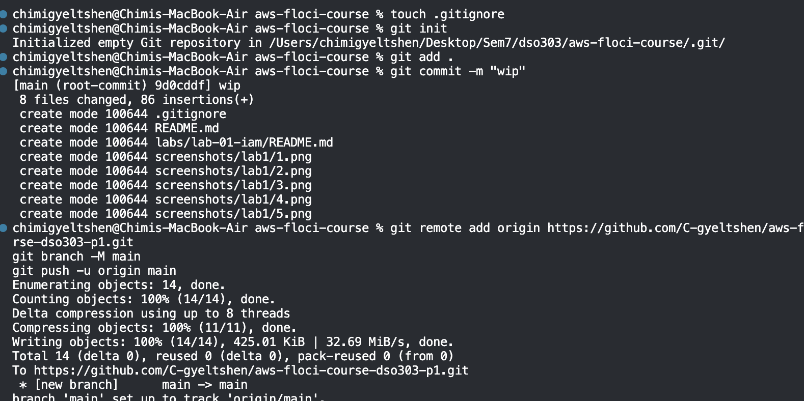

### Floci Storage Models Overview

Floci provides two distinct storage modes for persisting state across container restarts and setups.

#### 1. Ephemeral Mode (Default)

- **Behavior:** Data is stored strictly in container memory/tmpfs.
- **Persistence:** All IAM users, roles, policies, and S3 objects are completely wiped when the Docker container stops or restarts.
- **Use case:** Quick, isolated testing; stateless CI/CD runs; and rapid experimentation where persistent state is unnecessary.

#### 2. Persistent Mode

- **Behavior:** Floci maps state data to a host directory using a Docker bind mount (configured via `FLOCI_HOST_DATA_DIR`).
- **Persistence:** AWS resources and configurations persist across container restarts and system reboots.

### Step 8 — Write `docker-compose.yml` and `configs/course.env`

```bash
docker compose config >/dev/null && echo "compose file is valid"
```

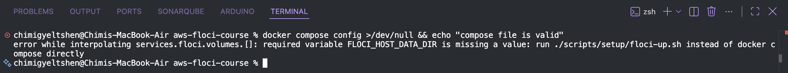

### Step 9 — Write the start/stop scripts and bring Floci up

- Create `scripts/setup/floci-up.sh`
- Create `scripts/setup/floci-down.sh`
- Run `floci-up.sh`

```bash
chmod +x scripts/setup/floci-down.sh
./scripts/setup/floci-up.sh
```

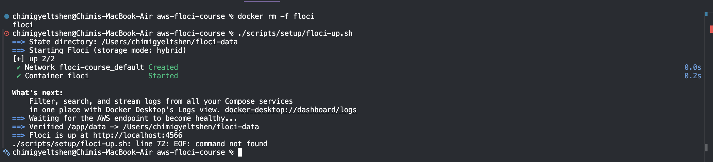

> **Note:** A Floci container from Lab 0 was already running, so it had to be stopped and removed before bringing up Lab 1.

### Step 10 — Install the AWS CLI

```bash
curl -fsSL "https://awscli.amazonaws.com/AWSCLIV2.pkg" -o AWSCLIV2.pkg
sudo installer -pkg AWSCLIV2.pkg -target /
rm AWSCLIV2.pkg
```

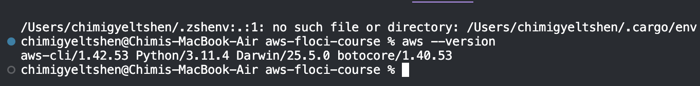

### AWS Core Concepts: Credentials, Regions, and Profiles

#### 1. AWS Regions

An **AWS Region** is a distinct, geographically isolated physical location in the world where AWS clusters its data centers.

**Why regions matter:**

- **Latency:** Deploy resources physically closer to end users to reduce response times.
- **Data sovereignty & compliance:** Ensure compliance with national data privacy and governance laws.
- **Cost:** Service pricing varies slightly across different regions due to operational costs.

**Global vs. regional services:** Most AWS services (e.g., S3, EC2, DynamoDB) are scoped to a specific region. However, **IAM (Identity and Access Management)** is a **global service** — IAM users, groups, roles, and policies apply universally across all regions.

**Naming format:** Regions use geographic codes, e.g. `us-east-1` (N. Virginia), `eu-west-1` (Ireland), or `ap-southeast-1` (Singapore).

#### 2. Credential Resolution Order

When you execute an AWS CLI command or SDK call, the tools evaluate potential credential sources in a **strict, top-down order of precedence**. The first valid credential found is used:

1. **Command line options** — direct inline flags (e.g., `--region us-east-1` or `--profile floci`).
2. **Environment variables** — session variables like `AWS_ACCESS_KEY_ID`, `AWS_SECRET_ACCESS_KEY`, and `AWS_PROFILE`.
3. **AWS credentials file** — access keys specified in `~/.aws/credentials`.
4. **AWS config file** — default settings and named profile configurations in `~/.aws/config`.
5. **Container credentials** — IAM roles provided by ECS tasks or EKS pod identities.
6. **Instance profile credentials** — temporary credentials retrieved automatically via the EC2 Instance Metadata Service (IMDS).

#### 3. AWS Profiles

An **AWS Profile** is a named collection of credentials and default parameters (region, output format, etc.) stored in local configuration files (`~/.aws/config` and `~/.aws/credentials`).

**Why profiles are essential:** Profiles allow you to seamlessly switch between multiple AWS environments (e.g., `default`, `production`, `sandbox`, or local mock tools like `floci`) on a single machine without constantly overriding environment variables.

### Step 12 — Create the `floci` AWS CLI profile

```bash
aws configure set aws_access_key_id     test                  --profile floci
aws configure set aws_secret_access_key test                  --profile floci
aws configure set region                us-east-1             --profile floci
aws configure set output                json                  --profile floci
aws configure set endpoint_url          http://localhost:4566 --profile floci
```

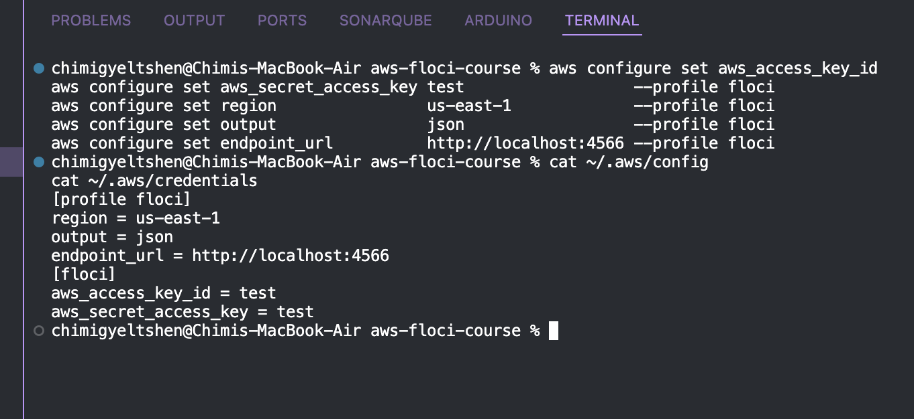
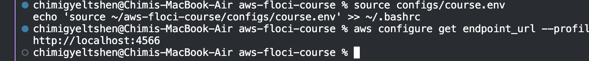

### Step 13 — Your first AWS CLI command, and the whoami helper

```bash
aws sts get-caller-identity --profile floci
```

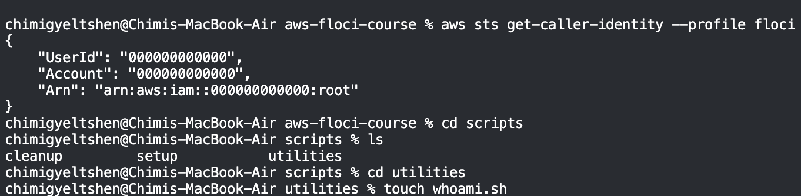
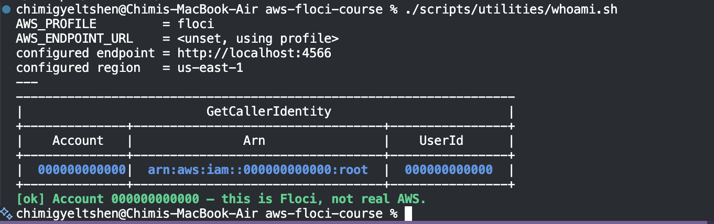

### Step 14 — Prove isolation from real AWS, and prove persistence

```bash
aws sts get-caller-identity --profile floci --debug 2>&1 \
  | grep -i "endpoint\|Making request" \
  | head -5
```

```bash
./scripts/setup/floci-down.sh
aws sts get-caller-identity --profile floci
```

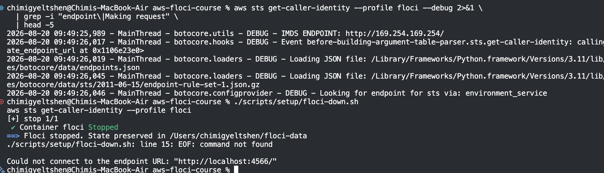

**Persist the data:**

```bash
# 1. Bring Floci back up
./scripts/setup/floci-up.sh

# 2. Create a marker resource
aws iam create-user --user-name persistence-check --output text --query 'User.Arn'

# 3. Restart the container — a full stop and start, not just a pause
docker compose restart floci
sleep 5
until curl -sf http://localhost:4566/_floci/health >/dev/null 2>&1; do sleep 2; done

# 4. Is it still there?
aws iam get-user --user-name persistence-check --query 'User.UserName' --output text
```

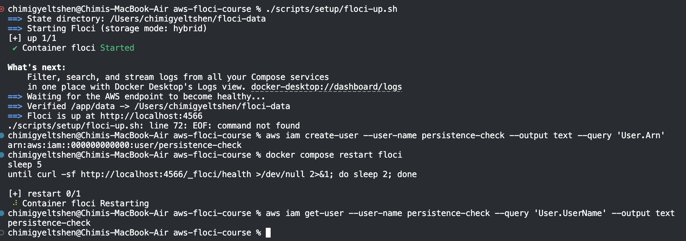

**Clean up the marker:**

```bash
aws iam delete-user --user-name persistence-check
```

**Exit codes:**

```bash
aws sts get-caller-identity --profile floci > /dev/null 2>&1
echo "exit code = $?"

aws iam get-user --user-name does-not-exist > /dev/null 2>&1
echo "exit code = $?"
```

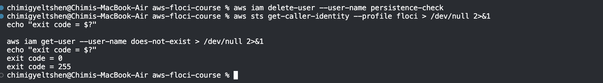

### Step 15 — Storage diagnostics, README, and commit Part A

Created `scripts/utilities/floci-storage-check.sh` and ran it.

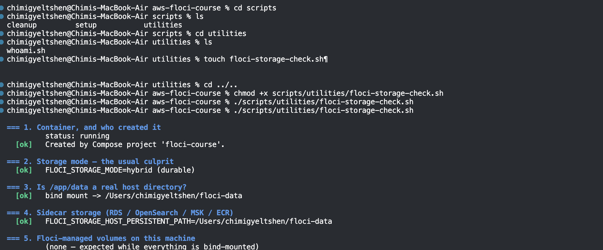

Cleanup script for stray volume:

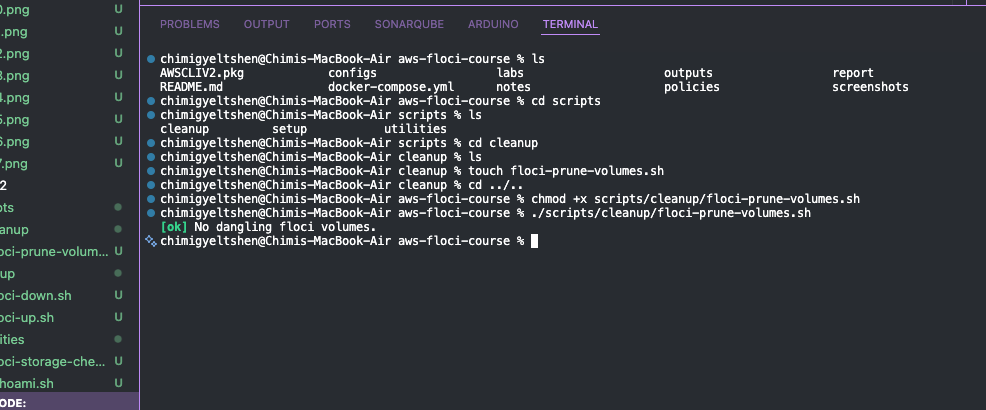

**Push Part A to GitHub:**

```bash
git add .
git commit -m "wip: p1"
git push
```

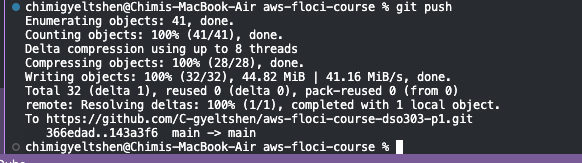

---

## Part B — Building the IAM Foundation

### Step 17 — Inspect the empty IAM account

```bash
aws iam list-users
```

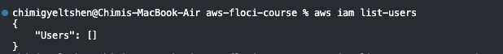

```bash
aws iam list-users --output json
aws iam list-users --output table
aws iam list-users --output text
```

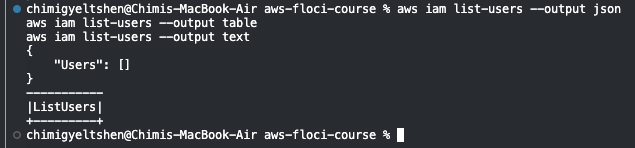

### Step 18 — Create the IAM groups

```bash
aws iam create-group --group-name usms-admins
aws iam create-group --group-name usms-developers
aws iam create-group --group-name usms-auditors
```

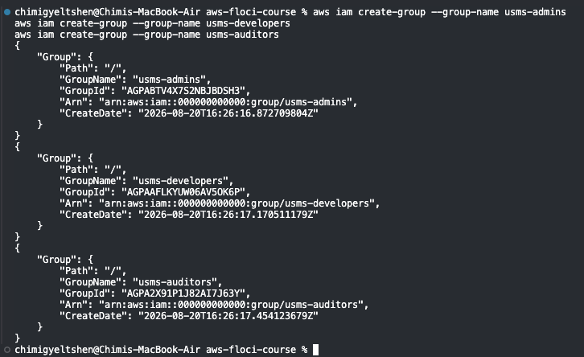

**Verify:**

```bash
aws iam list-groups --query 'Groups[*].[GroupName,Arn]' --output table
```

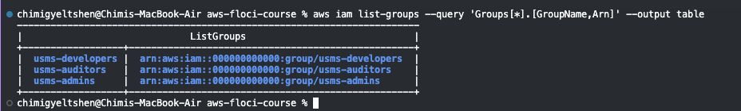

### Step 19 — Create the IAM users and capture their ARNs

```bash
ADMIN_ARN=$(aws iam create-user \
  --user-name usms-admin-01 \
  --tags Key=Project,Value=USMS Key=Role,Value=Administrator \
  --query 'User.Arn' \
  --output text)

DEV_ARN=$(aws iam create-user \
  --user-name usms-dev-01 \
  --tags Key=Project,Value=USMS Key=Role,Value=Developer \
  --query 'User.Arn' \
  --output text)

AUDIT_ARN=$(aws iam create-user \
  --user-name usms-audit-01 \
  --tags Key=Project,Value=USMS Key=Role,Value=Auditor \
  --query 'User.Arn' \
  --output text)

echo "$ADMIN_ARN"
echo "$DEV_ARN"
echo "$AUDIT_ARN"
```

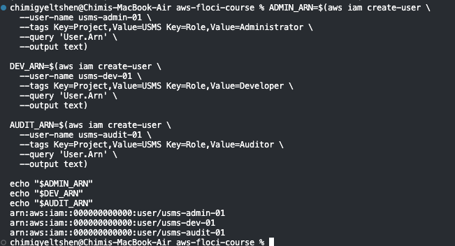

**Verify:**

```bash
aws iam list-users \
  --query 'Users[*].{User:UserName,Created:CreateDate,Arn:Arn}' \
  --output table
```

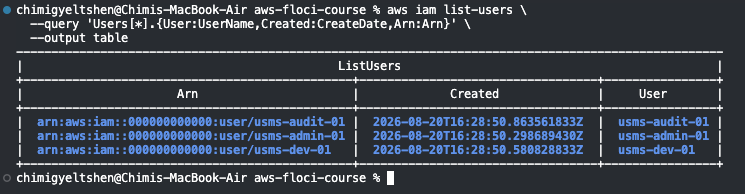

### Step 20 — Add users to groups

```bash
aws iam add-user-to-group --group-name usms-admins     --user-name usms-admin-01
aws iam add-user-to-group --group-name usms-developers --user-name usms-dev-01
aws iam add-user-to-group --group-name usms-auditors   --user-name usms-audit-01
```

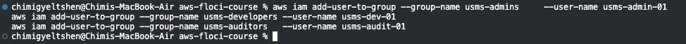

### Step 21 — Explore and attach an AWS managed policy

```bash
aws iam attach-group-policy \
  --group-name usms-auditors \
  --policy-arn arn:aws:iam::aws:policy/ReadOnlyAccess
```

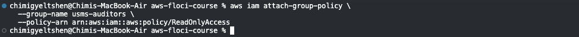

**Verify:**

```bash
aws iam list-attached-group-policies --group-name usms-auditors --output table
```

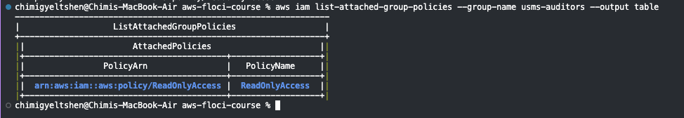

### Step 22 — Write your first customer managed policy

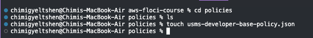

**Validate the JSON before sending it:**

```bash
cd policies
python3 -m json.tool usms-developer-base-policy.json > /dev/null && echo "Valid JSON"
```

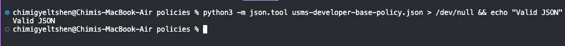

**Create the policy:**

```bash
DEV_POLICY_ARN=$(aws iam create-policy \
  --policy-name USMSDeveloperBase \
  --description "Read infrastructure + build VPC networking for USMS. Denies identity escalation." \
  --policy-document file://usms-developer-base-policy.json \
  --query 'Policy.Arn' \
  --output text)

echo "$DEV_POLICY_ARN"
```

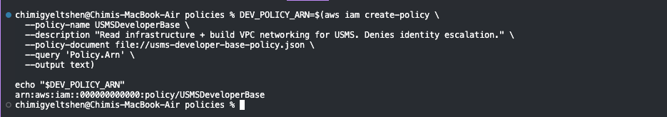

**Attach it to both groups that need it:**

```bash
aws iam attach-group-policy --group-name usms-developers --policy-arn "$DEV_POLICY_ARN"
aws iam attach-group-policy --group-name usms-admins     --policy-arn "$DEV_POLICY_ARN"
```

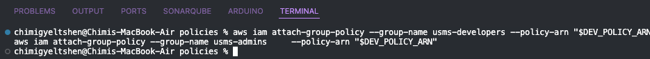

**Verify:**

```bash
aws iam list-attached-group-policies --group-name usms-developers --output table
aws iam get-policy --policy-arn "$DEV_POLICY_ARN" \
  --query 'Policy.{Name:PolicyName,Attached:AttachmentCount,Default:DefaultVersionId}' \
  --output table
```

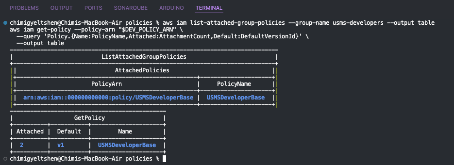

### Step 23 — Write the S3 data policy (used for real in Lab 4)

```bash
cd policies
touch usms-student-data-rw-policy.json

S3_POLICY_ARN=$(aws iam create-policy \
  --policy-name USMSStudentDataReadWrite \
  --description "Read/write student transcripts in the USMS bucket. Bucket deletion denied." \
  --policy-document file://usms-student-data-rw-policy.json \
  --query 'Policy.Arn' --output text)

echo "$S3_POLICY_ARN"
```

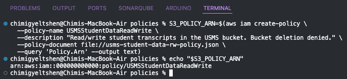

**Verify:**

```bash
aws iam list-policies --scope Local \
  --query 'Policies[*].{Name:PolicyName,Attached:AttachmentCount}' --output table
```

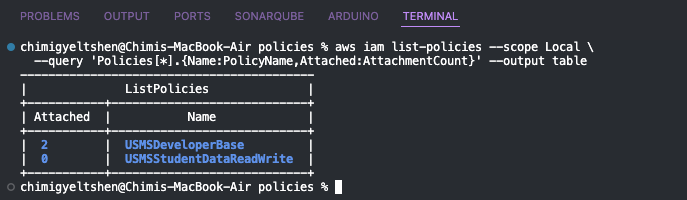

### Step 24 — Use `--generate-cli-skeleton` to discover parameters

```bash
cd templates
aws iam create-role --generate-cli-skeleton > create-role-skeleton.json
cat create-role-skeleton.json
```

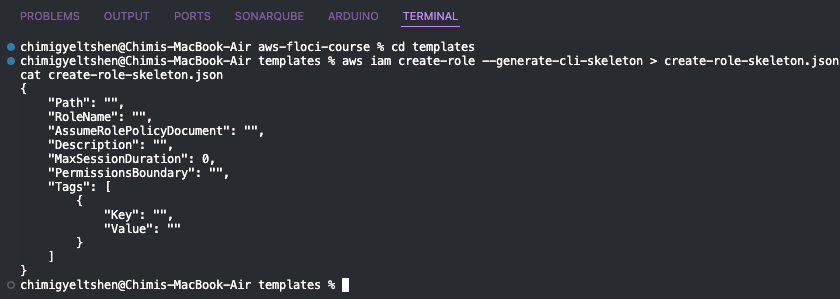

### Step 25 — Add an inline policy

```bash
cd policies
touch usms-self-manage-credentials.json
```

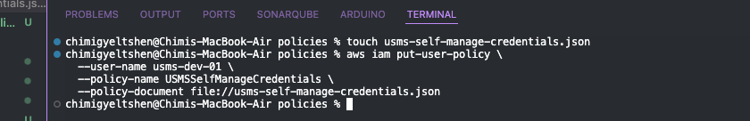

**Verify:**

```bash
aws iam list-user-policies --user-name usms-dev-01
aws iam get-user-policy --user-name usms-dev-01 --policy-name USMSSelfManageCredentials
```

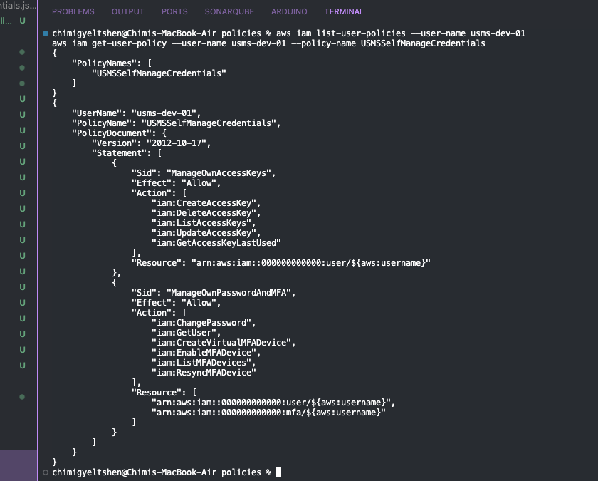

### Step 26 — Inspect what you have built

```bash
IAM_USER=usms-dev-01
echo "=== groups ===";      aws iam list-groups-for-user       --user-name $IAM_USER --query 'Groups[*].GroupName'                --output text
echo "=== attached ===";    aws iam list-attached-user-policies --user-name $IAM_USER --query 'AttachedPolicies[*].PolicyName'    --output text
echo "=== inline ===";      aws iam list-user-policies          --user-name $IAM_USER --query 'PolicyNames'                       --output text
echo "=== access keys ==="; aws iam list-access-keys            --user-name $IAM_USER --query 'AccessKeyMetadata[*].AccessKeyId'  --output text
```

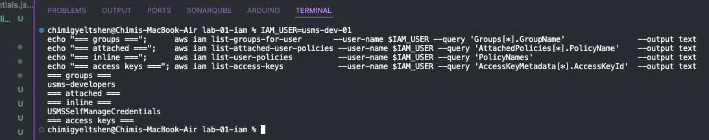

```bash
POLICY_ARN=arn:aws:iam::000000000000:policy/USMSDeveloperBase
VER=$(aws iam get-policy --policy-arn $POLICY_ARN --query 'Policy.DefaultVersionId' --output text)

aws iam get-policy-version \
  --policy-arn $POLICY_ARN \
  --version-id $VER \
  --query 'PolicyVersion.Document'
```

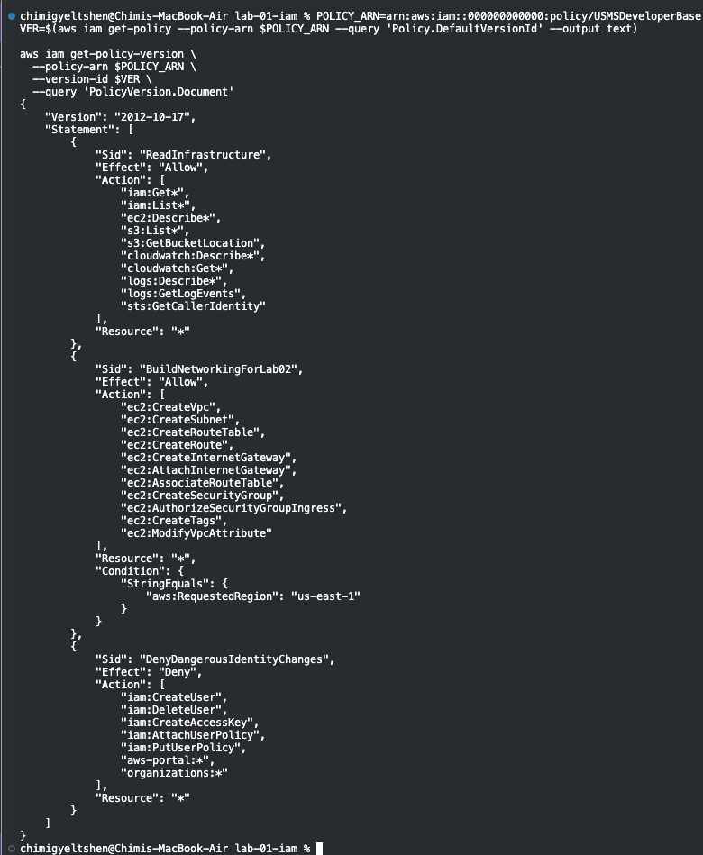

### Step 27 — Policy versions

```bash
python3 - << 'PY'
import json, pathlib
p = pathlib.Path("usms-developer-base-policy.json")
doc = json.loads(p.read_text())
for st in doc["Statement"]:
    if st.get("Sid") == "BuildNetworkingForLab02":
        st["Action"] += ["ec2:DeleteVpc", "ec2:DescribeAvailabilityZones"]
pathlib.Path("usms-developer-base-policy-v2.json").write_text(json.dumps(doc, indent=2))
print("wrote usms-developer-base-policy-v2.json")
PY

aws iam create-policy-version \
  --policy-arn arn:aws:iam::000000000000:policy/USMSDeveloperBase \
  --policy-document file://usms-developer-base-policy-v2.json \
  --set-as-default
```

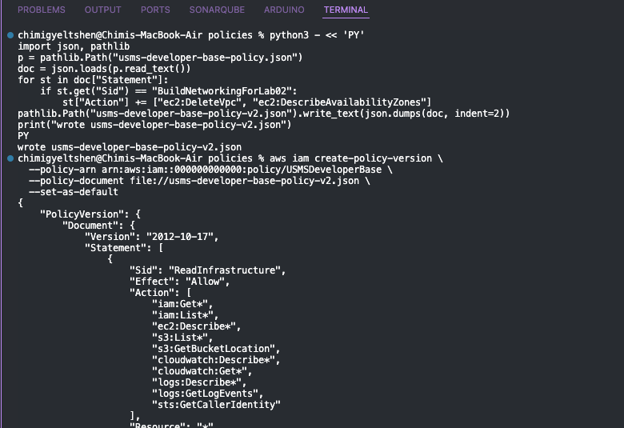

**Verify:**

```bash
aws iam list-policy-versions \
  --policy-arn arn:aws:iam::000000000000:policy/USMSDeveloperBase \
  --query 'Versions[*].{Version:VersionId,Default:IsDefaultVersion,Created:CreateDate}' \
  --output table
```

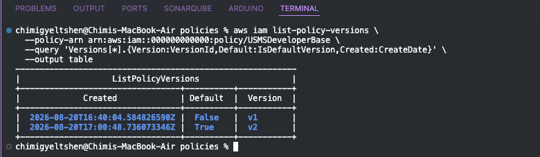

### Step 28 — Create a role for EC2, with a trust policy

```bash
EC2_ROLE_ARN=$(aws iam create-role \
  --role-name usms-ec2-app-role \
  --description "Role for the USMS application server (Lab 03). Grants S3 access to student data." \
  --assume-role-policy-document file://trust-ec2.json \
  --tags Key=Project,Value=USMS \
  --query 'Role.Arn' --output text)

echo "$EC2_ROLE_ARN"
```

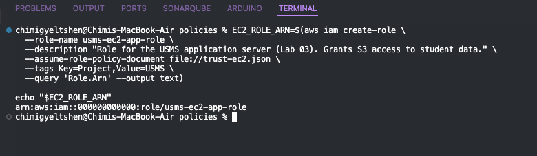

**Attach permissions to the role:**

```bash
aws iam attach-role-policy \
  --role-name usms-ec2-app-role \
  --policy-arn arn:aws:iam::000000000000:policy/USMSStudentDataReadWrite
```

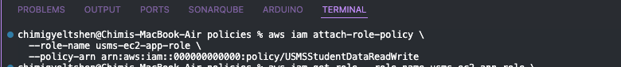

```bash
aws iam get-role --role-name usms-ec2-app-role \
  --query 'Role.{Name:RoleName,Arn:Arn,Trust:AssumeRolePolicyDocument.Statement[0].Principal}' \
  --output json

aws iam list-attached-role-policies --role-name usms-ec2-app-role --output table
```

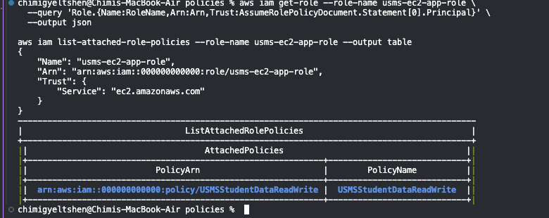

**Create the instance profile:**

```bash
aws iam create-instance-profile --instance-profile-name usms-ec2-app-profile

aws iam add-role-to-instance-profile \
  --instance-profile-name usms-ec2-app-profile \
  --role-name usms-ec2-app-role
```

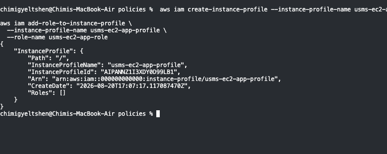

**Verify:**

```bash
aws iam get-instance-profile --instance-profile-name usms-ec2-app-profile \
  --query 'InstanceProfile.{Profile:InstanceProfileName,Roles:Roles[*].RoleName}' \
  --output json
```

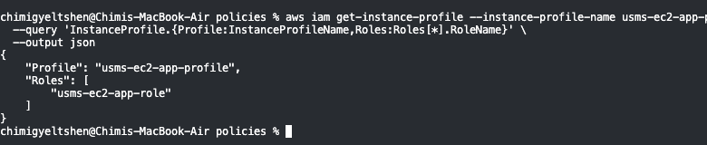

### Step 29 — Create the Lambda execution role

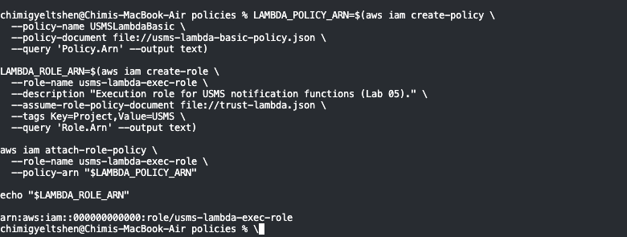
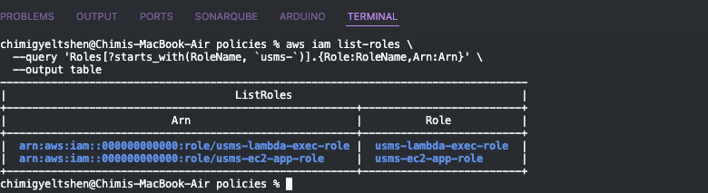

### Step 30 — A role for humans, and temporary credentials with STS

```bash
DEVROLE_ARN=$(aws iam create-role \
  --role-name usms-developer-role \
  --description "Elevated build permissions, assumed temporarily by USMS developers." \
  --assume-role-policy-document file://trust-account-developers.json \
  --max-session-duration 3600 \
  --query 'Role.Arn' --output text)

aws iam attach-role-policy \
  --role-name usms-developer-role \
  --policy-arn arn:aws:iam::000000000000:policy/USMSDeveloperBase

echo "$DEVROLE_ARN"
```

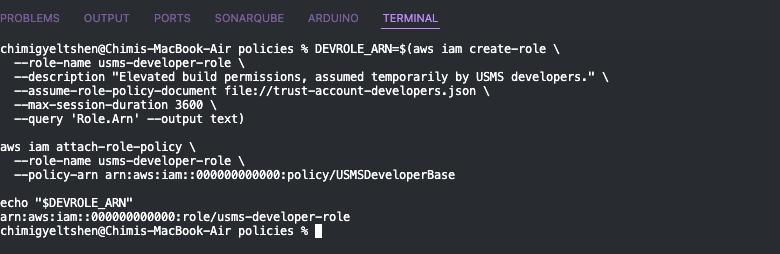
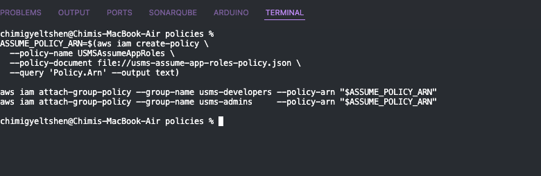

**Use the temporary credentials, then restore your identity:**

```bash
export AWS_ACCESS_KEY_ID=$(jq -r '.Credentials.AccessKeyId'         outputs/assumed-role.json)
export AWS_SECRET_ACCESS_KEY=$(jq -r '.Credentials.SecretAccessKey' outputs/assumed-role.json)
export AWS_SESSION_TOKEN=$(jq -r '.Credentials.SessionToken'        outputs/assumed-role.json)

aws sts get-caller-identity --endpoint-url http://localhost:4566 --region us-east-1
```

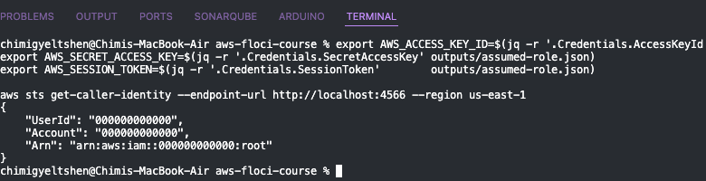

```bash
unset AWS_ACCESS_KEY_ID AWS_SECRET_ACCESS_KEY AWS_SESSION_TOKEN
./scripts/utilities/whoami.sh
```

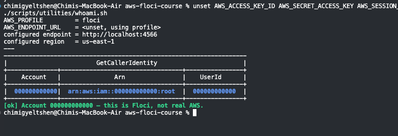

### Step 31 — Access keys, handled safely

```bash
aws iam create-access-key --user-name usms-dev-01 \
  > outputs/usms-dev-01-access-key.json

chmod 600 outputs/usms-dev-01-access-key.json
```

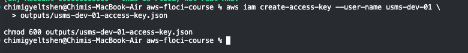

**Verify:**

```bash
aws iam list-access-keys --user-name usms-dev-01 \
  --query 'AccessKeyMetadata[*].{Key:AccessKeyId,Status:Status,Created:CreateDate}' \
  --output table
```

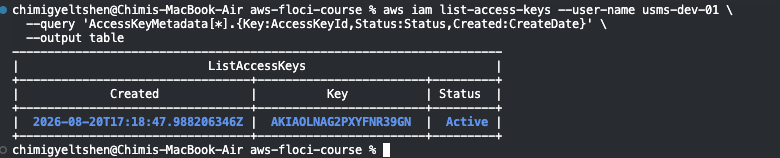

### Step 32 — Test permissions with the policy simulator

```bash
aws iam simulate-principal-policy \
  --policy-source-arn arn:aws:iam::000000000000:user/usms-dev-01 \
  --action-names "ec2:CreateVpc" "iam:CreateUser" "s3:GetObject" \
  --query 'EvaluationResults[*].{Action:EvalActionName,Decision:EvalDecision}' \
  --output table
```

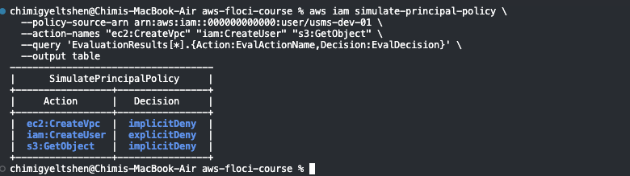

### Step 33 — Save the lab state for future labs

```bash
grep -n 'export .*=$\|None' configs/lab-01.env || echo "all values populated"
```

```bash
source configs/course.env
source configs/lab-01.env
echo "EC2 role  : $USMS_ROLE_EC2"
echo "Dev policy: $USMS_POLICY_DEV_BASE"
```

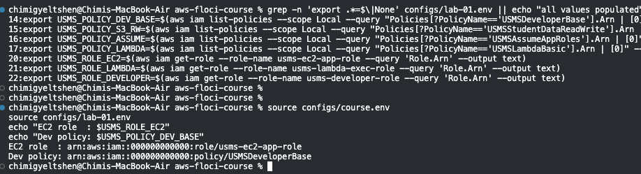

**Floci snapshot:**

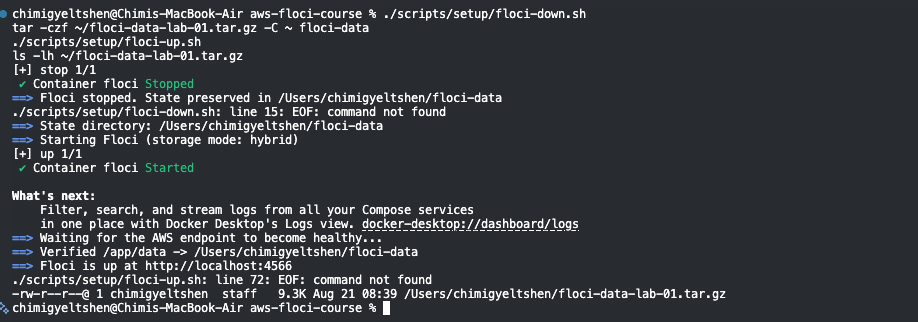

**Push Part B to GitHub:**

```bash
git add .
git commit -m "wip: p2"
git push
```

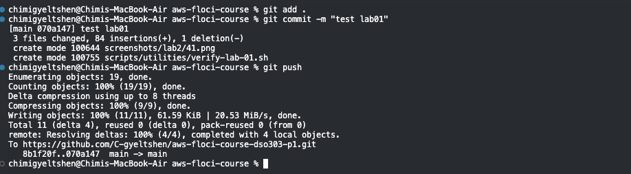

**Verification:**

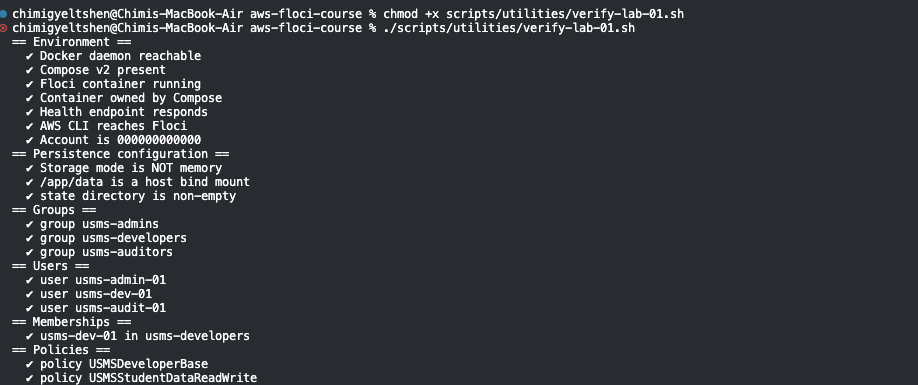