# Lab 2 — Independent Exercises: Detailed Guide

This guide walks through all five independent exercises for Lab 2 (VPC and Networking), following the same conventions used in the lab itself: `usms-*` naming, `--tag-specifications` instead of separate `create-tags` calls, capturing IDs with `$(...)` and `--query`, and verifying every change before moving on.

Before starting, load your environment variables from the lab so you're not retyping resource IDs:

```bash
cd ~/aws-floci-course
source configs/course.env
source configs/lab-02.env

echo "vpc=$USMS_VPC_ID  public-rt=$USMS_PUBLIC_RT  private-rt=$USMS_PRIVATE_RT  app-sg=$USMS_APP_SG  db-sg=$USMS_DB_SG"
```
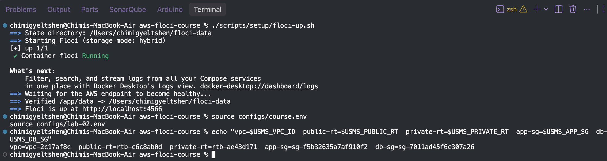

If any of these come back empty, re-run `source configs/lab-02.env` from the previous lab, or fall back to `describe-vpcs`/`describe-route-tables --filters "Name=tag:Name,Values=..."` to rediscover them.

---

## Exercise 1 (Basic) — A Third Public Subnet

**Goal:** `usms-public-subnet-c` in `us-east-1c`, CIDR `10.0.5.0/24`, tagged like the existing subnets, auto-assigning public IPv4, associated with `usms-public-rt`. Not added to `configs/lab-02.env` (Exercise 4 will remove it, so keep this one disposable).

### Step 1 — Create the subnet

This is Step 7 from the lab, with the AZ, CIDR, and name changed:

```bash
PUBLIC_SUBNET_C_ID=$(aws ec2 create-subnet \
  --vpc-id "$USMS_VPC_ID" \
  --cidr-block 10.0.5.0/24 \
  --availability-zone "${AWS_REGION_COURSE}c" \
  --tag-specifications 'ResourceType=subnet,Tags=[{Key=Name,Value=usms-public-subnet-c},{Key=Project,Value=USMS},{Key=Tier,Value=public},{Key=AZ,Value=c}]' \
  --query 'Subnet.SubnetId' \
  --output text)

echo "PUBLIC_SUBNET_C_ID = $PUBLIC_SUBNET_C_ID"
```
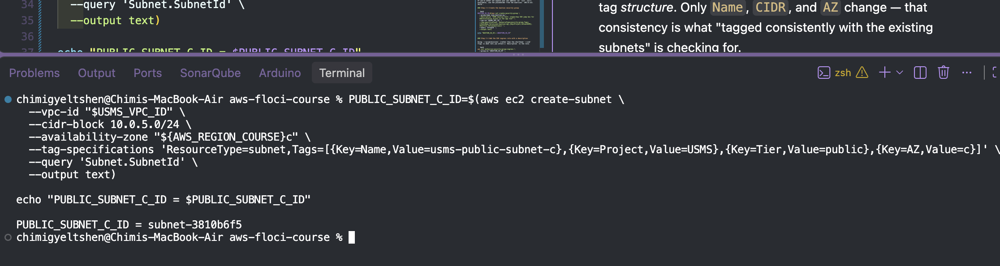

Note what stayed the same as Step 7: the `Project`, `Tier`, and tag *structure*. Only `Name`, `CIDR`, and `AZ` change — that consistency is what "tagged consistently with the existing subnets" is checking for.

### Step 2 — Turn on auto-assign public IPv4

This is Step 8, pointed at the new subnet:

```bash
aws ec2 modify-subnet-attribute \
  --subnet-id "$PUBLIC_SUBNET_C_ID" \
  --map-public-ip-on-launch

aws ec2 describe-subnets \
  --subnet-ids "$PUBLIC_SUBNET_C_ID" \
  --query 'Subnets[0].MapPublicIpOnLaunch' \
  --output text
```
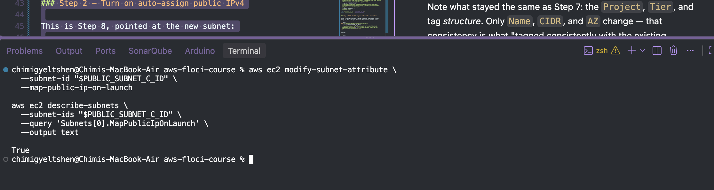

### Step 3 — Associate with the public route table

This is Step 11, pointed at the new subnet instead of subnet A:

```bash
PUBLIC_ASSOC_C_ID=$(aws ec2 associate-route-table \
  --route-table-id "$USMS_PUBLIC_RT" \
  --subnet-id "$PUBLIC_SUBNET_C_ID" \
  --query 'AssociationId' \
  --output text)

echo "PUBLIC_ASSOC_C_ID = $PUBLIC_ASSOC_C_ID"
```
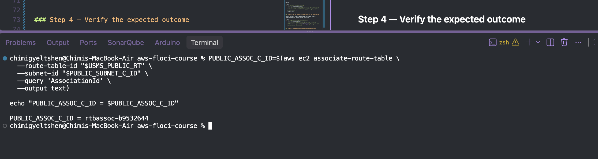

### Step 4 — Verify the expected outcome

```bash
aws ec2 describe-subnets \
  --filters "Name=vpc-id,Values=$USMS_VPC_ID" \
  --query 'sort_by(Subnets, &CidrBlock)[].{Name:Tags[?Key==`Name`]|[0].Value,CIDR:CidrBlock,AZ:AvailabilityZone,Public:MapPublicIpOnLaunch}' \
  --output table

aws ec2 describe-route-tables \
  --route-table-ids "$USMS_PUBLIC_RT" \
  --query 'RouteTables[0].Associations[].{SubnetId:SubnetId,Main:Main,AssociationId:RouteTableAssociationId}' \
  --output table
```
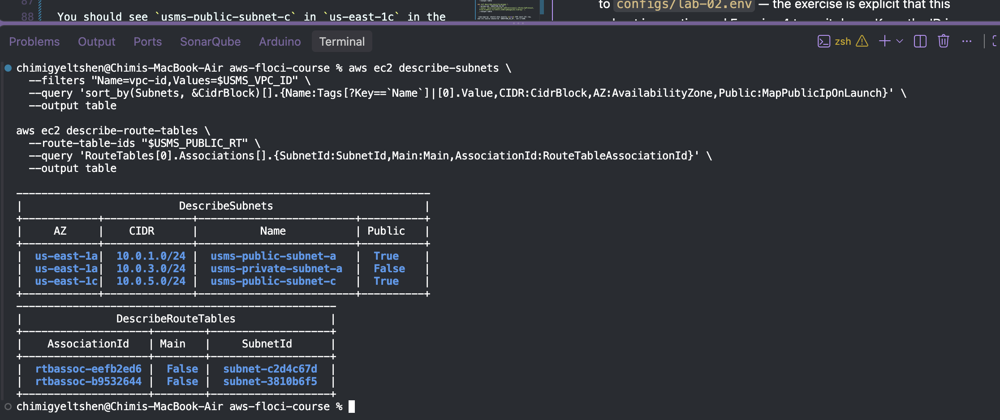

You should see `usms-public-subnet-c` in `us-east-1c` in the first table, and one more row (three subnet associations total, plus the main association) in the second than you had at the end of the lab.

**Deliberately not doing this:** don't add `USMS_PUBLIC_SUBNET_C` to `configs/lab-02.env` — the exercise is explicit that this subnet is practice and Exercise 4 tears it down. Keep the ID in your shell session or scratch notes only.

---

## Exercise 2 (Intermediate) — A Bastion Security Group

**Goal:** `usms-bastion-sg` allowing inbound SSH from one address; `usms-app-sg`'s SSH rule changed from the `10.0.0.0/16` CIDR to a reference to `usms-bastion-sg`, with the old rule explicitly revoked and every rule carrying a description.

### Step 1 — Decide the bastion's allowed source address

```bash
MY_IP=$(curl -s https://checkip.amazonaws.com)
echo "MY_IP = $MY_IP"
```
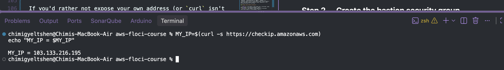

If you'd rather not expose your own address (or `curl` isn't available), use the placeholder from the exercise: `203.0.113.10/32`.

### Step 2 — Create the bastion security group

```bash
BASTION_SG_ID=$(aws ec2 create-security-group \
  --group-name usms-bastion-sg \
  --description "USMS bastion host: single-hop SSH jump box for administrative access to the app tier" \
  --vpc-id "$USMS_VPC_ID" \
  --tag-specifications 'ResourceType=security-group,Tags=[{Key=Name,Value=usms-bastion-sg},{Key=Project,Value=USMS},{Key=Tier,Value=bastion}]' \
  --query 'GroupId' \
  --output text)

echo "BASTION_SG_ID = $BASTION_SG_ID"
```
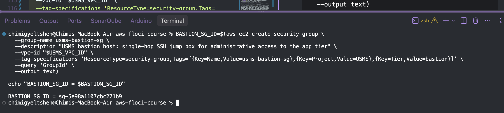

### Step 3 — Add the SSH ingress rule with a description

Using `--ip-permissions` (rather than the shorthand `--cidr` flag) is what lets you attach a `Description` to the rule:

```bash
aws ec2 authorize-security-group-ingress \
  --group-id "$BASTION_SG_ID" \
  --ip-permissions "IpProtocol=tcp,FromPort=22,ToPort=22,IpRanges=[{CidrIp=${MY_IP}/32,Description='SSH from the administrator workstation'}]"
```
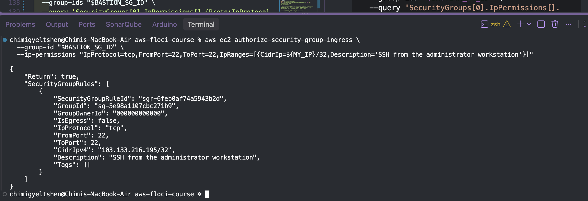
Verify:

```bash
aws ec2 describe-security-groups \
  --group-ids "$BASTION_SG_ID" \
  --query 'SecurityGroups[0].IpPermissions[].{Proto:IpProtocol,From:FromPort,To:ToPort,CIDR:IpRanges[0].CidrIp,Desc:IpRanges[0].Description}' \
  --output table
```
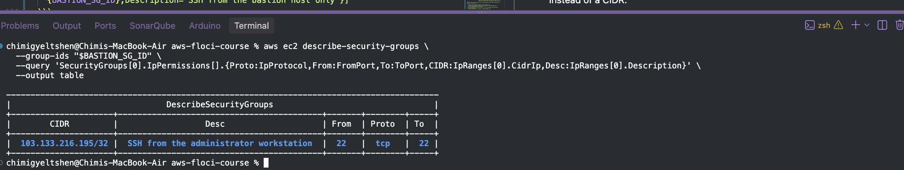

### Step 4 — Add the group-referenced SSH rule to `usms-app-sg`

This is the part Step 15 demonstrates for the DB tier — a `UserIdGroupPairs` source instead of a CIDR:

```bash
aws ec2 authorize-security-group-ingress \
  --group-id "$USMS_APP_SG" \
  --ip-permissions "IpProtocol=tcp,FromPort=22,ToPort=22,UserIdGroupPairs=[{GroupId=${BASTION_SG_ID},Description='SSH from the bastion host only'}]"
```
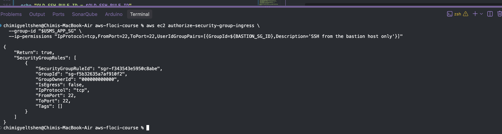

### Step 5 — Find and revoke the old CIDR-based SSH rule

Don't hand-copy the rule ID — pull it with a query, the same way the lab captures every other ID:

```bash
OLD_SSH_RULE_ID=$(aws ec2 describe-security-group-rules \
  --filters "Name=group-id,Values=$USMS_APP_SG" \
  --query 'SecurityGroupRules[?IsEgress==`false` && FromPort==`22` && CidrIpv4==`10.0.0.0/16`].SecurityGroupRuleId | [0]' \
  --output text)

echo "OLD_SSH_RULE_ID = $OLD_SSH_RULE_ID"

aws ec2 revoke-security-group-ingress \
  --group-id "$USMS_APP_SG" \
  --security-group-rule-ids "$OLD_SSH_RULE_ID"
```
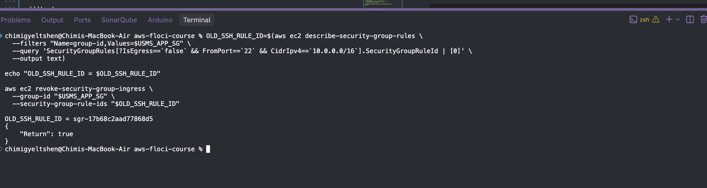

### Step 6 — Verify the expected outcome

```bash
aws ec2 describe-security-groups \
  --group-ids "$USMS_APP_SG" \
  --query 'SecurityGroups[0].IpPermissions[].{Proto:IpProtocol,From:FromPort,To:ToPort,SourceSG:UserIdGroupPairs[0].GroupId,SourceCIDR:IpRanges[0].CidrIp,Desc:UserIdGroupPairs[0].Description}' \
  --output table

aws ec2 describe-security-groups \
  --group-ids "$BASTION_SG_ID" \
  --query 'SecurityGroups[0].IpPermissions[].{Proto:IpProtocol,From:FromPort,To:ToPort,CIDR:IpRanges[0].CidrIp}' \
  --output table
```
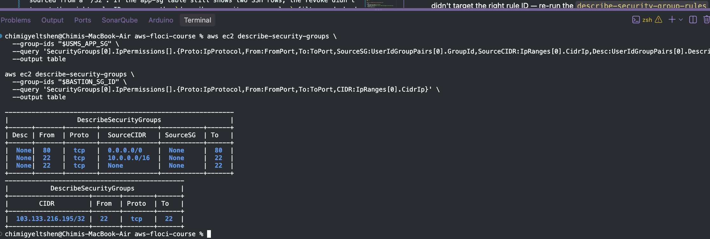


`usms-app-sg` should show exactly **one** SSH (port 22) row, and its source should be `$BASTION_SG_ID`, not a CIDR. `usms-bastion-sg` should show exactly one inbound rule, sourced from a `/32`. If the app-sg table still shows two SSH rows, the revoke didn't target the right rule ID — re-run the `describe-security-group-rules` filter and check `CidrIpv4` matches exactly `10.0.0.0/16`.

---

## Exercise 3 (Problem Solving) — `lab-02-network-report.sh`

**Goal:** a script that prints one line per subnet in `usms-vpc`, classifying each as `PUBLIC`, `PRIVATE`, or `ISOLATED` purely from its route table — never from its name or tags — and that produces identical output regardless of the working directory it's run from.

### Design notes before writing it

- **PUBLIC** = the subnet's route table has a `0.0.0.0/0` route whose target is an Internet Gateway (`igw-*`).
- **PRIVATE** = the subnet's route table has a `0.0.0.0/0` route whose target is a NAT Gateway (`nat-*`).
- **ISOLATED** = no `0.0.0.0/0` route at all.
- A subnet with no *explicit* route table association uses the VPC's main route table — the script has to fall back to that, not just assume "no association = isolated."
- `set -uo pipefail` without `-e`: `-e` would abort the script the first time a `describe-route-tables --query` legitimately returns an empty/`None` result for an isolated subnet, which is expected data, not a failure. `-u` (unset variables are errors) and `-o pipefail` (a failed command in a pipe fails the whole pipe) still catch real bugs like typoed variable names or a broken `aws`/`jq` call, without punishing the normal "no default route" case.
- Locating `configs/` from any working directory means resolving the script's own path via `${BASH_SOURCE[0]}`, the same pattern used in the setup scripts, rather than assuming the caller's `cwd`.

### The script

```bash
#!/usr/bin/env bash
set -uo pipefail

# Resolve paths relative to this script, not the caller's cwd.
SCRIPT_DIR="$(cd "$(dirname "${BASH_SOURCE[0]}")" && pwd)"
PROJECT_ROOT="$(cd "$SCRIPT_DIR/../.." && pwd)"

source "$PROJECT_ROOT/configs/course.env"
source "$PROJECT_ROOT/configs/lab-02.env"

VPC_ID="$USMS_VPC_ID"

MAIN_RT_ID=$(aws ec2 describe-route-tables \
  --filters "Name=vpc-id,Values=$VPC_ID" "Name=association.main,Values=true" \
  --query 'RouteTables[0].RouteTableId' \
  --output text)

SUBNET_IDS=$(aws ec2 describe-subnets \
  --filters "Name=vpc-id,Values=$VPC_ID" \
  --query 'sort_by(Subnets, &CidrBlock)[].SubnetId' \
  --output text)

for SUBNET_ID in $SUBNET_IDS; do
  read -r NAME CIDR AZ <<< "$(aws ec2 describe-subnets \
    --subnet-ids "$SUBNET_ID" \
    --query 'Subnets[0].[Tags[?Key==`Name`]|[0].Value,CidrBlock,AvailabilityZone]' \
    --output text)"

  RT_ID=$(aws ec2 describe-route-tables \
    --filters "Name=association.subnet-id,Values=$SUBNET_ID" \
    --query 'RouteTables[0].RouteTableId' \
    --output text)

  if [[ -z "$RT_ID" || "$RT_ID" == "None" ]]; then
    RT_ID="$MAIN_RT_ID"
  fi

  DEFAULT_ROUTE=$(aws ec2 describe-route-tables \
    --route-table-ids "$RT_ID" \
    --query 'RouteTables[0].Routes[?DestinationCidrBlock==`0.0.0.0/0`] | [0]' \
    --output json)

  GW_ID=$(echo "$DEFAULT_ROUTE" | jq -r '.GatewayId // empty')
  NAT_ID=$(echo "$DEFAULT_ROUTE" | jq -r '.NatGatewayId // empty')

  if [[ "$GW_ID" == igw-* ]]; then
    printf '%-24s%-15s%-14s%-9s via %s\n' "$NAME" "$CIDR" "$AZ" "PUBLIC" "$GW_ID"
  elif [[ -n "$NAT_ID" ]]; then
    printf '%-24s%-15s%-14s%-9s via %s\n' "$NAME" "$CIDR" "$AZ" "PRIVATE" "$NAT_ID"
  else
    printf '%-24s%-15s%-14s%-9s no default route\n' "$NAME" "$CIDR" "$AZ" "ISOLATED"
  fi
done
```

### Verify the expected outcome

```bash
cd ~
~/aws-floci-course/scripts/utilities/lab-02-network-report.sh > /tmp/report-from-home.txt

cd ~/aws-floci-course/labs/lab-02-vpc/
~/aws-floci-course/scripts/utilities/lab-02-network-report.sh > /tmp/report-from-lab-dir.txt

diff /tmp/report-from-home.txt /tmp/report-from-lab-dir.txt \
  && echo "IDENTICAL OUTPUT from both directories" \
  || echo "OUTPUT DIFFERS — check the BASH_SOURCE resolution"
```

Sample output, matching the format in the exercise:

```
usms-public-subnet-a    10.0.1.0/24    us-east-1a    PUBLIC   via igw-0f1e2d3c4b5a69870
usms-private-subnet-a   10.0.3.0/24    us-east-1a    PRIVATE  via nat-0abcdef1234567890
```

If you completed Exercise 1 and haven't cleaned it up yet, `usms-public-subnet-c` will show up as an extra `PUBLIC` row here — that's expected and is itself a nice confirmation that the classification is genuinely reading the route table rather than a hard-coded list.

---

## Exercise 4 (Challenge) — Design and Defend: the Exam-Results Service

**Goal:** a written design in `labs/lab-02-vpc/exercises.md`, plus the security-group half of it actually implemented as `usms-exam-sg`.

### Step 1 — Write the design document

```bash
mkdir -p labs/lab-02-vpc
cat > labs/lab-02-vpc/exercises.md << 'EOF'
# Exercise 4 — Design: Exam-Results Service

## Requirement summary
- Reachable only by campus staff. Campus network is 10.10.0.0/16, arriving over a
  site-to-site VPN, so traffic presents a campus source address at the VPC boundary.
- Reads the transcripts database (usms-db-sg tier).
- Must never be reachable from the public internet.
- Needs outbound access for security patches.

## Subnet placement
The service goes in the existing private tier — usms-private-subnet-a (or, once
Exercise 5 is done, whichever of usms-private-subnet-a/b has capacity) — not a new
subnet and not the public subnet.

Reasoning: campus traffic arrives over the site-to-site VPN attachment, not through
the Internet Gateway, so the service does not need — and must not have — a public IP
or an IGW route to be reachable from campus. It reaches the internet for patches the
same way the rest of the private tier already does: outbound through usms-nat, which
requires no new routing. Reusing the private tier keeps the "never reachable from the
public internet" requirement structurally true instead of relying on security-group
discipline alone.

## Security groups

### New: usms-exam-sg
Attached to the exam-results service instances.

| Direction | Protocol | Port | Source/Destination            | Description                                              |
|-----------|----------|------|--------------------------------|-----------------------------------------------------------|
| Ingress   | TCP      | 443  | 10.10.0.0/16                   | HTTPS from the campus network over the site-to-site VPN   |

No custom egress rule is needed: the default security-group egress (allow all) already
covers outbound HTTPS to the transcripts DB and to the internet via NAT for patches. If
this VPC's convention is to lock down egress explicitly (it currently is not — Step 16
shows the app and DB groups both keep the default allow-all egress), the equivalent
explicit rule would be:

| Direction | Protocol | Port | Source/Destination | Description                                   |
|-----------|----------|------|----------------------|------------------------------------------------|
| Egress    | TCP      | 5432 | usms-db-sg            | PostgreSQL to the transcripts database          |
| Egress    | TCP      | 443  | 0.0.0.0/0              | HTTPS out via NAT for OS/security patches       |

### Modified: usms-db-sg
Add one ingress rule so the exam-results service can read the transcripts database,
sourced from the new group rather than a CIDR, matching the pattern usms-app-sg
already uses:

| Direction | Protocol | Port | Source     | Description                                         |
|-----------|----------|------|------------|-------------------------------------------------------|
| Ingress   | TCP      | 5432 | usms-exam-sg | PostgreSQL reads from the exam-results service tier |

No existing usms-db-sg rule is removed — the app tier still needs its own access.

## NACL: warranted, one addition
usms-private-nacl's current ingress rules are:
- rule 100: allow tcp/5432 from 10.0.0.0/16 (VPC-internal Postgres)
- rule 110: allow tcp/1024-65535 from 0.0.0.0/0 (ephemeral return traffic)

Neither rule permits an inbound SYN on tcp/443 from 10.10.0.0/16. Security groups are
stateful, so the exam-sg rule alone would allow the connection at the instance level,
but NACLs are stateless and evaluated first — the initial packet to port 443 from the
campus range has no matching allow rule today, so it would be dropped at the subnet
boundary before the security group is ever consulted. This needs a new NACL entry:

    rule-number 120, ingress, allow, tcp, cidr 10.10.0.0/16, port-range 443-443

Existing rule 110 already covers the ephemeral-port return traffic for this new flow,
so nothing further is required on the egress side.

## Second NAT gateway in AZ b: not now, revisit at Exercise 5
usms-vpc currently has one NAT gateway, in usms-public-subnet-a. That is a single
point of failure for every private subnet's outbound path (patches, NAT-routed API
calls) if us-east-1a has an availability event.

Cost, at AWS's list us-east-1 NAT Gateway pricing of roughly $0.045 per gateway-hour
plus $0.045 per GB processed (rates change; confirm current figures in the AWS
Pricing Calculator before budgeting):
- One NAT gateway, running continuously: ~730 hrs x $0.045 = ~$32.85/month in the
  hourly charge alone, before any data-processing charge.
- A second NAT gateway in AZ b adds the same ~$32.85/month base charge, and — because
  each subnet's route table would point at the NAT gateway in its own AZ — removes
  the cross-AZ data-transfer charge that traffic from a usms-private-subnet-b would
  otherwise incur by hairpinning through AZ a's gateway.
- Net effect: doubling the base hourly cost of the VPC's single largest recurring
  line item, to remove a single point of failure that, today, would only affect this
  one exam-results service and the rest of the private tier during an AZ-level event.

Recommendation: do not add a second NAT gateway yet. The exam-results service is not
described as highly-available-critical, and one NAT gateway is consistent with the
rest of this lab's footprint. Revisit this when either (a) usms-private-subnet-b
(Exercise 5) is carrying production traffic with an uptime SLA, or (b) NAT data
processing volume grows enough that cross-AZ hairpin charges start to matter on their
own — at that point a second gateway pays for itself on cost grounds, not just HA
grounds.

## What to delete, and in what order

    usms-public-subnet-c   Exercise 1 practice subnet.       Danger: none once its
                            route-table association is removed; it holds no
                            resources. Safe to delete any time after this exercise.

Deletion order, since a subnet can't be deleted while route-table associations or
ENIs still reference it:

1. Disassociate usms-public-subnet-c from usms-public-rt
   (aws ec2 disassociate-route-table --association-id <PUBLIC_ASSOC_C_ID>)
2. Confirm no ENIs remain in the subnet
   (aws ec2 describe-network-interfaces --filters Name=subnet-id,Values=<id>)
3. Delete the subnet
   (aws ec2 delete-subnet --subnet-id <PUBLIC_SUBNET_C_ID>)
4. Re-run the Exercise 3 report script and confirm the PUBLIC row for
   usms-public-subnet-c no longer appears.

Nothing else built in this lab or in Exercises 1-3 is proposed for deletion here —
usms-bastion-sg, the modified usms-app-sg rule, and the report script are all meant
to persist.
EOF
```

### Step 2 — Implement only the security-group parts

```bash
EXAM_SG_ID=$(aws ec2 create-security-group \
  --group-name usms-exam-sg \
  --description "USMS exam-results service: HTTPS from campus over the site-to-site VPN only" \
  --vpc-id "$USMS_VPC_ID" \
  --tag-specifications 'ResourceType=security-group,Tags=[{Key=Name,Value=usms-exam-sg},{Key=Project,Value=USMS},{Key=Tier,Value=exam}]' \
  --query 'GroupId' \
  --output text)

echo "EXAM_SG_ID = $EXAM_SG_ID"

aws ec2 authorize-security-group-ingress \
  --group-id "$EXAM_SG_ID" \
  --ip-permissions "IpProtocol=tcp,FromPort=443,ToPort=443,IpRanges=[{CidrIp=10.10.0.0/16,Description='HTTPS from campus network over the site-to-site VPN'}]"

aws ec2 authorize-security-group-ingress \
  --group-id "$USMS_DB_SG" \
  --ip-permissions "IpProtocol=tcp,FromPort=5432,ToPort=5432,UserIdGroupPairs=[{GroupId=${EXAM_SG_ID},Description='PostgreSQL reads from the exam-results service tier'}]"
```

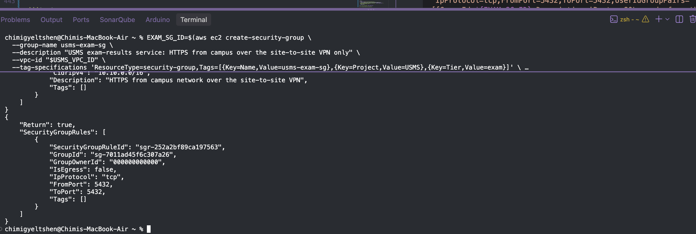

### Step 3 — Verify

```bash
aws ec2 describe-security-groups \
  --group-ids "$EXAM_SG_ID" \
  --query 'SecurityGroups[0].IpPermissions[].{Proto:IpProtocol,From:FromPort,To:ToPort,CIDR:IpRanges[0].CidrIp,Desc:IpRanges[0].Description}' \
  --output table

aws ec2 describe-security-groups \
  --group-ids "$USMS_DB_SG" \
  --query 'SecurityGroups[0].IpPermissions[].{Proto:IpProtocol,From:FromPort,To:ToPort,SourceSG:UserIdGroupPairs[0].GroupId,Desc:UserIdGroupPairs[0].Description}' \
  --output table
```
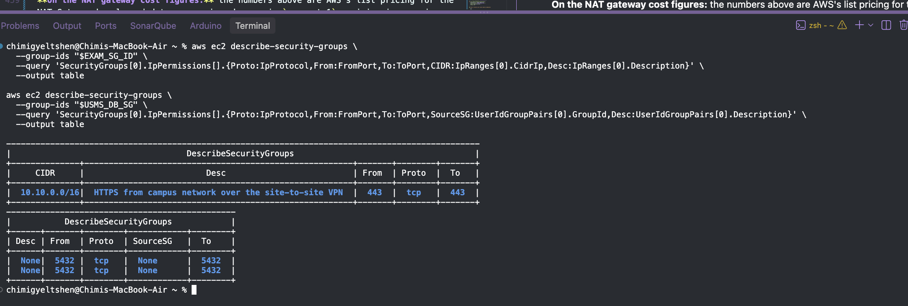

`usms-exam-sg` should show one ingress rule, tcp/443, from `10.10.0.0/16`. `usms-db-sg` should now show its original app-tier rule *plus* a new tcp/5432 rule sourced from `$EXAM_SG_ID`.

**On the NAT gateway cost figures:** the numbers above are AWS's list pricing for the NAT Gateway hourly and data-processing charges in `us-east-1`; pricing is a moving target and varies by region, so confirm current numbers in the AWS Pricing Calculator or your Cost Explorer before using them in a real budget conversation.

---

## Exercise 5 (Integration) — Complete the Second Availability Zone

**Goal:** `usms-private-subnet-b`, CIDR `10.0.4.0/24`, in `us-east-1b`, created *while holding the assumed developer role*, tagged consistently, associated with `usms-private-rt`, with `usms-private-nacl` applied — then identity restored, `configs/lab-02.env` regenerated, and `verify-lab-02.sh` re-run.

### Step 1 — Assume the developer role (Step 3's sequence)

```bash
echo "== identity before assuming the role =="
aws sts get-caller-identity --no-cli-pager

ROLE_ARN="arn:aws:iam::${USMS_ACCOUNT_ID}:role/${USMS_ROLE_DEVELOPER}"

aws sts assume-role \
  --role-arn "$ROLE_ARN" \
  --role-session-name "lab02-exercise5-subnet-b" \
  --profile usms-dev \
  > outputs/lab-02-ex5-assumed-role.json

chmod 600 outputs/lab-02-ex5-assumed-role.json

export AWS_ACCESS_KEY_ID=$(jq -r '.Credentials.AccessKeyId'     outputs/lab-02-ex5-assumed-role.json)
export AWS_SECRET_ACCESS_KEY=$(jq -r '.Credentials.SecretAccessKey' outputs/lab-02-ex5-assumed-role.json)
export AWS_SESSION_TOKEN=$(jq -r '.Credentials.SessionToken'    outputs/lab-02-ex5-assumed-role.json)

echo "== identity while the role is assumed =="
aws sts get-caller-identity --no-cli-pager
```
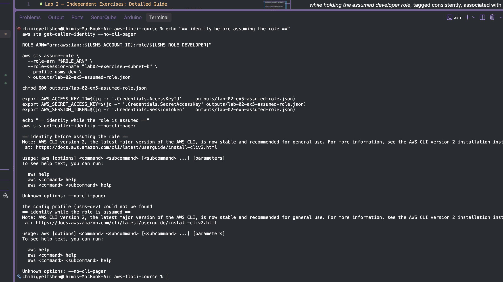

Keep both `get-caller-identity` outputs — they're the evidence the exercise asks for.

### Step 2 — Create the subnet (Step 9, changed AZ/CIDR/name)

```bash
PRIVATE_SUBNET_B_ID=$(aws ec2 create-subnet \
  --vpc-id "$USMS_VPC_ID" \
  --cidr-block 10.0.4.0/24 \
  --availability-zone "${AWS_REGION_COURSE}b" \
  --tag-specifications 'ResourceType=subnet,Tags=[{Key=Name,Value=usms-private-subnet-b},{Key=Project,Value=USMS},{Key=Tier,Value=private},{Key=AZ,Value=b}]' \
  --query 'Subnet.SubnetId' \
  --output text)

echo "PRIVATE_SUBNET_B_ID = $PRIVATE_SUBNET_B_ID"
```

### Step 3 — Associate with the private route table

```bash
PRIVATE_ASSOC_B_ID=$(aws ec2 associate-route-table \
  --route-table-id "$USMS_PRIVATE_RT" \
  --subnet-id "$PRIVATE_SUBNET_B_ID" \
  --query 'AssociationId' \
  --output text)

echo "PRIVATE_ASSOC_B_ID = $PRIVATE_ASSOC_B_ID"
```

### Step 4 — Apply `usms-private-nacl` (Step 18's pattern, reused)

A NACL can be associated with more than one subnet, so this is the same "find the current (default) association, then replace it" pattern as Step 18 — just aimed at subnet B:

```bash
NACL_ASSOC_B_ID=$(aws ec2 describe-network-acls \
  --filters "Name=association.subnet-id,Values=$PRIVATE_SUBNET_B_ID" \
  --query 'NetworkAcls[0].Associations[?SubnetId==`'"$PRIVATE_SUBNET_B_ID"'`].NetworkAclAssociationId | [0]' \
  --output text)

echo "current association: $NACL_ASSOC_B_ID"

aws ec2 replace-network-acl-association \
  --association-id "$NACL_ASSOC_B_ID" \
  --network-acl-id "$USMS_PRIVATE_NACL" \
  --query 'NewAssociationId' \
  --output text
```

### Step 5 — Restore your normal identity immediately

```bash
unset AWS_ACCESS_KEY_ID AWS_SECRET_ACCESS_KEY AWS_SESSION_TOKEN

echo "== identity after restoring =="
aws sts get-caller-identity --no-cli-pager
```

**Why restore immediately:** the assumed-role session carries broader, time-boxed developer permissions than your normal identity, so every command run afterward under those temporary credentials by mistake would be harder to audit back to a specific person — restoring right away keeps the blast radius of the elevated session to exactly the commands that needed it.

### Step 6 — Regenerate `configs/lab-02.env`

Re-run whatever generation step Step 24 used, now that a new resource ID exists to capture, then check it:

```bash
source configs/lab-02.env  # after regenerating, confirm it loads

echo "private-b = $USMS_PRIVATE_SUBNET_B"

grep -n 'export .*=$\|None' configs/lab-02.env || echo "all values populated"
```

The only acceptable remaining `None`/empty value is `USMS_PUBLIC_SUBNET_B`, and only if you didn't do Step 11's "Your turn" task in the base lab.

### Step 7 — Verify the expected outcome

```bash
aws ec2 describe-subnets \
  --filters "Name=vpc-id,Values=$USMS_VPC_ID" \
  --query 'sort_by(Subnets, &CidrBlock)[].{Name:Tags[?Key==`Name`]|[0].Value,CIDR:CidrBlock,AZ:AvailabilityZone,Public:MapPublicIpOnLaunch}' \
  --output table

./scripts/utilities/verify-lab-02.sh
```

You should now see four subnets across two AZs (`us-east-1a` and `us-east-1b`), two of them private, both riding `usms-private-rt` and `usms-private-nacl`. Capture the script's `PASS=`/`FAIL=` line as your evidence, and commit `configs/lab-02.env` once it's fully populated — Lab 3's Exercise 5 depends on `USMS_PRIVATE_SUBNET_B` existing unchanged.

```bash
git add configs/lab-02.env
git commit -m "lab-02 exercise-5: add usms-private-subnet-b in us-east-1b"
git push
```