# Lab 2: Virtual Private Cloud and Networking

## Aim / Objective

The aim of this lab is to create a Virtual Private Cloud (VPC) with public and private subnets, configure security groups and network ACLs, and set up internet access for the private subnet using a NAT gateway. This provides a secure and isolated network environment for deploying applications.

## Introduction

In this lab, a VPC is built with the following components:

- A public subnet in the `us-east-1a` availability zone
- A private subnet in the `us-east-1a` availability zone
- An internet gateway for the public subnet
- A NAT gateway for the private subnet
- Security groups for the application and database tiers

## Use Cases

### 1. Multi-Tier Enterprise E-Commerce Platform Architecture

**Scenario:** A scalable web application (e.g., an e-commerce platform) hosting a Next.js/React front end, a web/API server, a PostgreSQL database, and media storage.

**VPC Implementation:**
- **Public Subnet** — Houses the Application Load Balancer (ALB) and public-facing web servers with direct Internet Gateway access.
- **Private Subnet** — Houses the application backend services and database servers (e.g., Amazon RDS/PostgreSQL) with no public IP assignment.
- **NAT Gateway** — Enables private database instances to securely fetch software updates, OS security patches, and third-party API dependencies without direct public inbound access.
- **S3 Gateway Endpoint** — Allows application instances and database backups to communicate directly with Amazon S3 over the internal AWS network, reducing latency and eliminating data transfer costs over the public internet.

### 2. Secure Microservices & Database Isolation

**Scenario:** A fintech or healthcare platform handling sensitive user data with compliance requirements.

**VPC Implementation:**
- Strict network perimeter control using stateful Security Groups that reference other Security Groups (e.g., allowing database traffic only from instances attached to the Application Security Group).
- Layered defense with stateless Network ACLs (NACLs) acting as a subnet-boundary firewall to block specific malicious traffic patterns or untrusted IP ranges.

### 3. Private Cloud Data Lake & Asset Storage Pipeline

**Scenario:** Processing sensitive analytics files, raw backups, or user uploads within S3 buckets.

**VPC Implementation:**
- Routing all S3 traffic inside the VPC via an S3 VPC Gateway Endpoint.
- Ensuring data transfers remain entirely on AWS internal network infrastructure, improving security compliance and eliminating internet egress bandwidth charges.

## System Architecture

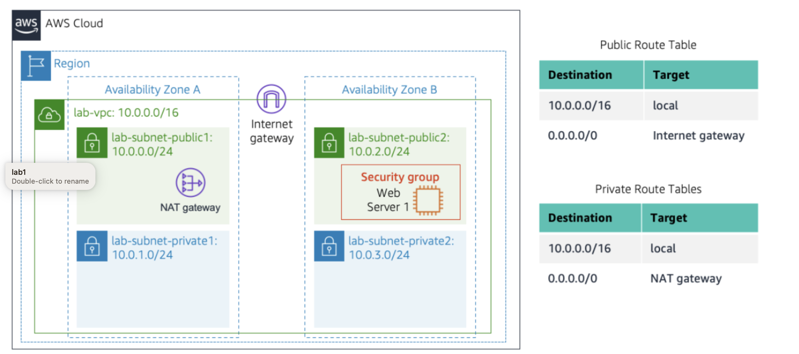

## Step-by-Step Implementation

### Step 1 — Resume the Environment

```bash
cd ~/aws-floci-course
./scripts/setup/floci-up.sh
./scripts/utilities/floci-storage-check.sh
```

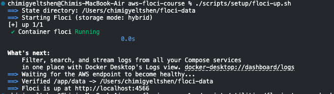
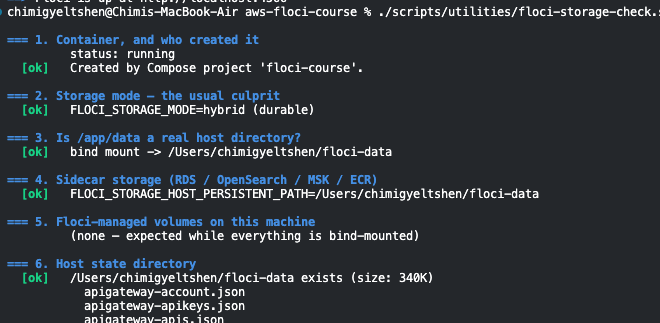

Verify:

```bash
docker rm -f floci
./scripts/setup/floci-up.sh
```

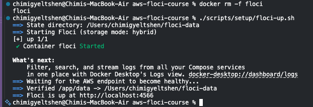

### Step 2 — Load the Previous Lab's Environment and Confirm Identity

```bash
source configs/course.env
source configs/lab-01.env

./scripts/utilities/whoami.sh

echo "developer role : $USMS_ROLE_DEVELOPER"
echo "developer user : $USMS_DEV_USER"
echo "account        : $USMS_ACCOUNT_ID"
```

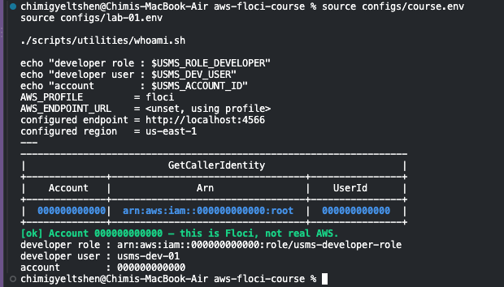

### Step 3 — Assume the Developer Role and Create the VPC

**Part 1 — Read the policy before relying on it**

```bash
POLICY_ARN="arn:aws:iam::${USMS_ACCOUNT_ID}:policy/USMSDeveloperBase"

DEFAULT_VERSION=$(aws iam get-policy \
  --policy-arn "$POLICY_ARN" \
  --query 'Policy.DefaultVersionId' \
  --output text)

echo "default version: $DEFAULT_VERSION"

aws iam get-policy-version \
  --policy-arn "$POLICY_ARN" \
  --version-id "$DEFAULT_VERSION" \
  --query 'PolicyVersion.Document' \
  --output json | tee outputs/lab-02-developer-base.json
```

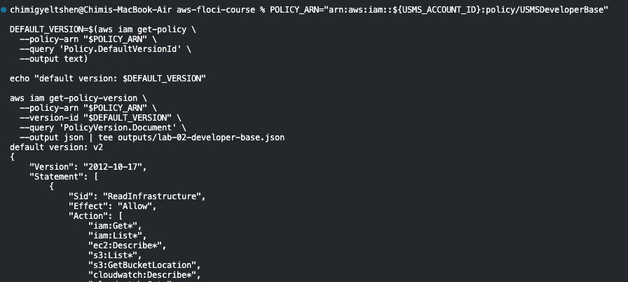

**Part 2 — Assume the role**

```bash
ROLE_ARN="arn:aws:iam::${USMS_ACCOUNT_ID}:role/${USMS_ROLE_DEVELOPER}"

aws sts assume-role \
  --role-arn "$ROLE_ARN" \
  --role-session-name "lab02-vpc-build" \
  --profile usms-dev \
  > outputs/lab-02-assumed-role.json

chmod 600 outputs/lab-02-assumed-role.json

export AWS_ACCESS_KEY_ID=$(jq -r '.Credentials.AccessKeyId'     outputs/lab-02-assumed-role.json)
export AWS_SECRET_ACCESS_KEY=$(jq -r '.Credentials.SecretAccessKey' outputs/lab-02-assumed-role.json)
export AWS_SESSION_TOKEN=$(jq -r '.Credentials.SessionToken'    outputs/lab-02-assumed-role.json)

aws sts get-caller-identity --no-cli-pager
```

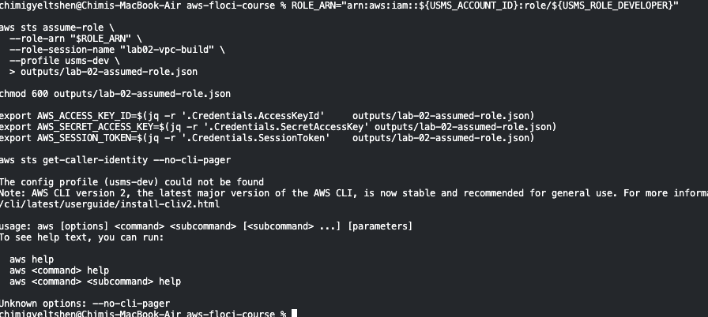

**Part 3 — Create the VPC**

```bash
VPC_ID=$(aws ec2 create-vpc \
  --cidr-block 10.0.0.0/16 \
  --tag-specifications 'ResourceType=vpc,Tags=[{Key=Name,Value=usms-vpc},{Key=Project,Value=USMS},{Key=Tier,Value=network},{Key=ManagedBy,Value=aws-cli}]' \
  --query 'Vpc.VpcId' \
  --output text)

echo "VPC_ID = $VPC_ID"
```

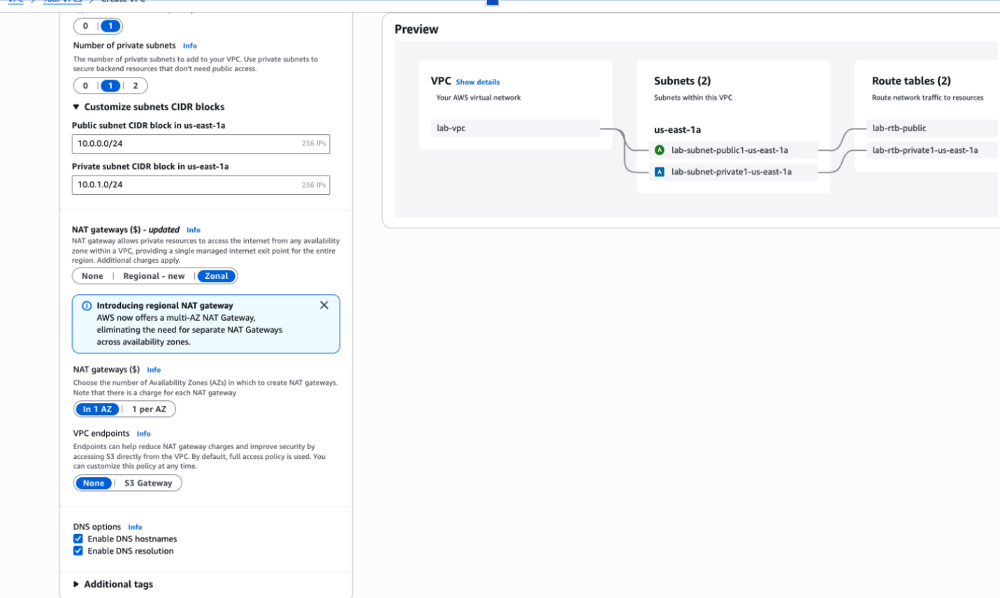
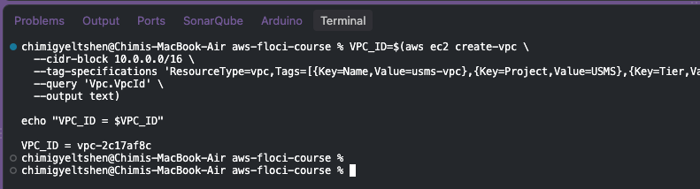

### Step 4 — Restore Normal Identity

```bash
unset AWS_ACCESS_KEY_ID AWS_SECRET_ACCESS_KEY AWS_SESSION_TOKEN

./scripts/utilities/whoami.sh

aws ec2 describe-vpcs \
  --vpc-ids "$VPC_ID" \
  --query 'Vpcs[0].{Id:VpcId,CIDR:CidrBlock,State:State,Default:IsDefault,Tenancy:InstanceTenancy}' \
  --output table
```

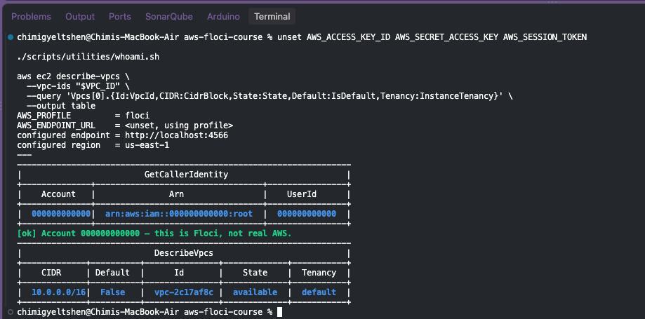

### Step 5 — Enable DNS Support and DNS Hostnames

```bash
aws ec2 modify-vpc-attribute --vpc-id "$VPC_ID" --enable-dns-support   '{"Value":true}'
aws ec2 modify-vpc-attribute --vpc-id "$VPC_ID" --enable-dns-hostnames '{"Value":true}'
```

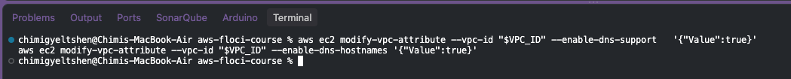

Verify:

```bash
for attr in enableDnsSupport enableDnsHostnames; do
  printf "%-20s " "$attr"
  aws ec2 describe-vpc-attribute \
    --vpc-id "$VPC_ID" \
    --attribute "$attr" \
    --query "${attr^}.Value" \
    --output text
done
```

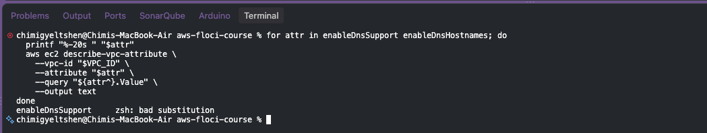

### Step 6 — Create and Attach the Internet Gateway

```bash
IGW_ID=$(aws ec2 create-internet-gateway \
  --tag-specifications 'ResourceType=internet-gateway,Tags=[{Key=Name,Value=usms-igw},{Key=Project,Value=USMS}]' \
  --query 'InternetGateway.InternetGatewayId' \
  --output text)

echo "IGW_ID = $IGW_ID"

aws ec2 attach-internet-gateway \
  --internet-gateway-id "$IGW_ID" \
  --vpc-id "$VPC_ID"
```

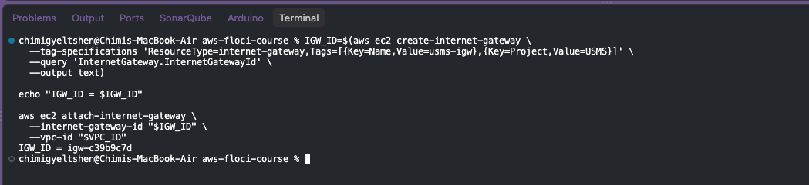

Verify:

```bash
aws ec2 describe-internet-gateways \
  --internet-gateway-ids "$IGW_ID" \
  --query 'InternetGateways[0].{Id:InternetGatewayId,Attachments:Attachments}' \
  --output json
```

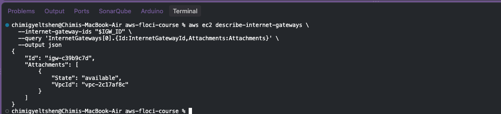

### Step 7 — Create the Public Subnet in us-east-1a

```bash
PUBLIC_SUBNET_A_ID=$(aws ec2 create-subnet \
  --vpc-id "$VPC_ID" \
  --cidr-block 10.0.1.0/24 \
  --availability-zone "${AWS_REGION_COURSE}a" \
  --tag-specifications 'ResourceType=subnet,Tags=[{Key=Name,Value=usms-public-subnet-a},{Key=Project,Value=USMS},{Key=Tier,Value=public},{Key=AZ,Value=a}]' \
  --query 'Subnet.SubnetId' \
  --output text)

echo "PUBLIC_SUBNET_A_ID = $PUBLIC_SUBNET_A_ID"
```

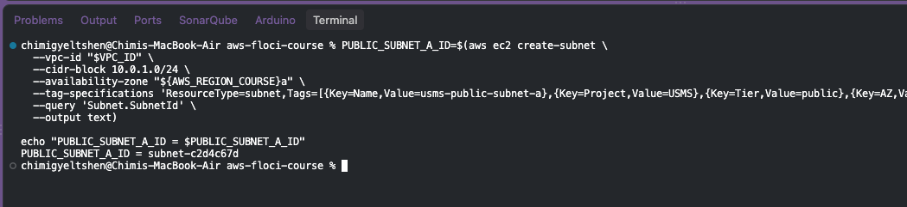
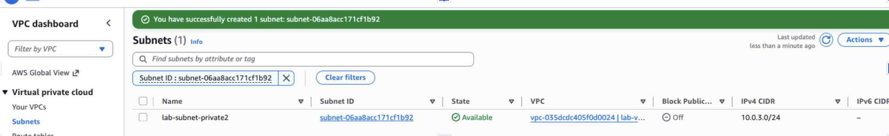

Verify:

```bash
aws ec2 describe-subnets \
  --subnet-ids "$PUBLIC_SUBNET_A_ID" \
  --query 'Subnets[0].{Id:SubnetId,CIDR:CidrBlock,AZ:AvailabilityZone,Free:AvailableIpAddressCount,PublicIP:MapPublicIpOnLaunch,State:State}' \
  --output table
```

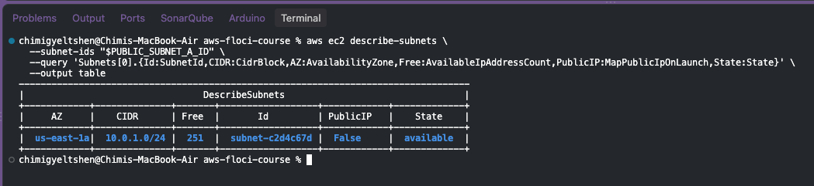

### Step 8 — Enable Auto-Assign Public IPv4 for the Public Subnet

```bash
aws ec2 modify-subnet-attribute \
  --subnet-id "$PUBLIC_SUBNET_A_ID" \
  --map-public-ip-on-launch

aws ec2 describe-subnets \
  --subnet-ids "$PUBLIC_SUBNET_A_ID" \
  --query 'Subnets[0].MapPublicIpOnLaunch' \
  --output text
```

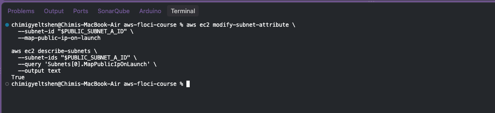

### Step 9 — Create the Private Subnet in us-east-1a

```bash
PRIVATE_SUBNET_A_ID=$(aws ec2 create-subnet \
  --vpc-id "$VPC_ID" \
  --cidr-block 10.0.3.0/24 \
  --availability-zone "${AWS_REGION_COURSE}a" \
  --tag-specifications 'ResourceType=subnet,Tags=[{Key=Name,Value=usms-private-subnet-a},{Key=Project,Value=USMS},{Key=Tier,Value=private},{Key=AZ,Value=a}]' \
  --query 'Subnet.SubnetId' \
  --output text)

echo "PRIVATE_SUBNET_A_ID = $PRIVATE_SUBNET_A_ID"
```

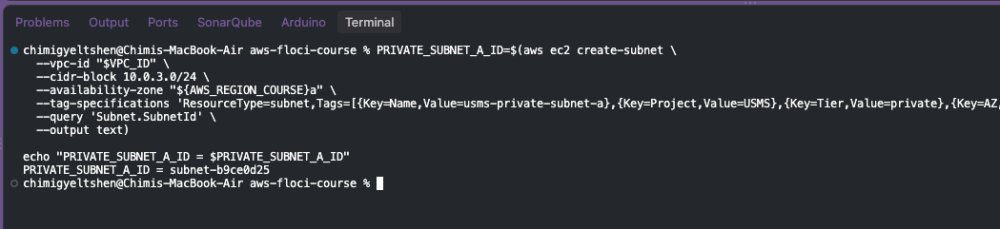
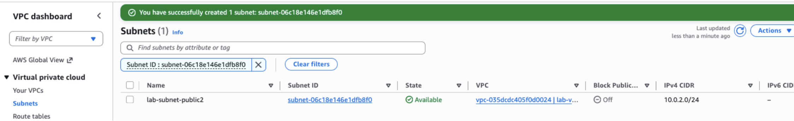

Verify:

```bash
aws ec2 describe-subnets \
  --filters "Name=vpc-id,Values=$VPC_ID" \
  --query 'sort_by(Subnets, &CidrBlock)[].{Name:Tags[?Key==`Name`]|[0].Value,CIDR:CidrBlock,AZ:AvailabilityZone,Public:MapPublicIpOnLaunch}' \
  --output table
```

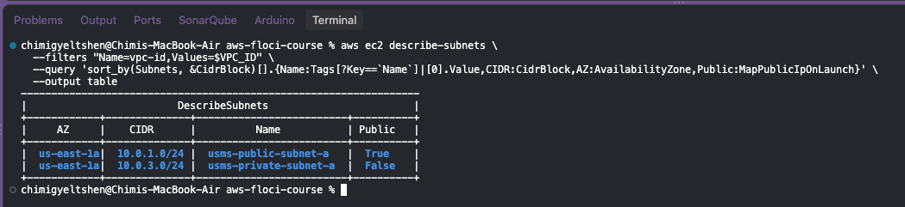

### Step 10 — Create the Public Route Table and Default Route

```bash
PUBLIC_RT_ID=$(aws ec2 create-route-table \
  --vpc-id "$VPC_ID" \
  --tag-specifications 'ResourceType=route-table,Tags=[{Key=Name,Value=usms-public-rt},{Key=Project,Value=USMS},{Key=Tier,Value=public}]' \
  --query 'RouteTable.RouteTableId' \
  --output text)

echo "PUBLIC_RT_ID = $PUBLIC_RT_ID"

aws ec2 create-route \
  --route-table-id "$PUBLIC_RT_ID" \
  --destination-cidr-block 0.0.0.0/0 \
  --gateway-id "$IGW_ID"
```

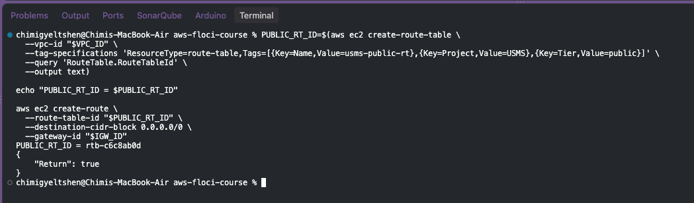

Verify:

```bash
aws ec2 describe-route-tables \
  --route-table-ids "$PUBLIC_RT_ID" \
  --query 'RouteTables[0].Routes[].{Destination:DestinationCidrBlock,Target:GatewayId,State:State}' \
  --output table
```

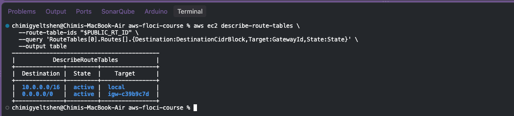

### Step 11 — Associate the Public Subnet with the Public Route Table

```bash
PUBLIC_ASSOC_A_ID=$(aws ec2 associate-route-table \
  --route-table-id "$PUBLIC_RT_ID" \
  --subnet-id "$PUBLIC_SUBNET_A_ID" \
  --query 'AssociationId' \
  --output text)

echo "PUBLIC_ASSOC_A_ID = $PUBLIC_ASSOC_A_ID"
```

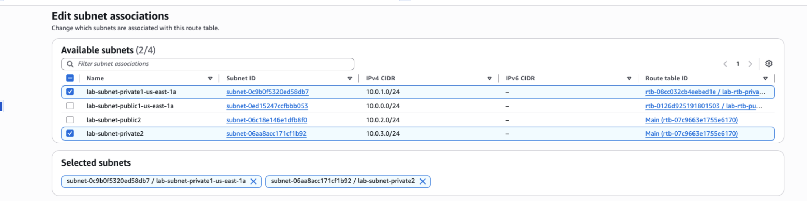
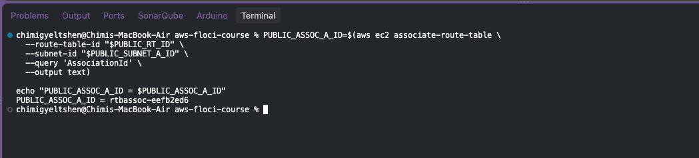

### Step 12 — Create the Private Route Table and Associate the Private Subnet

```bash
PRIVATE_RT_ID=$(aws ec2 create-route-table \
  --vpc-id "$VPC_ID" \
  --tag-specifications 'ResourceType=route-table,Tags=[{Key=Name,Value=usms-private-rt},{Key=Project,Value=USMS},{Key=Tier,Value=private}]' \
  --query 'RouteTable.RouteTableId' \
  --output text)

echo "PRIVATE_RT_ID = $PRIVATE_RT_ID"

PRIVATE_ASSOC_A_ID=$(aws ec2 associate-route-table \
  --route-table-id "$PRIVATE_RT_ID" \
  --subnet-id "$PRIVATE_SUBNET_A_ID" \
  --query 'AssociationId' \
  --output text)

echo "PRIVATE_ASSOC_A_ID = $PRIVATE_ASSOC_A_ID"
```

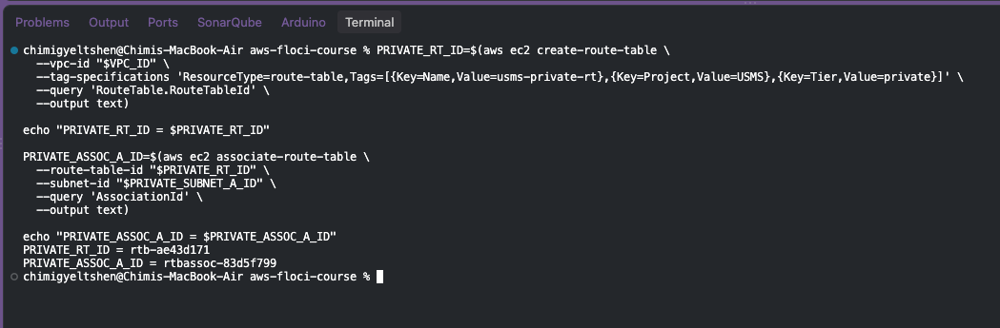

### Step 13 — Prove the Two Subnets Are Actually Different

```bash
for s in "$PUBLIC_SUBNET_A_ID" "$PRIVATE_SUBNET_A_ID"; do
  name=$(aws ec2 describe-subnets --subnet-ids "$s" \
          --query 'Subnets[0].Tags[?Key==`Name`]|[0].Value' --output text)

  rt=$(aws ec2 describe-route-tables \
        --filters "Name=association.subnet-id,Values=$s" \
        --query 'RouteTables[0].RouteTableId' --output text)

  igw=$(aws ec2 describe-route-tables --route-table-ids "$rt" \
        --query 'RouteTables[0].Routes[?DestinationCidrBlock==`0.0.0.0/0`].GatewayId | [0]' \
        --output text)

  printf '%-24s subnet=%-26s rt=%-24s default-route-target=%s\n' \
         "$name" "$s" "$rt" "$igw"
done
```

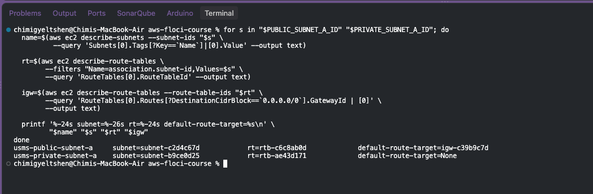

### Step 14 — Create the Application Security Group

```bash
APP_SG_ID=$(aws ec2 create-security-group \
  --group-name usms-app-sg \
  --description "USMS application tier: HTTP/HTTPS from the internet, SSH from inside the VPC" \
  --vpc-id "$VPC_ID" \
  --tag-specifications 'ResourceType=security-group,Tags=[{Key=Name,Value=usms-app-sg},{Key=Project,Value=USMS},{Key=Tier,Value=app}]' \
  --query 'GroupId' \
  --output text)

echo "APP_SG_ID = $APP_SG_ID"

aws ec2 authorize-security-group-ingress \
  --group-id "$APP_SG_ID" \
  --protocol tcp --port 80 --cidr 0.0.0.0/0 \
  --query 'SecurityGroupRules[0].SecurityGroupRuleId' --output text

aws ec2 authorize-security-group-ingress \
  --group-id "$APP_SG_ID" \
  --protocol tcp --port 22 --cidr 10.0.0.0/16 \
  --query 'SecurityGroupRules[0].SecurityGroupRuleId' --output text
```

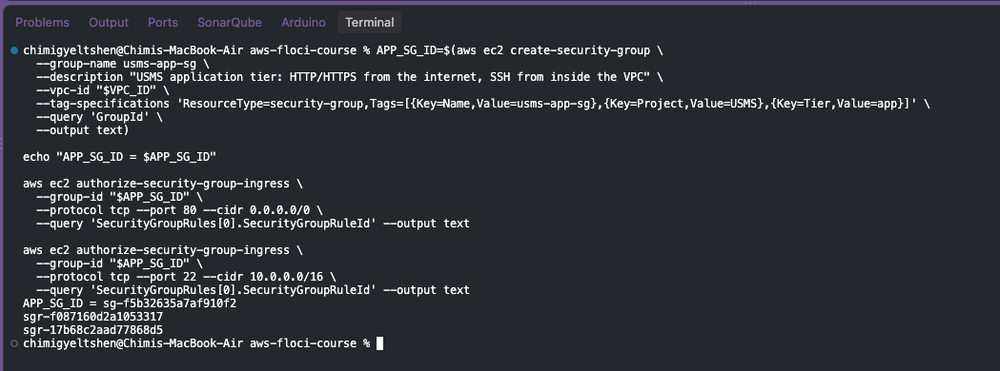
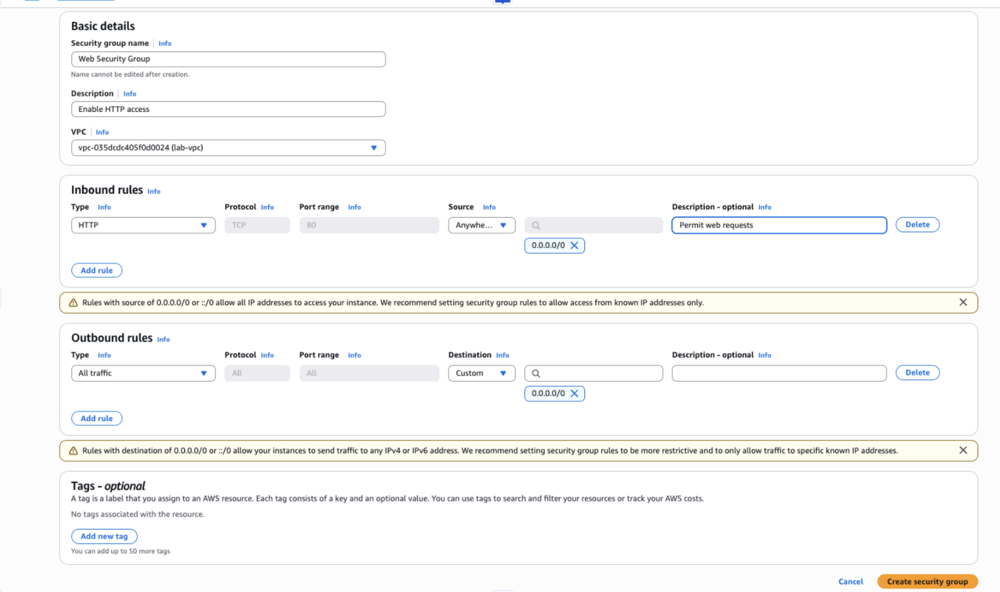
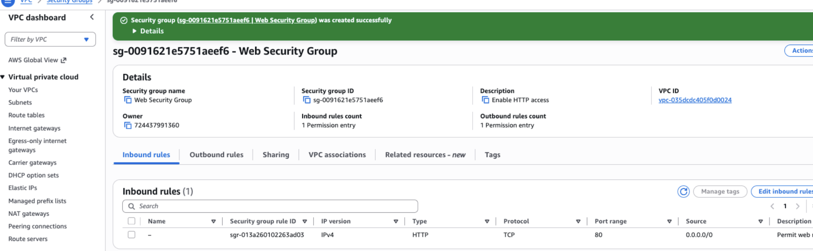

### Step 15 — Create the Database Security Group, Sourced from the App Group

**Part 1 — Create the group**

```bash
DB_SG_ID=$(aws ec2 create-security-group \
  --group-name usms-db-sg \
  --description "USMS data tier: PostgreSQL from the application tier only" \
  --vpc-id "$VPC_ID" \
  --tag-specifications 'ResourceType=security-group,Tags=[{Key=Name,Value=usms-db-sg},{Key=Project,Value=USMS},{Key=Tier,Value=data}]' \
  --query 'GroupId' \
  --output text)

echo "DB_SG_ID = $DB_SG_ID"
```

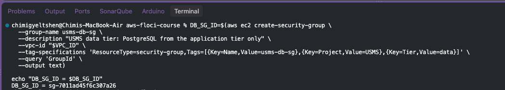

**Part 2 — Write the rule as a JSON document**

```bash
cd policies
touch usms-db-sg-ingress.json
```

**Part 3 — Apply it**

```bash
aws ec2 authorize-security-group-ingress \
  --group-id "$DB_SG_ID" \
  --ip-permissions file://policies/usms-db-sg-ingress.json \
  --query 'SecurityGroupRules[].SecurityGroupRuleId' \
  --output text
```

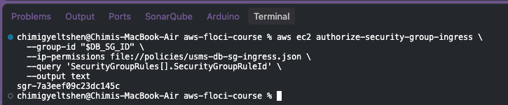

Verify:

```bash
aws ec2 describe-security-groups \
  --group-ids "$DB_SG_ID" \
  --query 'SecurityGroups[0].IpPermissions[].{Proto:IpProtocol,From:FromPort,To:ToPort,SourceSG:UserIdGroupPairs[0].GroupId,SourceCIDR:IpRanges[0].CidrIp}' \
  --output table
```

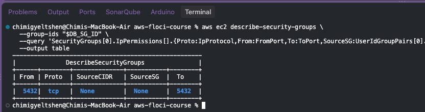

### Step 16 — Read the Groups Back and Understand "Stateful"

```bash
aws ec2 describe-security-groups \
  --filters "Name=vpc-id,Values=$VPC_ID" \
  --query 'SecurityGroups[].{Name:GroupName,Id:GroupId,Inbound:length(IpPermissions),Outbound:length(IpPermissionsEgress)}' \
  --output table
```

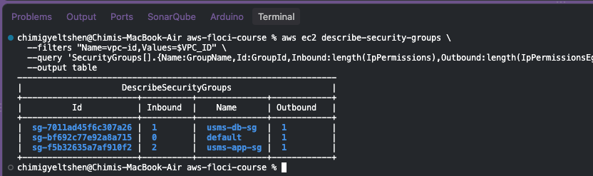

### Step 17 — Explore the Default Network ACL, Then Create a Private One

**Part 1 — Read the default NACL**

```bash
aws ec2 describe-network-acls \
  --filters "Name=vpc-id,Values=$VPC_ID" "Name=default,Values=true" \
  --query 'NetworkAcls[0].Entries[].{Rule:RuleNumber,Egress:Egress,Proto:Protocol,Action:RuleAction,CIDR:CidrBlock}' \
  --output table
```

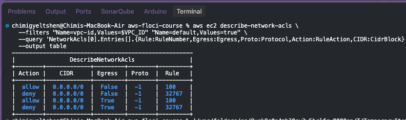

**Part 2 — Create the private NACL**

```bash
PRIVATE_NACL_ID=$(aws ec2 create-network-acl \
  --vpc-id "$VPC_ID" \
  --tag-specifications 'ResourceType=network-acl,Tags=[{Key=Name,Value=usms-private-nacl},{Key=Project,Value=USMS},{Key=Tier,Value=private}]' \
  --query 'NetworkAcl.NetworkAclId' \
  --output text)

echo "PRIVATE_NACL_ID = $PRIVATE_NACL_ID"
```

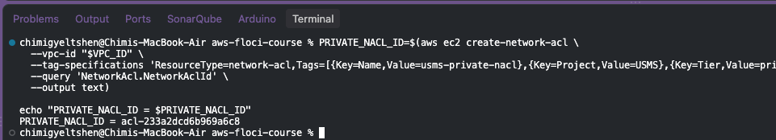

**Part 3 — Write the rules**

```bash
aws ec2 create-network-acl-entry \
  --network-acl-id "$PRIVATE_NACL_ID" \
  --rule-number 100 --protocol tcp --rule-action allow \
  --ingress --cidr-block 10.0.0.0/16 \
  --port-range From=5432,To=5432

aws ec2 create-network-acl-entry \
  --network-acl-id "$PRIVATE_NACL_ID" \
  --rule-number 110 --protocol tcp --rule-action allow \
  --ingress --cidr-block 0.0.0.0/0 \
  --port-range From=1024,To=65535

aws ec2 create-network-acl-entry \
  --network-acl-id "$PRIVATE_NACL_ID" \
  --rule-number 100 --protocol tcp --rule-action allow \
  --egress --cidr-block 10.0.0.0/16 \
  --port-range From=1024,To=65535

aws ec2 create-network-acl-entry \
  --network-acl-id "$PRIVATE_NACL_ID" \
  --rule-number 110 --protocol tcp --rule-action allow \
  --egress --cidr-block 0.0.0.0/0 \
  --port-range From=443,To=443
```

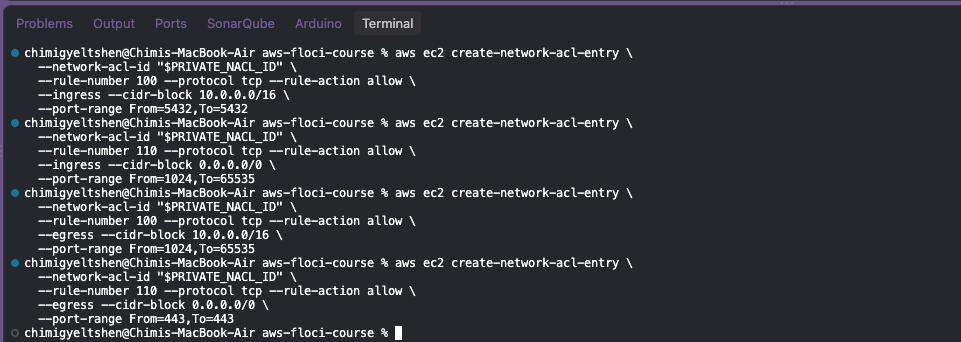

Verify:

```bash
aws ec2 describe-network-acls \
  --network-acl-ids "$PRIVATE_NACL_ID" \
  --query 'NetworkAcls[0].Entries[].{Rule:RuleNumber,Egress:Egress,Action:RuleAction,CIDR:CidrBlock,Ports:PortRange}' \
  --output json
```

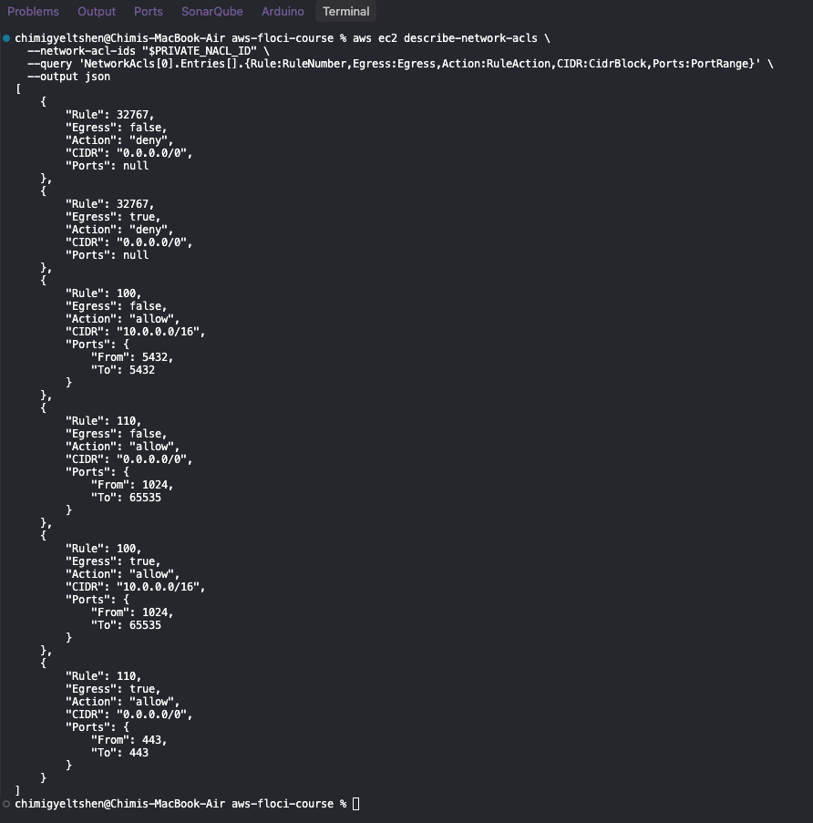

### Step 18 — Associate the Private NACL with the Private Subnet

```bash
NACL_ASSOC_ID=$(aws ec2 describe-network-acls \
  --filters "Name=association.subnet-id,Values=$PRIVATE_SUBNET_A_ID" \
  --query 'NetworkAcls[0].Associations[?SubnetId==`'"$PRIVATE_SUBNET_A_ID"'`].NetworkAclAssociationId | [0]' \
  --output text)

echo "current association: $NACL_ASSOC_ID"

aws ec2 replace-network-acl-association \
  --association-id "$NACL_ASSOC_ID" \
  --network-acl-id "$PRIVATE_NACL_ID" \
  --query 'NewAssociationId' \
  --output text
```

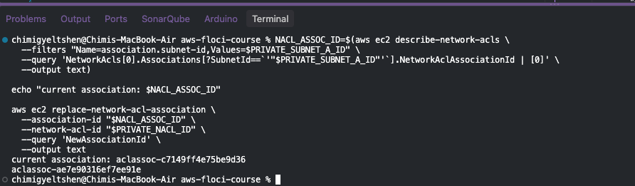

Verify:

```bash
aws ec2 describe-network-acls \
  --filters "Name=association.subnet-id,Values=$PRIVATE_SUBNET_A_ID" \
  --query 'NetworkAcls[0].{Id:NetworkAclId,Default:IsDefault,Name:Tags[?Key==`Name`]|[0].Value}' \
  --output table
```

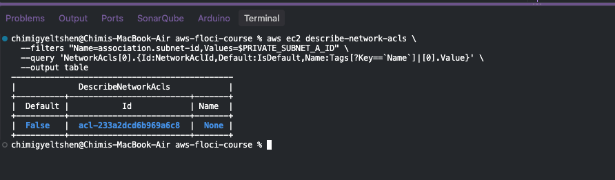

### Step 19 — Give the Private Subnet Outbound Internet Access with a NAT Gateway

**Part 1 — Allocate an Elastic IP**

```bash
NAT_EIP_ALLOC_ID=$(aws ec2 allocate-address \
  --domain vpc \
  --tag-specifications 'ResourceType=elastic-ip,Tags=[{Key=Name,Value=usms-nat-eip},{Key=Project,Value=USMS}]' \
  --query 'AllocationId' \
  --output text)

echo "NAT_EIP_ALLOC_ID = $NAT_EIP_ALLOC_ID"

aws ec2 describe-addresses \
  --allocation-ids "$NAT_EIP_ALLOC_ID" \
  --query 'Addresses[0].{Alloc:AllocationId,IP:PublicIp,Domain:Domain}' \
  --output table
```

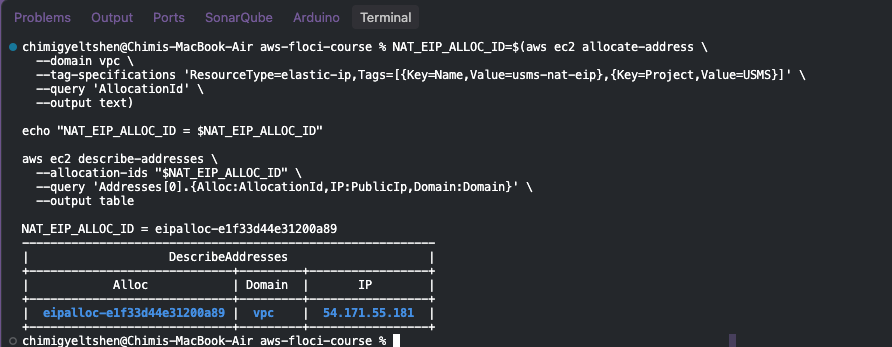

**Part 2 — Create the NAT gateway in the public subnet**

```bash
NAT_GW_ID=$(aws ec2 create-nat-gateway \
  --subnet-id "$PUBLIC_SUBNET_A_ID" \
  --allocation-id "$NAT_EIP_ALLOC_ID" \
  --tag-specifications 'ResourceType=natgateway,Tags=[{Key=Name,Value=usms-nat},{Key=Project,Value=USMS}]' \
  --query 'NatGateway.NatGatewayId' \
  --output text)

echo "NAT_GW_ID = $NAT_GW_ID"
```

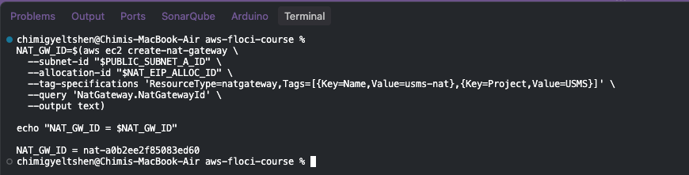

**Part 3 — Wait for it to become available**

```bash
aws ec2 wait nat-gateway-available --nat-gateway-ids "$NAT_GW_ID" && echo "NAT gateway available"
```

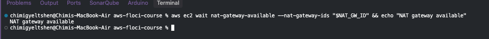

### Step 20 — Point the Private Route Table at the NAT Gateway

```bash
aws ec2 create-route \
  --route-table-id "$PRIVATE_RT_ID" \
  --destination-cidr-block 0.0.0.0/0 \
  --nat-gateway-id "$NAT_GW_ID"

aws ec2 describe-route-tables \
  --route-table-ids "$PRIVATE_RT_ID" \
  --query 'RouteTables[0].Routes[].{Destination:DestinationCidrBlock,Gateway:GatewayId,NAT:NatGatewayId,State:State}' \
  --output table
```

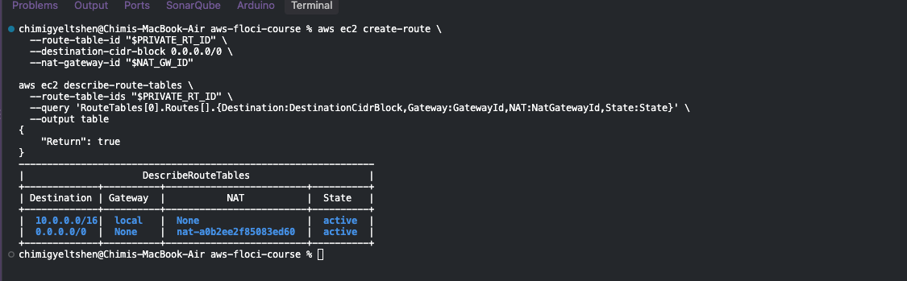

### Step 21 — Create the S3 Gateway Endpoint

```bash
S3_ENDPOINT_ID=$(aws ec2 create-vpc-endpoint \
  --vpc-id "$VPC_ID" \
  --service-name "com.amazonaws.${AWS_REGION_COURSE}.s3" \
  --vpc-endpoint-type Gateway \
  --route-table-ids "$PRIVATE_RT_ID" \
  --tag-specifications 'ResourceType=vpc-endpoint,Tags=[{Key=Name,Value=usms-s3-endpoint},{Key=Project,Value=USMS}]' \
  --query 'VpcEndpoint.VpcEndpointId' \
  --output text)

echo "S3_ENDPOINT_ID = $S3_ENDPOINT_ID"
```

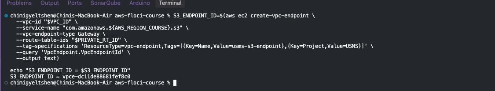

Verify:

```bash
aws ec2 describe-vpc-endpoints \
  --vpc-endpoint-ids "$S3_ENDPOINT_ID" \
  --query 'VpcEndpoints[0].{Id:VpcEndpointId,Service:ServiceName,Type:VpcEndpointType,State:State,RouteTables:RouteTableIds}' \
  --output json

aws ec2 describe-route-tables \
  --route-table-ids "$PRIVATE_RT_ID" \
  --query 'RouteTables[0].Routes[].{Destination:DestinationCidrBlock,PrefixList:DestinationPrefixListId,Target:GatewayId,NAT:NatGatewayId}' \
  --output table
```

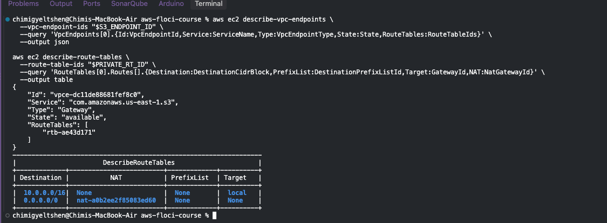

### Step 22 — Audit Tags

```bash
echo "== Resources tagged Project=USMS in this VPC =="
aws ec2 describe-tags \
  --filters "Name=tag:Project,Values=USMS" \
  --query 'sort_by(Tags[?Key==`Name`], &Value)[].{Type:ResourceType,Name:Value,Id:ResourceId}' \
  --output table
```

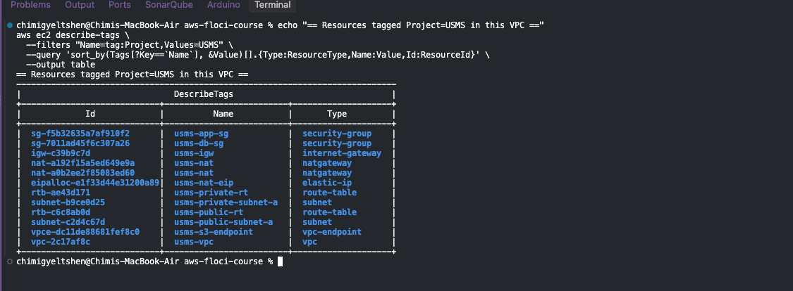

### Step 23 — Prove the Network Survives a Restart

**Part 1 — Record the state before the restart**

```bash
aws ec2 describe-vpcs --vpc-ids "$VPC_ID" \
  --query 'Vpcs[0].VpcId' --output text > outputs/lab-02-pre-restart.txt

aws ec2 describe-subnets --filters "Name=vpc-id,Values=$VPC_ID" \
  --query 'length(Subnets)' --output text >> outputs/lab-02-pre-restart.txt

aws ec2 describe-security-groups --filters "Name=vpc-id,Values=$VPC_ID" \
  --query 'length(SecurityGroups)' --output text >> outputs/lab-02-pre-restart.txt

cat outputs/lab-02-pre-restart.txt
```

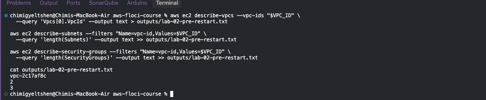

**Part 2 — Restart the environment**

```bash
./scripts/setup/floci-down.sh
sleep 3
./scripts/setup/floci-up.sh
sleep 5
```

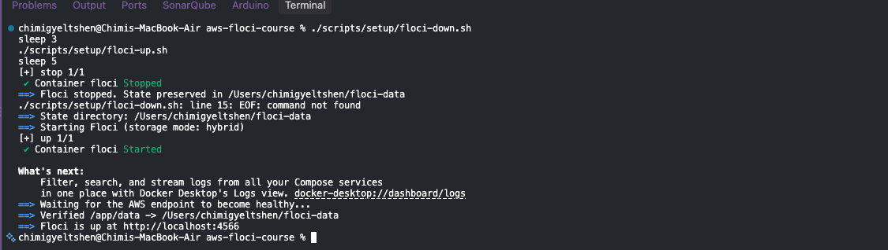

**Part 3 — Read the state back and compare**

```bash
source configs/course.env

VPC_ID=$(aws ec2 describe-vpcs \
  --filters "Name=tag:Name,Values=usms-vpc" \
  --query 'Vpcs[0].VpcId' --output text)

{
  echo "$VPC_ID"
  aws ec2 describe-subnets --filters "Name=vpc-id,Values=$VPC_ID" \
    --query 'length(Subnets)' --output text
  aws ec2 describe-security-groups --filters "Name=vpc-id,Values=$VPC_ID" \
    --query 'length(SecurityGroups)' --output text
} > outputs/lab-02-post-restart.txt

diff outputs/lab-02-pre-restart.txt outputs/lab-02-post-restart.txt \
  && echo "PERSISTENCE PROVEN: VPC id, subnet count and security group count all unchanged" \
  || echo "PERSISTENCE FAILED: run ./scripts/utilities/floci-storage-check.sh"
```

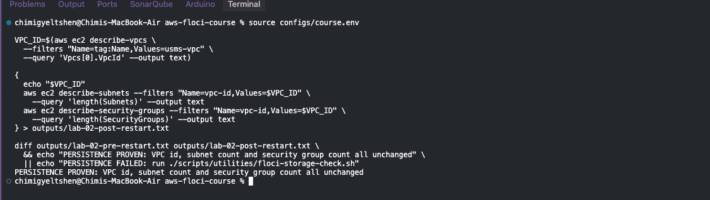

### Step 24 — Write `configs/lab-02.env`

```bash
cd configs
touch lab-02.env
```

```bash
grep -n 'export .*=$\|None' configs/lab-02.env || echo "all values populated"
```

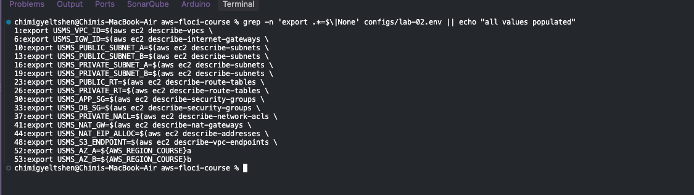

Confirm the file loads cleanly:

```bash
source configs/lab-02.env
echo "vpc=$USMS_VPC_ID  public-a=$USMS_PUBLIC_SUBNET_A  app-sg=$USMS_APP_SG"
```

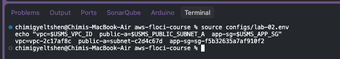

### Step 25 — Commit the Work

**Part 1 — Look before you add**

```bash
git add .
git commit -m "wip: report"
git push
```

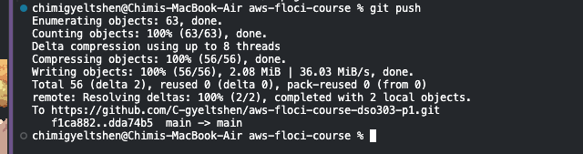

## Reflection

Through this lab on Amazon Virtual Private Cloud (VPC), I gained hands-on experience architecting an isolated, secure network infrastructure on AWS. This included CIDR IP address planning, public and private subnet division, Internet Gateways (IGW), NAT Gateways, route tables, S3 Gateway Endpoints, Security Groups, and Network Access Control Lists (NACLs).

The primary challenge I encountered was correctly configuring routing and multi-layered security controls — specifically, differentiating between stateful Security Groups (which automatically allow return traffic) and stateless NACLs (which require explicit inbound and outbound rule pairing) — to avoid unintended access blocks.

In a real-world cloud environment, I would apply this VPC architecture to isolate production databases in private subnets while exposing front-end web applications or load balancers in public subnets, with secure NAT-mediated outbound access for updates and S3 VPC Endpoints for private asset storage.

To further deepen my cloud expertise, I would like to explore multi-availability-zone high-availability designs, VPC Peering, AWS Transit Gateway, and VPC Flow Logs for network traffic auditing and threat detection.