# Lab 03 — EC2: Web and Data Tier Instances

Launch the USMS web server and database-tier instances into the Lab 02 network, attach storage and a stable public address, prove persistence across restarts, and capture a golden AMI.

## Contents

- [Part A — Environment Setup](#part-a--environment-setup)
- [Part B — Prepare the Launch](#part-b--prepare-the-launch)
- [Part C — Launch and Inspect the Web Server](#part-c--launch-and-inspect-the-web-server)
- [Part D — Networking and Storage](#part-d--networking-and-storage)
- [Part E — Database Tier](#part-e--database-tier)
- [Part F — Resilience](#part-f--resilience)
- [Part G — Golden AMI and Wrap-up](#part-g--golden-ami-and-wrap-up)
- [Verification](#verification)

---

## Part A — Environment Setup

### Step 1 — Resume the environment and load the env files

Start Floci, load the course, Lab 01 and Lab 02 configuration, and confirm the values this lab depends on.

```bash
./scripts/setup/floci-up.sh

source configs/course.env
source configs/lab-01.env
source configs/lab-02.env

./scripts/utilities/whoami.sh

printf '%-24s %s\n' \
  "public subnet a"     "$USMS_PUBLIC_SUBNET_A" \
  "private subnet a"    "$USMS_PRIVATE_SUBNET_A" \
  "app security group"  "$USMS_APP_SG" \
  "db security group"   "$USMS_DB_SG" \
  "instance profile"    "$USMS_INSTANCE_PROFILE" \
  "availability zone a" "$USMS_AZ_A"
```

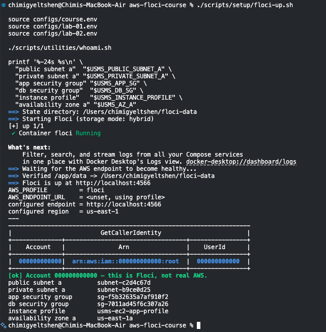

### Step 2 — Confirm Lab 02's network is intact

Verify the VPC, subnets and security groups from Lab 02 still exist before building on them.

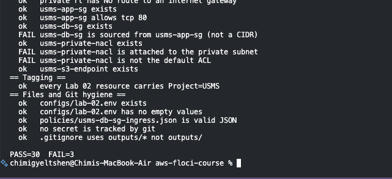

---

## Part B — Prepare the Launch

### Step 3 — Choose an AMI

**Part 1 — List the images available in this build**

```bash
aws ec2 describe-images \
  --owners amazon \
  --query 'Images[].{Id:ImageId,Name:Name,Arch:Architecture,Root:RootDeviceType}' \
  --output table
```

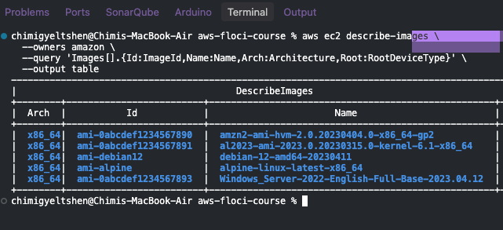

**Part 2 — Capture one**

```bash
AMI_ID=$(aws ec2 describe-images \
  --owners amazon \
  --query 'Images[0].ImageId' \
  --output text)

echo "AMI_ID = $AMI_ID"
```

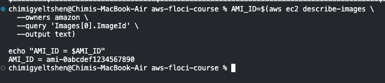

### Step 4 — Create the key pair and store the private key safely

```bash
aws ec2 create-key-pair \
  --key-name usms-app-key \
  --key-type rsa \
  --tag-specifications 'ResourceType=key-pair,Tags=[{Key=Name,Value=usms-app-key},{Key=Project,Value=USMS}]' \
  --query 'KeyMaterial' \
  --output text > outputs/usms-app-key.pem

chmod 600 outputs/usms-app-key.pem

ls -l outputs/usms-app-key.pem
head -1 outputs/usms-app-key.pem
```

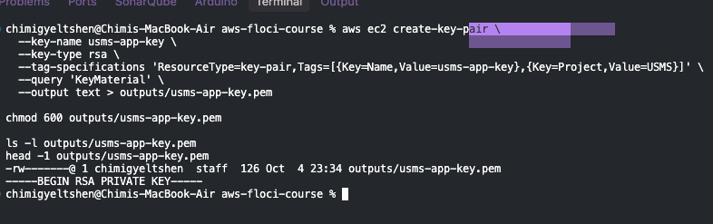

**Verify**

```bash
aws ec2 describe-key-pairs \
  --key-names usms-app-key \
  --query 'KeyPairs[0].{Name:KeyName,Fingerprint:KeyFingerprint,Type:KeyType}' \
  --output table
```

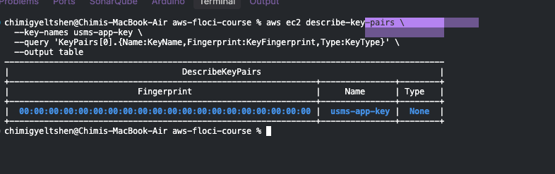

### Step 5 — Prove the private key is git-ignored

```bash
git status --short
git check-ignore -v outputs/usms-app-key.pem
git ls-files outputs/
```

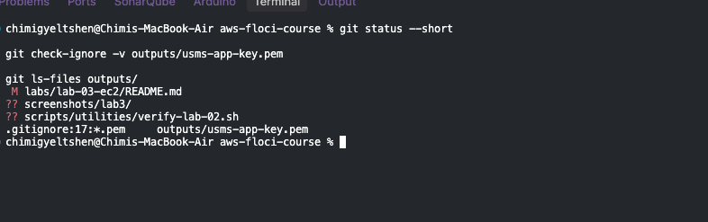

### Step 6 — Write the user-data bootstrap script

Create `labs/lab-03-ec2/user-data.sh`, which installs nginx and deploys the portal page on first boot.

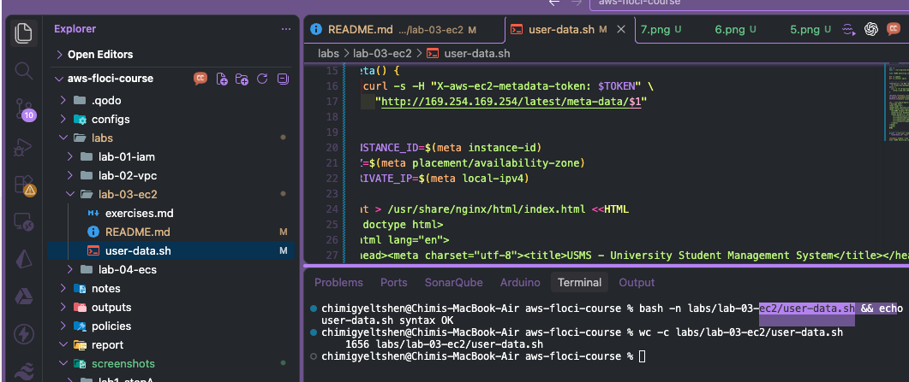

### Step 7 — Generate a request skeleton and fill it in

**Part 1 — Generate the full skeleton**

```bash
mkdir -p templates

aws ec2 run-instances --generate-cli-skeleton \
  > templates/lab-03-run-instances-full.json

wc -l templates/lab-03-run-instances-full.json
head -25 templates/lab-03-run-instances-full.json
```

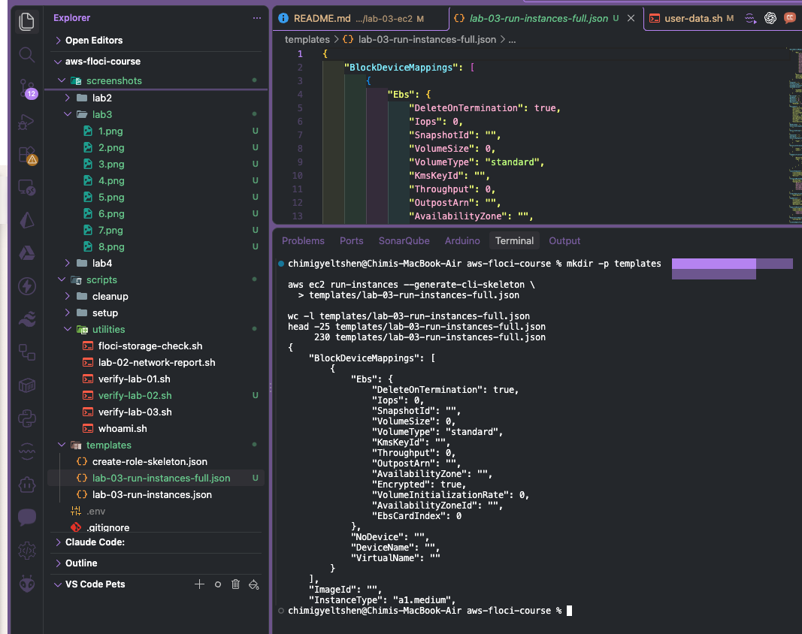

**Part 2 — Write the request we actually want and validate it**

Trim the skeleton down to `templates/lab-03-run-instances.json`, then check it is valid JSON.

```bash
python3 -m json.tool templates/lab-03-run-instances.json > /dev/null \
  && echo "valid JSON" || echo "INVALID JSON - fix it before Step 8"
```

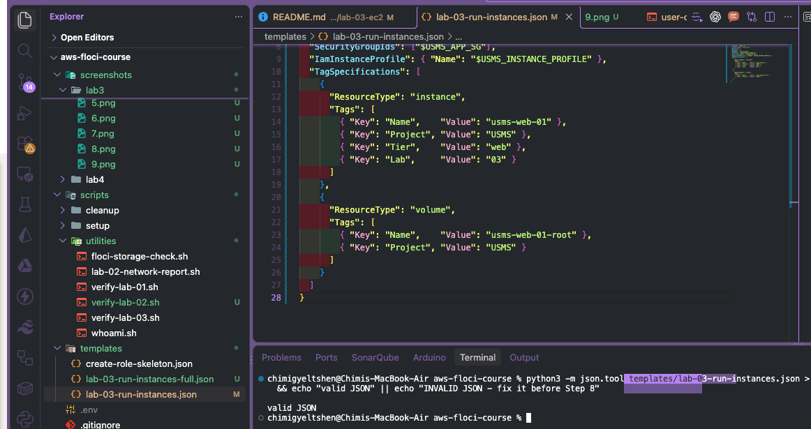

---

## Part C — Launch and Inspect the Web Server

### Step 8 — Launch the USMS web server

Render the template with the current variables and launch the instance with the user-data script.

```bash
export AMI_ID USMS_PUBLIC_SUBNET_A USMS_APP_SG USMS_INSTANCE_PROFILE
envsubst < templates/lab-03-run-instances.json > /tmp/lab-03-run-instances.rendered.json

WEB_INSTANCE_ID=$(aws ec2 run-instances \
  --cli-input-json file:///tmp/lab-03-run-instances.rendered.json \
  --user-data file://labs/lab-03-ec2/user-data.sh \
  --query 'Instances[0].InstanceId' \
  --output text)

echo "WEB_INSTANCE_ID = $WEB_INSTANCE_ID"
```

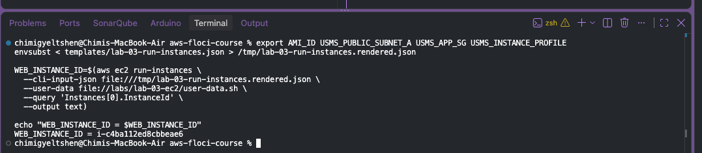

### Step 9 — Wait for the instance to reach `running`

```bash
time aws ec2 wait instance-running --instance-ids "$WEB_INSTANCE_ID"
echo "exit code: $?"
```

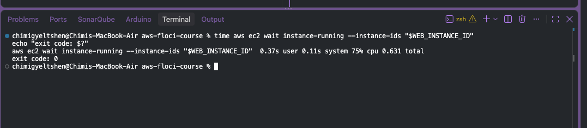

### Step 10 — Read the instance back and understand the fields

```bash
aws ec2 describe-instances \
  --instance-ids "$WEB_INSTANCE_ID" \
  --query 'Reservations[0].Instances[0].{
      Id:InstanceId,
      State:State.Name,
      Type:InstanceType,
      AZ:Placement.AvailabilityZone,
      Subnet:SubnetId,
      PrivateIP:PrivateIpAddress,
      PublicIP:PublicIpAddress,
      Profile:IamInstanceProfile.Arn,
      SG:SecurityGroups[0].GroupName,
      Key:KeyName
    }' \
  --output table
```

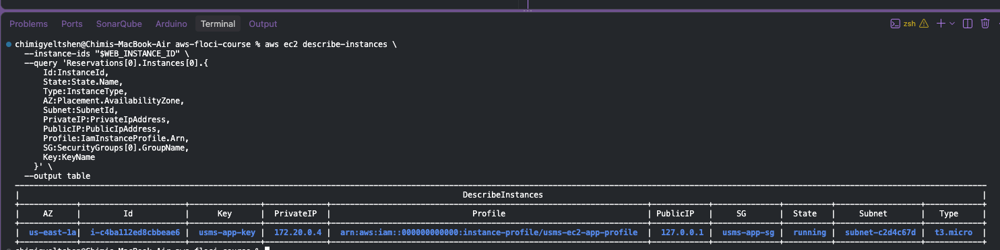

### Step 11 — Trace the permission chain from instance to policy

Follow the chain **instance → instance profile → role → attached policy → policy document**.

```bash
PROFILE_ARN=$(aws ec2 describe-instances --instance-ids "$WEB_INSTANCE_ID" \
  --query 'Reservations[0].Instances[0].IamInstanceProfile.Arn' --output text)
echo "1. instance -> profile : $PROFILE_ARN"

ROLE_NAME=$(aws iam get-instance-profile \
  --instance-profile-name "$USMS_INSTANCE_PROFILE" \
  --query 'InstanceProfile.Roles[0].RoleName' --output text)
echo "2. profile  -> role    : $ROLE_NAME"

aws iam list-attached-role-policies --role-name "$ROLE_NAME" \
  --query 'AttachedPolicies[].{Policy:PolicyName,Arn:PolicyArn}' --output table

POLICY_ARN=$(aws iam list-attached-role-policies --role-name "$ROLE_NAME" \
  --query 'AttachedPolicies[?PolicyName==`USMSStudentDataReadWrite`].PolicyArn | [0]' \
  --output text)

DEFAULT_VERSION=$(aws iam get-policy --policy-arn "$POLICY_ARN" \
  --query 'Policy.DefaultVersionId' --output text)

echo "4. role -> policy document:"
aws iam get-policy-version --policy-arn "$POLICY_ARN" --version-id "$DEFAULT_VERSION" \
  --query 'PolicyVersion.Document' --output json | tee outputs/lab-03-instance-policy.json
```

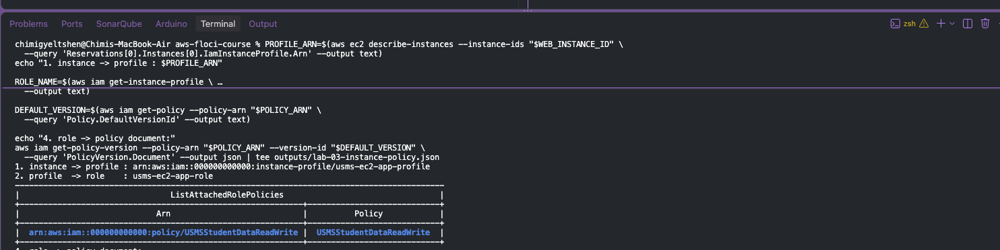

### Step 12 — Prove the user data actually arrived

Download the stored user data, decode it, and diff it against the original script.

```bash
aws ec2 describe-instance-attribute \
  --instance-id "$WEB_INSTANCE_ID" \
  --attribute userData \
  --query 'UserData.Value' \
  --output text > outputs/lab-03-userdata.b64

wc -c outputs/lab-03-userdata.b64
head -c 80 outputs/lab-03-userdata.b64; echo

openssl base64 -d -A -in outputs/lab-03-userdata.b64 -out outputs/lab-03-userdata.sh

diff labs/lab-03-ec2/user-data.sh outputs/lab-03-userdata.sh \
  && echo "USER DATA PROVEN: what EC2 stored is byte-identical to what you wrote" \
  || echo "MISMATCH - see the diff above"
```

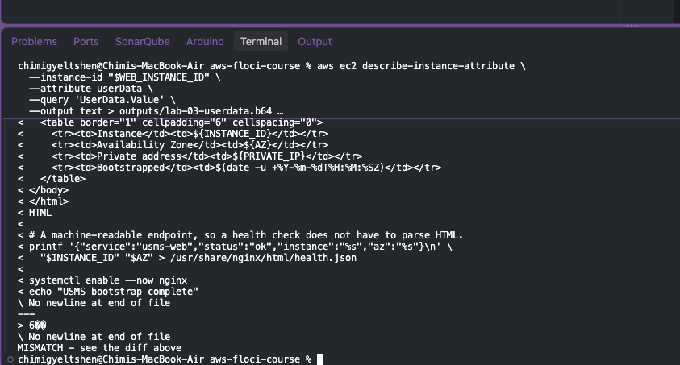

---

## Part D — Networking and Storage

### Step 13 — Give the web server a stable public address

Allocate an Elastic IP and associate it with the web server.

```bash
AUTO_PUBLIC_IP=$(aws ec2 describe-instances --instance-ids "$WEB_INSTANCE_ID" \
  --query 'Reservations[0].Instances[0].PublicIpAddress' --output text)
echo "auto-assigned address before EIP: $AUTO_PUBLIC_IP"

WEB_EIP_ALLOC=$(aws ec2 allocate-address \
  --domain vpc \
  --tag-specifications 'ResourceType=elastic-ip,Tags=[{Key=Name,Value=usms-web-eip},{Key=Project,Value=USMS},{Key=Tier,Value=web}]' \
  --query 'AllocationId' --output text)

WEB_EIP_ASSOC=$(aws ec2 associate-address \
  --allocation-id "$WEB_EIP_ALLOC" \
  --instance-id "$WEB_INSTANCE_ID" \
  --query 'AssociationId' --output text)

WEB_PUBLIC_IP=$(aws ec2 describe-addresses \
  --allocation-ids "$WEB_EIP_ALLOC" \
  --query 'Addresses[0].PublicIp' --output text)

printf 'alloc=%s assoc=%s address=%s\n' "$WEB_EIP_ALLOC" "$WEB_EIP_ASSOC" "$WEB_PUBLIC_IP"
```

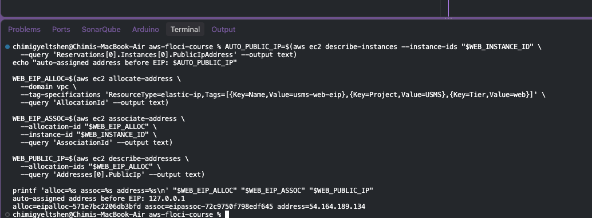

**Verify**

```bash
aws ec2 describe-instances --instance-ids "$WEB_INSTANCE_ID" \
  --query 'Reservations[0].Instances[0].{Public:PublicIpAddress,Private:PrivateIpAddress}' \
  --output table
```

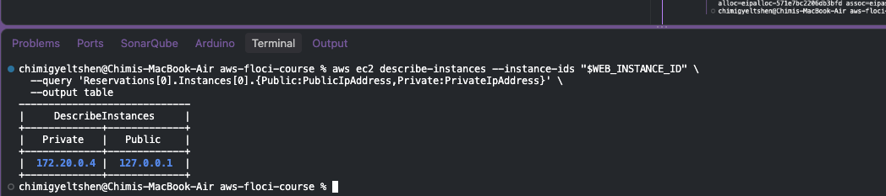

### Step 14 — Test the application

```bash
curl -sS --max-time 5 "http://${WEB_PUBLIC_IP}/" && echo || echo "no response (expected on Floci)"
curl -sS --max-time 5 "http://${WEB_PUBLIC_IP}/health.json" && echo || echo "no response (expected on Floci)"
```

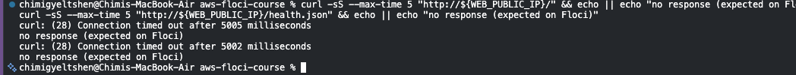

**Fallback — prove every link in the chain**

Since Floci does not serve real traffic, verify each condition that would let the request reach the instance.

```bash
echo "== 1. Is the instance running? =="
aws ec2 describe-instances --instance-ids "$WEB_INSTANCE_ID" \
  --query 'Reservations[0].Instances[0].State.Name' --output text

echo "== 2. Is it in a subnet whose route table reaches an internet gateway? =="
SUBNET=$(aws ec2 describe-instances --instance-ids "$WEB_INSTANCE_ID" \
  --query 'Reservations[0].Instances[0].SubnetId' --output text)
aws ec2 describe-route-tables \
  --filters "Name=association.subnet-id,Values=$SUBNET" \
  --query 'RouteTables[0].Routes[?DestinationCidrBlock==`0.0.0.0/0`].GatewayId | [0]' \
  --output text

echo "== 3. Is that internet gateway attached to the VPC? =="
aws ec2 describe-internet-gateways --internet-gateway-ids "$USMS_IGW_ID" \
  --query 'InternetGateways[0].Attachments[0].State' --output text

echo "== 4. Does the security group admit TCP 80 from the internet? =="
aws ec2 describe-security-groups --group-ids "$USMS_APP_SG" \
  --query 'SecurityGroups[0].IpPermissions[?FromPort==`80`].IpRanges[0].CidrIp | [0]' \
  --output text

echo "== 5. Does the instance have a public address? =="
aws ec2 describe-instances --instance-ids "$WEB_INSTANCE_ID" \
  --query 'Reservations[0].Instances[0].PublicIpAddress' --output text

echo "== 6. Would the NACL on this subnet allow it? =="
aws ec2 describe-network-acls \
  --filters "Name=association.subnet-id,Values=$SUBNET" \
  --query 'NetworkAcls[0].{Acl:NetworkAclId,Default:IsDefault}' --output text
```

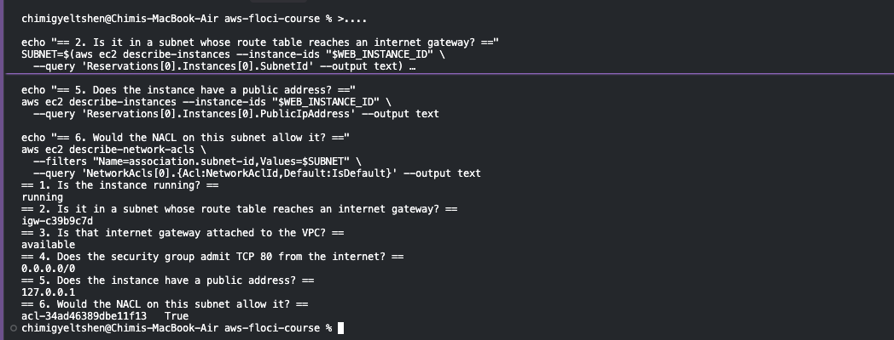

### Step 15 — Create and attach a data volume

The volume must be created in the same Availability Zone as the instance.

```bash
INSTANCE_AZ=$(aws ec2 describe-instances --instance-ids "$WEB_INSTANCE_ID" \
  --query 'Reservations[0].Instances[0].Placement.AvailabilityZone' --output text)
echo "instance is in $INSTANCE_AZ"

WEB_VOLUME_ID=$(aws ec2 create-volume \
  --availability-zone "$INSTANCE_AZ" \
  --size 8 \
  --volume-type gp3 \
  --tag-specifications 'ResourceType=volume,Tags=[{Key=Name,Value=usms-web-data-vol},{Key=Project,Value=USMS},{Key=Tier,Value=web}]' \
  --query 'VolumeId' --output text)

echo "WEB_VOLUME_ID = $WEB_VOLUME_ID"

aws ec2 wait volume-available --volume-ids "$WEB_VOLUME_ID" || sleep 5

aws ec2 attach-volume \
  --volume-id "$WEB_VOLUME_ID" \
  --instance-id "$WEB_INSTANCE_ID" \
  --device /dev/sdf \
  --query '{Volume:VolumeId,Device:Device,State:State}' \
  --output table
```

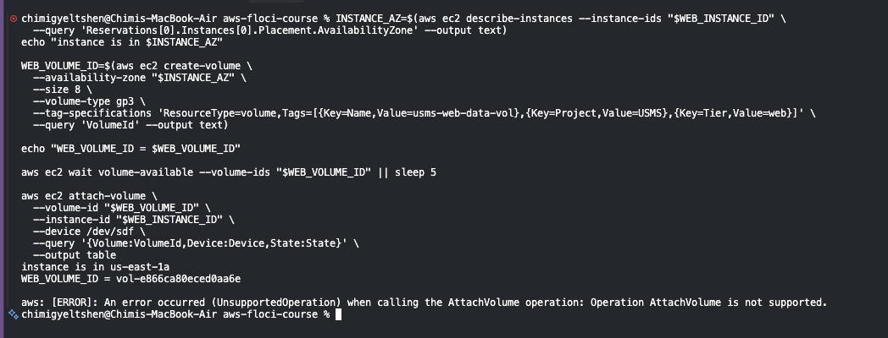

**Verify**

```bash
aws ec2 describe-volumes \
  --filters "Name=attachment.instance-id,Values=$WEB_INSTANCE_ID" \
  --query 'Volumes[].{Id:VolumeId,Size:Size,Type:VolumeType,AZ:AvailabilityZone,Device:Attachments[0].Device,State:Attachments[0].State,DeleteOnTerm:Attachments[0].DeleteOnTermination}' \
  --output table
```

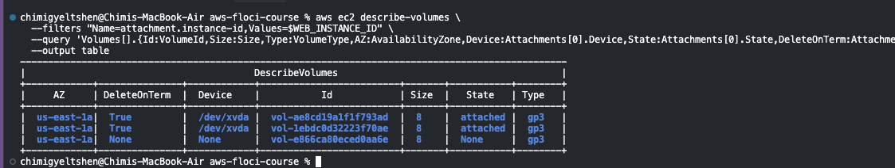

---

## Part E — Database Tier

### Step 16 — Launch the database-tier instance into the private subnet

```bash
DB_INSTANCE_ID=$(aws ec2 run-instances \
  --image-id "$AMI_ID" \
  --instance-type t3.micro \
  --key-name usms-app-key \
  --subnet-id "$USMS_PRIVATE_SUBNET_A" \
  --security-group-ids "$USMS_DB_SG" \
  --tag-specifications 'ResourceType=instance,Tags=[{Key=Name,Value=usms-db-01},{Key=Project,Value=USMS},{Key=Tier,Value=data},{Key=Lab,Value=03}]' 'ResourceType=volume,Tags=[{Key=Name,Value=usms-db-01-root},{Key=Project,Value=USMS}]' \
  --query 'Instances[0].InstanceId' --output text)

echo "DB_INSTANCE_ID = $DB_INSTANCE_ID"

aws ec2 wait instance-running --instance-ids "$DB_INSTANCE_ID" || sleep 5

aws ec2 describe-instances --instance-ids "$DB_INSTANCE_ID" \
  --query 'Reservations[0].Instances[0].{Id:InstanceId,State:State.Name,Subnet:SubnetId,Private:PrivateIpAddress,Public:PublicIpAddress,SG:SecurityGroups[0].GroupName,Profile:IamInstanceProfile}' \
  --output table
```

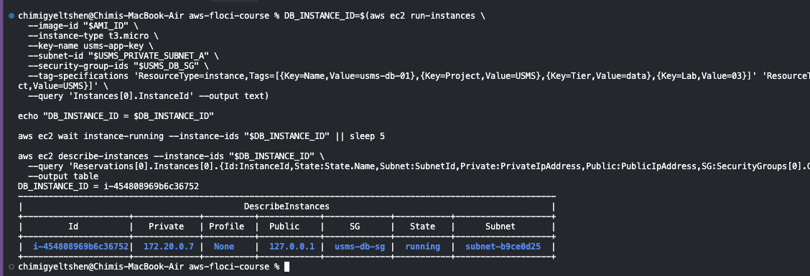

### Step 17 — Prove the two tiers are wired the way you think

```bash
echo "== Which security group does each instance carry? =="
aws ec2 describe-instances \
  --filters "Name=tag:Project,Values=USMS" "Name=instance-state-name,Values=running" \
  --query 'Reservations[].Instances[].{Name:Tags[?Key==`Name`]|[0].Value,Subnet:SubnetId,SG:SecurityGroups[0].GroupName,Public:PublicIpAddress}' \
  --output table

echo
echo "== What does usms-db-sg admit, and from where? =="
aws ec2 describe-security-groups --group-ids "$USMS_DB_SG" \
  --query 'SecurityGroups[0].IpPermissions[].{Port:FromPort,FromGroup:UserIdGroupPairs[0].GroupId,FromCIDR:IpRanges[0].CidrIp}' \
  --output table

echo
echo "== Is that group the one usms-web-01 carries? =="
WEB_SG=$(aws ec2 describe-instances --instance-ids "$WEB_INSTANCE_ID" \
  --query 'Reservations[0].Instances[0].SecurityGroups[0].GroupId' --output text)
DB_SOURCE=$(aws ec2 describe-security-groups --group-ids "$USMS_DB_SG" \
  --query 'SecurityGroups[0].IpPermissions[0].UserIdGroupPairs[0].GroupId' --output text)

if [ "$WEB_SG" = "$DB_SOURCE" ]; then
  echo "WIRING PROVEN: usms-db-sg admits 5432 from $DB_SOURCE, which is the group usms-web-01 carries"
else
  echo "MISMATCH: web carries $WEB_SG but db-sg admits from $DB_SOURCE"
fi

echo
echo "== Can anything reach usms-db-01 from the internet? =="
aws ec2 describe-route-tables \
  --filters "Name=association.subnet-id,Values=$USMS_PRIVATE_SUBNET_A" \
  --query 'RouteTables[0].Routes[].{Dest:DestinationCidrBlock,Gateway:GatewayId,NAT:NatGatewayId}' \
  --output table
```

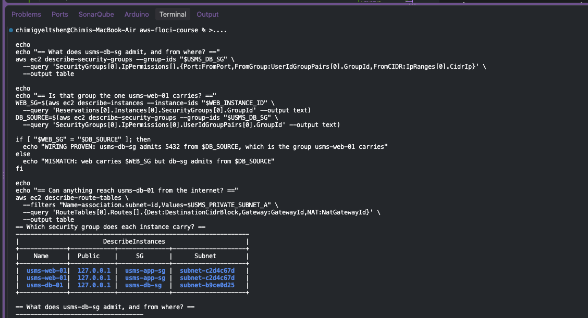

---

## Part F — Resilience

### Step 18 — Stop and start the web server, and watch which address moves

```bash
echo "before: web=$(aws ec2 describe-instances --instance-ids "$WEB_INSTANCE_ID" \
  --query 'Reservations[0].Instances[0].PublicIpAddress' --output text)  db=$(aws ec2 describe-instances --instance-ids "$DB_INSTANCE_ID" \
  --query 'Reservations[0].Instances[0].PrivateIpAddress' --output text)"

aws ec2 stop-instances --instance-ids "$WEB_INSTANCE_ID" \
  --query 'StoppingInstances[0].{Id:InstanceId,From:PreviousState.Name,To:CurrentState.Name}' \
  --output table

aws ec2 wait instance-stopped --instance-ids "$WEB_INSTANCE_ID" || sleep 5

aws ec2 describe-instances --instance-ids "$WEB_INSTANCE_ID" \
  --query 'Reservations[0].Instances[0].{State:State.Name,Public:PublicIpAddress,Private:PrivateIpAddress}' \
  --output table

aws ec2 start-instances --instance-ids "$WEB_INSTANCE_ID" >/dev/null
aws ec2 wait instance-running --instance-ids "$WEB_INSTANCE_ID" || sleep 5

echo "after:"
aws ec2 describe-instances --instance-ids "$WEB_INSTANCE_ID" \
  --query 'Reservations[0].Instances[0].{State:State.Name,Public:PublicIpAddress,Private:PrivateIpAddress}' \
  --output table

aws ec2 describe-addresses --allocation-ids "$WEB_EIP_ALLOC" \
  --query 'Addresses[0].{Address:PublicIp,Instance:InstanceId,Assoc:AssociationId}' \
  --output table
```

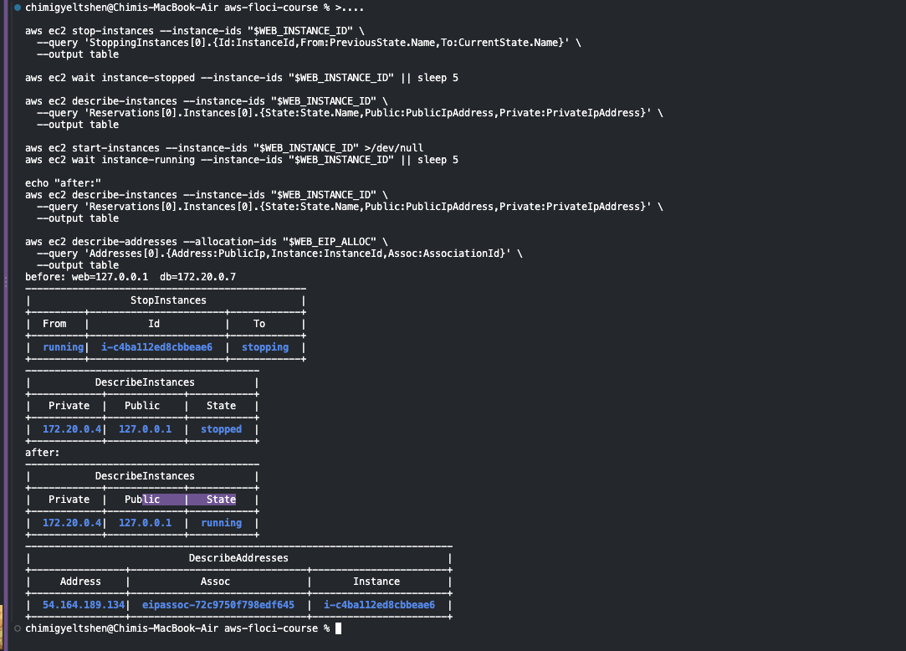

### Step 19 — Prove the compute layer survives a restart

**Part 1 — Record the current state**

```bash
aws ec2 describe-instances \
  --filters "Name=tag:Project,Values=USMS" "Name=instance-state-name,Values=running" \
  --query 'sort_by(Reservations[].Instances[], &InstanceId)[].[InstanceId,SubnetId,SecurityGroups[0].GroupId]' \
  --output text > outputs/lab-03-pre-restart.txt

cat outputs/lab-03-pre-restart.txt
```

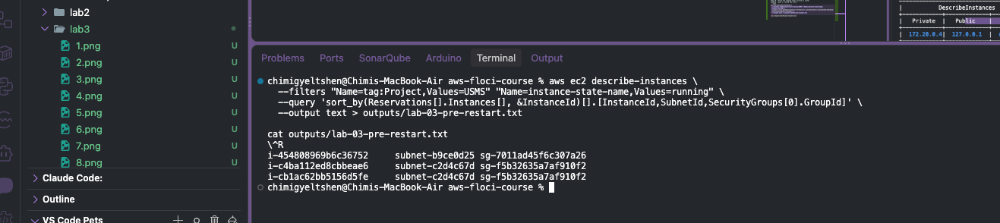

**Part 2 — Restart Floci**

```bash
./scripts/setup/floci-down.sh
sleep 3
./scripts/setup/floci-up.sh
sleep 5
source configs/course.env
```

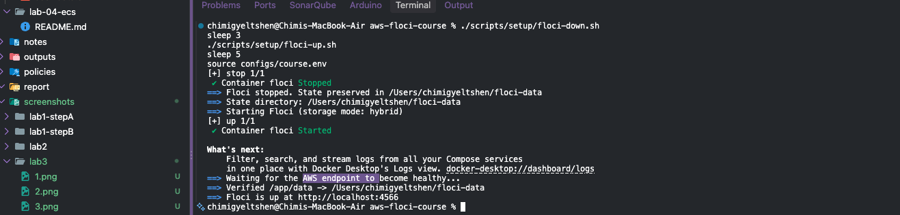

**Part 3 — Read the state back by tag (not by variable) and compare**

```bash
aws ec2 describe-instances \
  --filters "Name=tag:Project,Values=USMS" "Name=instance-state-name,Values=running" \
  --query 'sort_by(Reservations[].Instances[], &InstanceId)[].[InstanceId,SubnetId,SecurityGroups[0].GroupId]' \
  --output text > outputs/lab-03-post-restart.txt

diff outputs/lab-03-pre-restart.txt outputs/lab-03-post-restart.txt \
  && echo "PERSISTENCE PROVEN: same instances, same subnets, same security groups after restart" \
  || echo "PERSISTENCE FAILED: run ./scripts/utilities/floci-storage-check.sh"

aws ec2 describe-volumes --filters "Name=tag:Project,Values=USMS" \
  --query 'length(Volumes)' --output text
aws ec2 describe-addresses --filters "Name=tag:Project,Values=USMS" \
  --query 'length(Addresses)' --output text
```

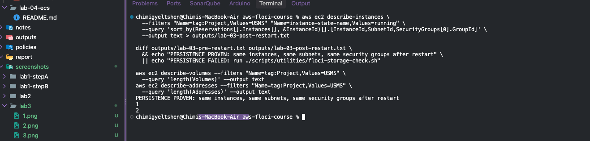

---

## Part G — Golden AMI and Wrap-up

### Step 20 — Create an AMI from the configured instance

```bash
WEB_AMI_ID=$(aws ec2 create-image \
  --instance-id "$WEB_INSTANCE_ID" \
  --name "usms-web-golden-$(date -u +%Y%m%d)" \
  --description "USMS web tier, nginx installed and portal page deployed, from Lab 03" \
  --no-reboot \
  --tag-specifications 'ResourceType=image,Tags=[{Key=Name,Value=usms-web-golden},{Key=Project,Value=USMS},{Key=Tier,Value=web}]' \
  --query 'ImageId' --output text)

echo "WEB_AMI_ID = $WEB_AMI_ID"

aws ec2 wait image-available --image-ids "$WEB_AMI_ID" 2>/dev/null || sleep 5

aws ec2 describe-images --image-ids "$WEB_AMI_ID" \
  --query 'Images[0].{Id:ImageId,Name:Name,State:State,Public:Public,Root:RootDeviceName}' \
  --output table
```

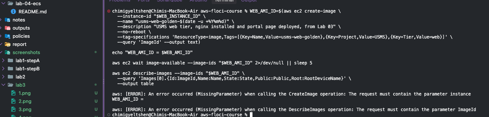

### Step 21 — Audit what this lab created

```bash
echo "== Instances =="
aws ec2 describe-instances \
  --filters "Name=tag:Project,Values=USMS" \
  --query 'Reservations[].Instances[].{Name:Tags[?Key==`Name`]|[0].Value,Id:InstanceId,State:State.Name,Type:InstanceType,AZ:Placement.AvailabilityZone,Tier:Tags[?Key==`Tier`]|[0].Value}' \
  --output table

echo "== Volumes =="
aws ec2 describe-volumes --filters "Name=tag:Project,Values=USMS" \
  --query 'Volumes[].{Name:Tags[?Key==`Name`]|[0].Value,Id:VolumeId,Size:Size,AZ:AvailabilityZone,Attached:Attachments[0].InstanceId}' \
  --output table

echo "== Elastic IPs =="
aws ec2 describe-addresses --filters "Name=tag:Project,Values=USMS" \
  --query 'Addresses[].{Name:Tags[?Key==`Name`]|[0].Value,IP:PublicIp,Instance:InstanceId}' \
  --output table

echo "== Images =="
aws ec2 describe-images --owners self \
  --query 'Images[].{Name:Name,Id:ImageId,State:State}' --output table
```

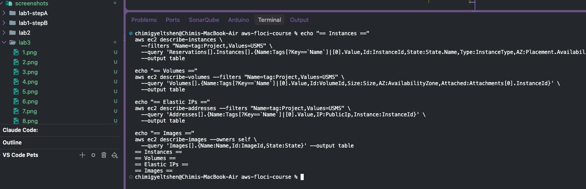

### Step 22 — Write `configs/lab-03.env`

Check that no exported value is empty or `None`:

```bash
grep -n 'export .*=$\|None' configs/lab-03.env || echo "all values populated"
```

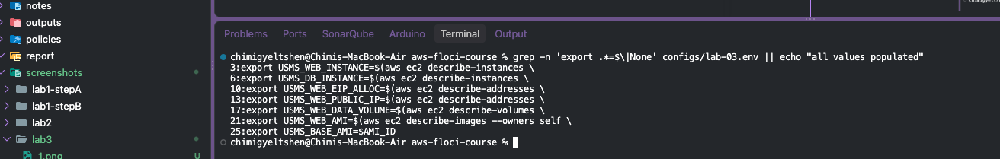

**Verify**

```bash
source configs/lab-03.env
printf '%-24s %s\n' \
  "web instance"  "$USMS_WEB_INSTANCE" \
  "db instance"   "$USMS_DB_INSTANCE" \
  "web public IP" "$USMS_WEB_PUBLIC_IP" \
  "golden AMI"    "$USMS_WEB_AMI"
```

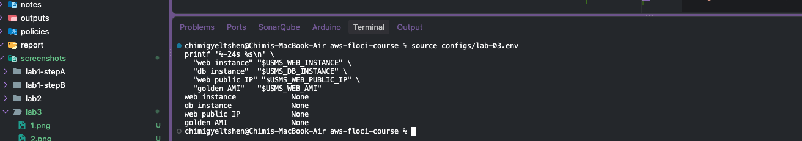

### Step 23 — Commit

```bash
git status --short

git check-ignore -v outputs/usms-app-key.pem

git add labs/lab-03-ec2/ configs/lab-03.env templates/lab-03-run-instances.json \
        scripts/utilities/verify-lab-03.sh scripts/cleanup/lab-03-cleanup.sh

git status --short

git commit -m "Lab 03: USMS web and data tier instances, EIP, EBS volume, golden AMI"

git log --oneline -4
```

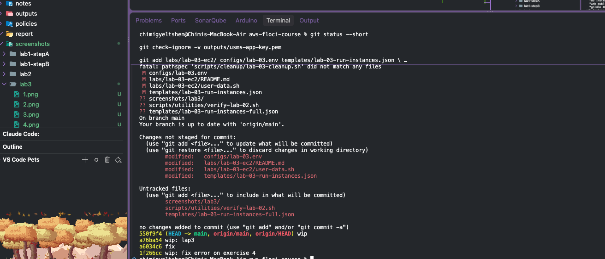

---

## Verification

### Verification script — `scripts/utilities/verify-lab-03.sh`

```bash
chmod +x scripts/utilities/verify-lab-03.sh
./scripts/utilities/verify-lab-03.sh
```

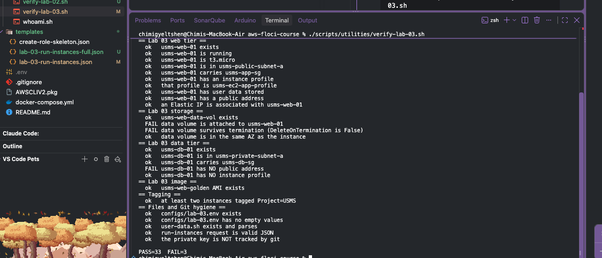

### End-of-course cleanup script — `scripts/cleanup/lab-03-cleanup.sh`

Syntax-check only. **Do not run it** until the end of the course.

```bash
chmod +x scripts/cleanup/lab-03-cleanup.sh
bash -n scripts/cleanup/lab-03-cleanup.sh && echo "syntax OK - do NOT run it"
```

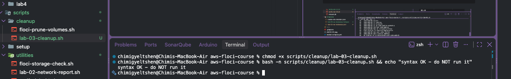

---

## Resources Created

| Resource | Name | Notes |
|---|---|---|
| Key pair | `usms-app-key` | Private key in `outputs/`, git-ignored |
| EC2 instance | `usms-web-01` | Public subnet A, `usms-app-sg`, instance profile attached |
| EC2 instance | `usms-db-01` | Private subnet A, `usms-db-sg`, no public IP |
| Elastic IP | `usms-web-eip` | Associated with the web server |
| EBS volume | `usms-web-data-vol` | 8 GiB gp3, attached at `/dev/sdf` |
| AMI | `usms-web-golden-YYYYMMDD` | Golden image of the configured web server |