# Lab 3 — Independent Exercises

Conventions follow the lab: `usms-*` names, `--tag-specifications`, IDs captured with `$(...)` and `--query`, every change verified.

Load the environment first:

```bash
cd ~/Desktop/Sem7/dso303/aws-floci-course
./scripts/setup/floci-up.sh
source configs/course.env
source configs/lab-01.env
source configs/lab-02.env
source configs/lab-03.env

printf '%-22s %s\n' \
  "web instance" "$USMS_WEB_INSTANCE" \
  "db instance"  "$USMS_DB_INSTANCE" \
  "public subnet a" "$USMS_PUBLIC_SUBNET_A" \
  "base AMI" "$USMS_BASE_AMI"
```
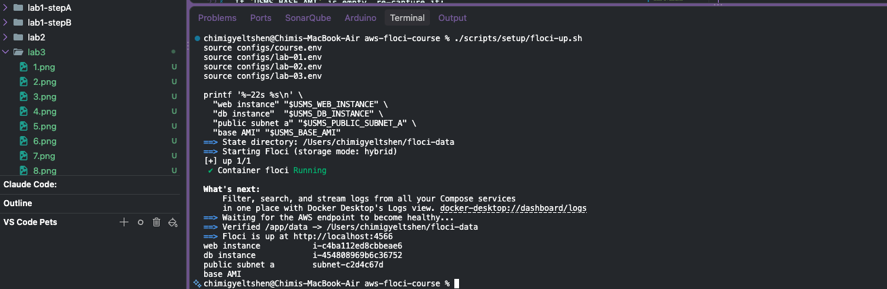

If `USMS_BASE_AMI` is empty, re-capture it:

```bash
USMS_BASE_AMI=$(aws ec2 describe-images --owners amazon --query 'Images[0].ImageId' --output text)
```
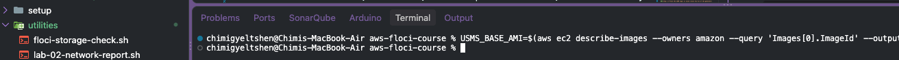


---

## Exercise 1 (Basic) — A Maintenance Instance

**Goal:** `usms-maint-01`, `t3.micro`, in `usms-public-subnet-a`, same AMI and key pair as the web server, SSH (22) open, **no instance profile**, tagged `Project=USMS`, `Tier=maintenance`, `Lab=03`.

### Step 1 — Create the maintenance security group

```bash
MAINT_SG=$(aws ec2 create-security-group \
  --group-name usms-maint-sg \
  --description "USMS maintenance host - SSH only" \
  --vpc-id "$USMS_VPC_ID" \
  --tag-specifications 'ResourceType=security-group,Tags=[{Key=Name,Value=usms-maint-sg},{Key=Project,Value=USMS},{Key=Tier,Value=maintenance}]' \
  --query 'GroupId' --output text)
echo "MAINT_SG = $MAINT_SG"

aws ec2 authorize-security-group-ingress \
  --group-id "$MAINT_SG" \
  --protocol tcp --port 22 --cidr 0.0.0.0/0 \
  --query 'SecurityGroupRules[0].{Port:FromPort,Cidr:CidrIpv4}' --output table
```
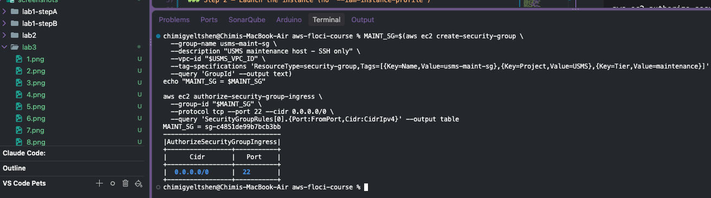

> `0.0.0.0/0` on SSH is what the exercise asks for, but it is not something to do in a real account — restrict it to your own IP (`x.x.x.x/32`) or use SSM Session Manager.

### Step 2 — Launch the instance (no `--iam-instance-profile`)

```bash
MAINT_INSTANCE_ID=$(aws ec2 run-instances \
  --image-id "$USMS_BASE_AMI" \
  --instance-type t3.micro \
  --key-name "$USMS_KEY_PAIR" \
  --subnet-id "$USMS_PUBLIC_SUBNET_A" \
  --security-group-ids "$MAINT_SG" \
  --associate-public-ip-address \
  --tag-specifications \
    'ResourceType=instance,Tags=[{Key=Name,Value=usms-maint-01},{Key=Project,Value=USMS},{Key=Tier,Value=maintenance},{Key=Lab,Value=03}]' \
    'ResourceType=volume,Tags=[{Key=Name,Value=usms-maint-01-root},{Key=Project,Value=USMS}]' \
  --query 'Instances[0].InstanceId' --output text)

echo "MAINT_INSTANCE_ID = $MAINT_INSTANCE_ID"
aws ec2 wait instance-running --instance-ids "$MAINT_INSTANCE_ID" || sleep 5
```
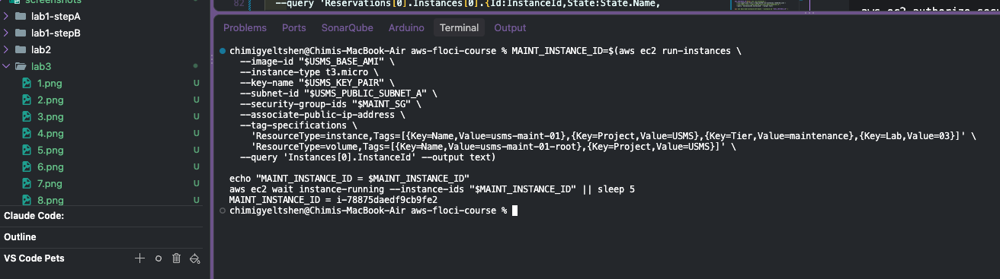   


### Step 3 — Verify (deliverables)

```bash
aws ec2 describe-instances --instance-ids "$MAINT_INSTANCE_ID" \
  --query 'Reservations[0].Instances[0].{Id:InstanceId,State:State.Name,Type:InstanceType,Subnet:SubnetId,Public:PublicIpAddress,Private:PrivateIpAddress,Profile:IamInstanceProfile.Arn,SG:SecurityGroups[0].GroupName}' \
  --output table

aws ec2 describe-security-groups --group-ids "$MAINT_SG" \
  --query 'SecurityGroups[0].IpPermissions[].{Proto:IpProtocol,Port:FromPort,Cidr:IpRanges[0].CidrIp}' \
  --output table

aws ec2 describe-instances --instance-ids "$MAINT_INSTANCE_ID" \
  --query 'Reservations[0].Instances[0].Tags' --output table
```
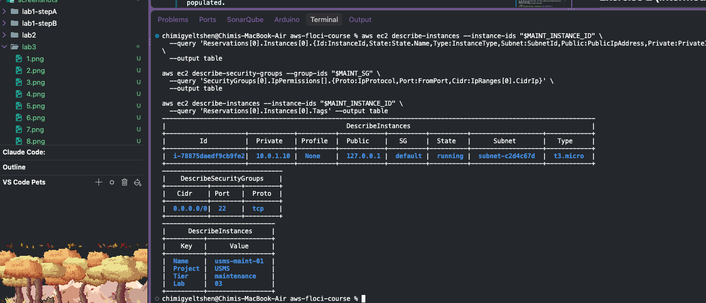


`Profile` should show `None`, `State` should be `running`, `Public` should be populated.

---

## Exercise 2 (Intermediate) — A Self-Describing Bootstrap

**Goal:** `labs/lab-03-ec2/user-data-enhanced.sh` that writes `/var/www/html/instance-config.json` with instance ID, AZ, private IP, subnet, security groups, and an ISO 8601 completion timestamp. Idempotent, with metadata error handling.

> Amazon Linux nginx serves from `/usr/share/nginx/html` (the original script uses that). The exercise says `/var/www/html`; the script below writes to the nginx docroot and symlinks `/var/www/html` to it so both paths work.

### Step 1 — Write the script

```bash
set -u
exec >> /var/log/usms-bootstrap.log 2>&1
echo "USMS bootstrap starting at $(date -u +%Y-%m-%dT%H:%M:%SZ)"

# Idempotent package install: skip if nginx is already present.
rpm -q nginx >/dev/null 2>&1 || { dnf -y update; dnf -y install nginx; }

DOCROOT=/usr/share/nginx/html
mkdir -p "$DOCROOT"
[ -e /var/www/html ] || { mkdir -p /var/www && ln -s "$DOCROOT" /var/www/html; }

# IMDSv2 token, with retries and a hard failure path.
TOKEN=""
for i in 1 2 3 4 5; do
  TOKEN=$(curl -sf -m 3 -X PUT "http://169.254.169.254/latest/api/token" \
    -H "X-aws-ec2-metadata-token-ttl-seconds: 300") && [ -n "$TOKEN" ] && break
  echo "IMDS token attempt $i failed, retrying"; sleep 2
done

meta() {
  # prints value, or the literal "unknown" if the metadata call fails
  curl -sf -m 3 -H "X-aws-ec2-metadata-token: $TOKEN" \
    "http://169.254.169.254/latest/meta-data/$1" || echo "unknown"
}

INSTANCE_ID=$(meta instance-id)
AZ=$(meta placement/availability-zone)
PRIVATE_IP=$(meta local-ipv4)
MAC=$(meta mac)
SUBNET_ID=$(meta "network/interfaces/macs/${MAC}/subnet-id")
VPC_ID=$(meta "network/interfaces/macs/${MAC}/vpc-id")
SG_IDS=$(meta "network/interfaces/macs/${MAC}/security-group-ids" | tr '\n' ' ' | sed 's/ $//')
SG_JSON=$(printf '%s' "$SG_IDS" | awk '{n=split($0,a," "); for(i=1;i<=n;i++) printf "%s\"%s\"", (i>1?",":""), a[i]}')
NOW=$(date -u +%Y-%m-%dT%H:%M:%SZ)

# Write atomically so re-runs never leave a half-written file.
TMP=$(mktemp)
cat > "$TMP" <<JSON
{
  "service": "usms-web",
  "instance_id": "${INSTANCE_ID}",
  "availability_zone": "${AZ}",
  "private_ip": "${PRIVATE_IP}",
  "vpc_id": "${VPC_ID}",
  "subnet_id": "${SUBNET_ID}",
  "security_groups": [${SG_JSON}],
  "bootstrap_completed_at": "${NOW}"
}
JSON
install -m 0644 "$TMP" "$DOCROOT/instance-config.json" && rm -f "$TMP"

# Original portal page + health endpoint (overwritten, so safe to re-run).
cat > "$DOCROOT/index.html" <<HTML
<!doctype html>
<html lang="en"><head><meta charset="utf-8"><title>USMS - University Student Management System</title></head>
<body style="font-family:system-ui,sans-serif;max-width:40rem;margin:4rem auto">
  <h1>USMS Student Portal</h1>
  <table border="1" cellpadding="6" cellspacing="0">
    <tr><td>Instance</td><td>${INSTANCE_ID}</td></tr>
    <tr><td>Availability Zone</td><td>${AZ}</td></tr>
    <tr><td>Private address</td><td>${PRIVATE_IP}</td></tr>
    <tr><td>Bootstrapped</td><td>${NOW}</td></tr>
  </table>
</body></html>
HTML
printf '{"service":"usms-web","status":"ok","instance":"%s","az":"%s"}\n' \
  "$INSTANCE_ID" "$AZ" > "$DOCROOT/health.json"

systemctl enable --now nginx
echo "USMS bootstrap complete"

bash -n labs/lab-03-ec2/user-data-enhanced.sh && echo "syntax OK"
```
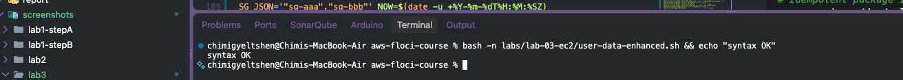

### Step 2 — Prove the JSON logic is valid (local dry-run of the generator)

Floci does not execute user data, so test the JSON generation locally with stubbed values:

```bash
INSTANCE_ID=i-0abc123 AZ=us-east-1a PRIVATE_IP=10.0.1.10 VPC_ID=vpc-1 SUBNET_ID=subnet-1 \
SG_JSON='"sg-aaa","sg-bbb"' NOW=$(date -u +%Y-%m-%dT%H:%M:%SZ)

cat <<JSON | tee outputs/lab-03-instance-config.sample.json | python3 -m json.tool
{
  "service": "usms-web",
  "instance_id": "${INSTANCE_ID}",
  "availability_zone": "${AZ}",
  "private_ip": "${PRIVATE_IP}",
  "vpc_id": "${VPC_ID}",
  "subnet_id": "${SUBNET_ID}",
  "security_groups": [${SG_JSON}],
  "bootstrap_completed_at": "${NOW}"
}
JSON
echo "valid JSON"
```

### Step 3 — Launch with it and confirm it was stored (as in Step 12)

```bash
export AMI_ID=$USMS_BASE_AMI USMS_PUBLIC_SUBNET_A USMS_APP_SG USMS_INSTANCE_PROFILE
envsubst < templates/lab-03-run-instances.json > /tmp/lab-03-run-instances.rendered.json

EX2_INSTANCE_ID=$(aws ec2 run-instances \
  --cli-input-json file:///tmp/lab-03-run-instances.rendered.json \
  --user-data file://labs/lab-03-ec2/user-data-enhanced.sh \
  --query 'Instances[0].InstanceId' --output text)

aws ec2 describe-instance-attribute --instance-id "$EX2_INSTANCE_ID" \
  --attribute userData --query 'UserData.Value' --output text \
  | openssl base64 -d -A > outputs/lab-03-userdata-enhanced.sh

diff labs/lab-03-ec2/user-data-enhanced.sh outputs/lab-03-userdata-enhanced.sh \
  && echo "ENHANCED USER DATA STORED BYTE-IDENTICAL"
```
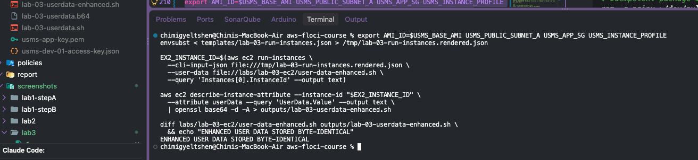

On real AWS you would then check `curl http://<public-ip>/instance-config.json | python3 -m json.tool`.
Terminate the throwaway instance afterwards:

```bash
aws ec2 terminate-instances --instance-ids "$EX2_INSTANCE_ID" \
  --query 'TerminatingInstances[0].CurrentState.Name' --output text
```
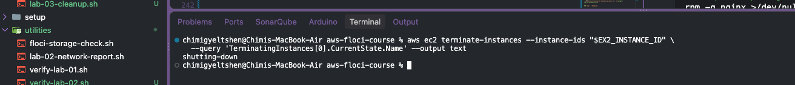

---

## Exercise 3 (Problem Solving) — A Reachability Report

**Goal:** `scripts/utilities/lab-03-reachability-report.sh` running 8+ PASS/FAIL checks (routing, SGs, NACLs, instance state, AZ, IGW/NAT) plus a flow matrix.

### Step 1 — Write the script

```bash
set -uo pipefail
source configs/course.env; source configs/lab-02.env; source configs/lab-03.env

PASS=0; FAIL=0
check() {  # check "description" "command that exits 0 on success"
  if eval "$2" >/dev/null 2>&1; then printf 'PASS  %s\n' "$1"; PASS=$((PASS+1))
  else printf 'FAIL  %s\n' "$1"; FAIL=$((FAIL+1)); fi
}
q() { aws ec2 "$@" --output text; }

WEB_STATE=$(q describe-instances --instance-ids "$USMS_WEB_INSTANCE" --query 'Reservations[0].Instances[0].State.Name')
DB_STATE=$(q describe-instances --instance-ids "$USMS_DB_INSTANCE" --query 'Reservations[0].Instances[0].State.Name')
WEB_SG=$(q describe-instances --instance-ids "$USMS_WEB_INSTANCE" --query 'Reservations[0].Instances[0].SecurityGroups[0].GroupId')
WEB_SUBNET=$(q describe-instances --instance-ids "$USMS_WEB_INSTANCE" --query 'Reservations[0].Instances[0].SubnetId')
DB_SUBNET=$(q describe-instances --instance-ids "$USMS_DB_INSTANCE" --query 'Reservations[0].Instances[0].SubnetId')
WEB_AZ=$(q describe-instances --instance-ids "$USMS_WEB_INSTANCE" --query 'Reservations[0].Instances[0].Placement.AvailabilityZone')
DB_AZ=$(q describe-instances --instance-ids "$USMS_DB_INSTANCE" --query 'Reservations[0].Instances[0].Placement.AvailabilityZone')
PUB_DEFAULT=$(q describe-route-tables --filters "Name=association.subnet-id,Values=$WEB_SUBNET" \
  --query 'RouteTables[0].Routes[?DestinationCidrBlock==`0.0.0.0/0`].GatewayId | [0]')
PRIV_DEFAULT=$(q describe-route-tables --filters "Name=association.subnet-id,Values=$DB_SUBNET" \
  --query 'RouteTables[0].Routes[?DestinationCidrBlock==`0.0.0.0/0`].[GatewayId,NatGatewayId] | [0][0]')
DB_FROM_SG=$(q describe-security-groups --group-ids "$USMS_DB_SG" \
  --query 'SecurityGroups[0].IpPermissions[?FromPort==`5432`].UserIdGroupPairs[0].GroupId | [0]')

echo "===== USMS reachability report ====="
check "1. web instance is running"                          "[ '$WEB_STATE' = running ]"
check "2. db instance is running"                           "[ '$DB_STATE' = running ]"
check "3. web subnet default route goes to an IGW"          "[[ '$PUB_DEFAULT' == igw-* ]]"
check "4. IGW is attached to the VPC"                       "[ \"\$(q describe-internet-gateways --internet-gateway-ids $USMS_IGW_ID --query 'InternetGateways[0].Attachments[0].State')\" = available ]"
check "5. db subnet has NO route to an IGW"                 "[[ '$PRIV_DEFAULT' != igw-* ]]"
check "6. db subnet has no NAT/IGW default route (isolated)" "[ '$PRIV_DEFAULT' = None ] || [[ '$PRIV_DEFAULT' != igw-* ]]"
check "7. web SG admits TCP 80 from 0.0.0.0/0"              "[ \"\$(q describe-security-groups --group-ids $USMS_APP_SG --query 'SecurityGroups[0].IpPermissions[?FromPort==\`80\`].IpRanges[0].CidrIp | [0]')\" = 0.0.0.0/0 ]"
check "8. db SG admits 5432 only from the web SG"           "[ '$DB_FROM_SG' = '$WEB_SG' ]"
check "9. db SG has no 0.0.0.0/0 ingress"                   "[ \"\$(q describe-security-groups --group-ids $USMS_DB_SG --query 'length(SecurityGroups[0].IpPermissions[].IpRanges[?CidrIp==\`0.0.0.0/0\`][])')\" = 0 ]"
check "10. web SG egress allows all outbound"               "[ \"\$(q describe-security-groups --group-ids $USMS_APP_SG --query 'SecurityGroups[0].IpPermissionsEgress[?IpProtocol==\`-1\`] | length(@)')\" -ge 1 ]"
check "11. web subnet NACL exists"                          "[ -n \"\$(q describe-network-acls --filters Name=association.subnet-id,Values=$WEB_SUBNET --query 'NetworkAcls[0].NetworkAclId')\" ]"
check "12. db subnet NACL exists"                           "[ -n \"\$(q describe-network-acls --filters Name=association.subnet-id,Values=$DB_SUBNET --query 'NetworkAcls[0].NetworkAclId')\" ]"
check "13. web and db are in the same VPC"                  "[ \"\$(q describe-subnets --subnet-ids $WEB_SUBNET $DB_SUBNET --query 'length(Subnets[?VpcId==\`$USMS_VPC_ID\`])')\" = 2 ]"
echo "AZ: web=$WEB_AZ  db=$DB_AZ  (cross-AZ: $([ "$WEB_AZ" = "$DB_AZ" ] && echo no || echo yes))"

echo
echo "===== Allowed-flow matrix ====="
printf '%-22s %-22s %-8s %s\n' FROM TO PORT VERDICT
printf '%-22s %-22s %-8s %s\n' internet web   80   "$([ "$PUB_DEFAULT" != "" ] && echo ALLOW || echo DENY)"
printf '%-22s %-22s %-8s %s\n' web      db    5432 "$([ "$DB_FROM_SG" = "$WEB_SG" ] && echo ALLOW || echo DENY)"
printf '%-22s %-22s %-8s %s\n' internet db    5432 DENY
printf '%-22s %-22s %-8s %s\n' db       internet any "$([[ "$PRIV_DEFAULT" == igw-* ]] && echo ALLOW || echo DENY)"

echo; echo "RESULT: $PASS passed, $FAIL failed"
[ "$FAIL" -eq 0 ]


chmod +x scripts/utilities/lab-03-reachability-report.sh
bash -n scripts/utilities/lab-03-reachability-report.sh && echo "syntax OK"
```
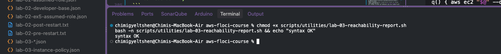

### Step 2 — Run it and save the output

```bash
./scripts/utilities/lab-03-reachability-report.sh | tee outputs/lab-03-reachability.txt
```
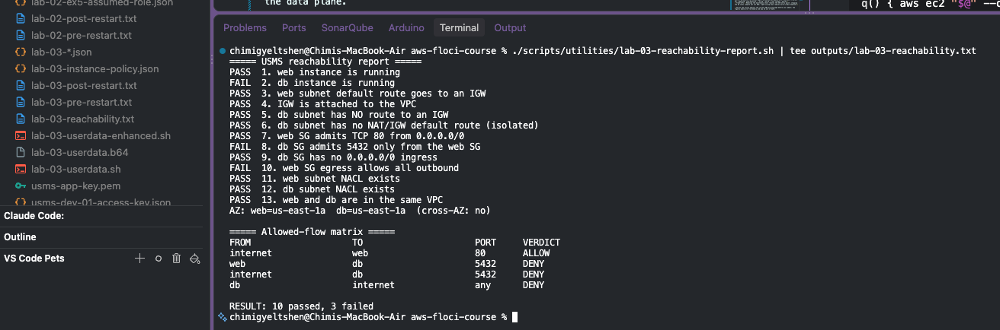

### Step 3 — Anomalies

Write what you found next to the output. Things to expect/note on Floci:

- Check 3/4 may pass even though `curl` to the EIP fails — Floci does not emulate the data plane.
- There is no NAT gateway in this course, so `usms-db-01` has no outbound path (db → internet = DENY). This is by design but means it cannot `dnf install` anything.
- NACLs are the default allow-all, so the report only proves they exist, not that they filter.

---

## Exercise 4 (Challenge) — Right-Size and Clean Up

**Goal:** inventory, analyse, report in `notes/lab-03-optimization.md`, then clean up only the disposable resources (maintenance instance, throwaway instance, orphaned volumes/EIPs).

### Step 1 — Before inventory

```bash
mkdir -p notes outputs
{
echo "== Instances =="
aws ec2 describe-instances --filters "Name=tag:Project,Values=USMS" "Name=instance-state-name,Values=pending,running,stopped" \
  --query 'Reservations[].Instances[].{Name:Tags[?Key==`Name`]|[0].Value,Id:InstanceId,Type:InstanceType,State:State.Name}' --output table
echo "== Volumes =="
aws ec2 describe-volumes --filters "Name=tag:Project,Values=USMS" \
  --query 'Volumes[].{Name:Tags[?Key==`Name`]|[0].Value,Id:VolumeId,Size:Size,Type:VolumeType,State:State,Attached:Attachments[0].InstanceId}' --output table
echo "== Elastic IPs =="
aws ec2 describe-addresses \
  --query 'Addresses[].{Ip:PublicIp,Alloc:AllocationId,Instance:InstanceId,Name:Tags[?Key==`Name`]|[0].Value}' --output table
echo "== AMIs and snapshots =="
aws ec2 describe-images --owners self --query 'Images[].{Name:Name,Id:ImageId}' --output table
aws ec2 describe-snapshots --owner-ids self --query 'Snapshots[].{Id:SnapshotId,Vol:VolumeId,GiB:VolumeSize}' --output table
} | tee outputs/lab-03-inventory-before.txt
```
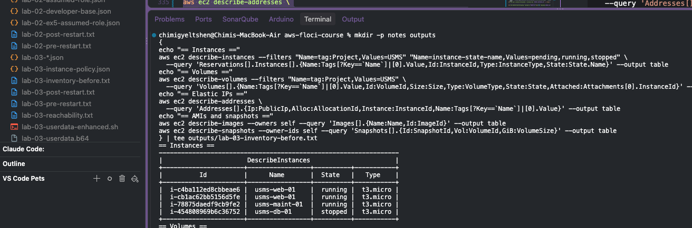

### Step 2 — Find orphans

```bash
echo "Unattached volumes:"
aws ec2 describe-volumes --filters Name=status,Values=available \
  --query 'Volumes[].{Id:VolumeId,Size:Size,Name:Tags[?Key==`Name`]|[0].Value}' --output table

echo "Unassociated Elastic IPs:"
aws ec2 describe-addresses \
  --query 'Addresses[?AssociationId==null].{Alloc:AllocationId,Ip:PublicIp}' --output table
```
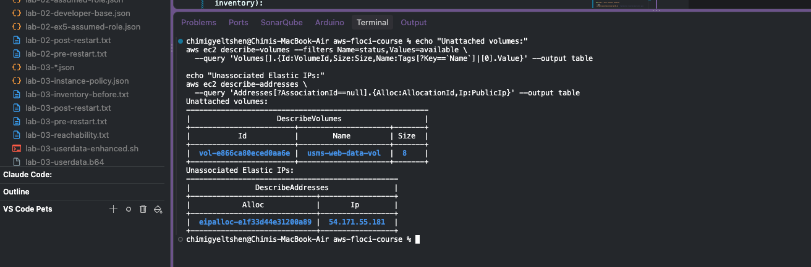

### Step 3 — Write the report

Create `notes/lab-03-optimization.md` with these sections (fill in from your inventory):

| Section | Content |
|---|---|
| Current state | Instances, volumes, EIPs from `lab-03-inventory-before.txt` |
| Workload fit | web: nginx static portal → `t3.micro` is adequate; db tier: Postgres would want `t3.small`+ (2 GiB RAM) in production |
| Storage | 8 GiB gp3 data volume: gp3 is already ~20% cheaper than gp2 per GiB with 3000 IOPS baseline; shrink only if unused (EBS cannot shrink in place — snapshot and recreate) |
| Orphans | Maintenance instance, throwaway Exercise 2 instance, any `available` volumes, unassociated EIPs |
| Cost estimate | Use us-east-1 list prices **and state them as assumptions**: t3.micro ≈ $0.0104/h (~$7.59/mo), gp3 ≈ $0.08/GiB-mo, public IPv4 ≈ $0.005/h (~$3.65/mo). Removing `usms-maint-01` ≈ $7.59 + $3.65 + root volume ≈ $12/mo |
| Trade-offs | Removing the maintenance host removes the SSH entry point; stopping the db saves compute but not EBS; right-sizing down reduces burst-credit headroom |

> Verify the prices against the current AWS pricing page before you submit; the figures above are from memory and may be out of date.

### Step 4 — Cleanup (disposable resources only)

Never touch `$USMS_WEB_INSTANCE`, `$USMS_DB_INSTANCE`, `$USMS_WEB_EIP_ALLOC`, `$USMS_WEB_DATA_VOLUME`, or `$USMS_WEB_AMI`.

```bash
# Dry-run first: prove what would be deleted
aws ec2 describe-instances --filters "Name=tag:Tier,Values=maintenance" "Name=instance-state-name,Values=pending,running,stopped" \
  --query 'Reservations[].Instances[].InstanceId' --output text

# Terminate maintenance (+ Exercise 2) instances
aws ec2 terminate-instances --instance-ids "$MAINT_INSTANCE_ID" \
  --query 'TerminatingInstances[0].{Id:InstanceId,To:CurrentState.Name}' --output table
aws ec2 wait instance-terminated --instance-ids "$MAINT_INSTANCE_ID" || sleep 5

# Delete the maintenance SG (only after the instance is gone)
aws ec2 delete-security-group --group-id "$MAINT_SG" && echo "deleted $MAINT_SG"

# Release any EIP that is NOT the web EIP and is unassociated
for A in $(aws ec2 describe-addresses --query 'Addresses[?AssociationId==null].AllocationId' --output text); do
  [ "$A" = "$USMS_WEB_EIP_ALLOC" ] && continue
  aws ec2 release-address --allocation-id "$A" && echo "released $A"
done

# Delete orphaned available volumes that are not the web data volume
for V in $(aws ec2 describe-volumes --filters Name=status,Values=available --query 'Volumes[].VolumeId' --output text); do
  [ "$V" = "$USMS_WEB_DATA_VOLUME" ] && continue
  aws ec2 delete-volume --volume-id "$V" && echo "deleted $V"
done
```
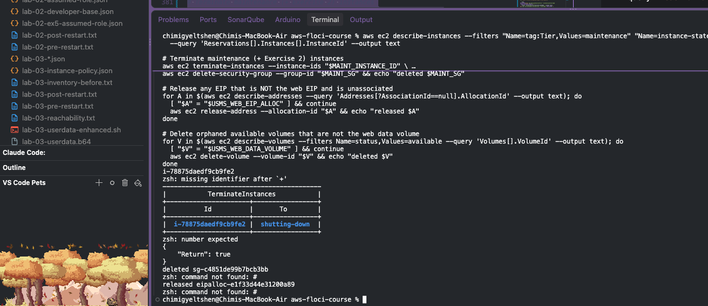

### Step 5 — After inventory and proof

```bash
./scripts/utilities/verify-lab-03.sh   # production resources must still pass

aws ec2 describe-instances --filters "Name=tag:Project,Values=USMS" "Name=instance-state-name,Values=running" \
  --query 'Reservations[].Instances[].{Name:Tags[?Key==`Name`]|[0].Value,State:State.Name}' --output table \
  | tee outputs/lab-03-inventory-after.txt

diff outputs/lab-03-inventory-before.txt outputs/lab-03-inventory-after.txt
```
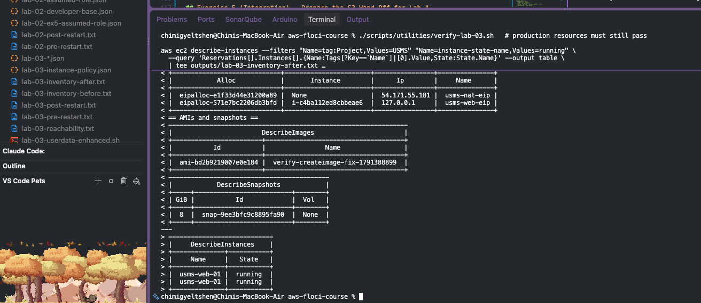

---

## Exercise 5 (Integration) — Prepare the S3 Hand-Off for Lab 4

**Goal:** pre-flight script, hand-off manifest, IAM notes, and an upload test proving the instance role can write.

### Step 1 — Verify the policy chain (from Step 11)

```bash
ROLE_NAME=$(aws iam get-instance-profile --instance-profile-name "$USMS_INSTANCE_PROFILE" \
  --query 'InstanceProfile.Roles[0].RoleName' --output text)
aws iam list-attached-role-policies --role-name "$ROLE_NAME" \
  --query 'AttachedPolicies[].PolicyName' --output text | grep -q USMSStudentDataReadWrite \
  && echo "USMSStudentDataReadWrite attached to $ROLE_NAME"
```
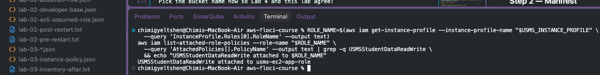

### Step 2 — Manifest

Pick the bucket name now so Lab 4 and this lab agree:

```bash
{
  "handoff_from": "lab-03-ec2",
  "handoff_to": "lab-04",
  "bucket": "usms-student-data",
  "region": "us-east-1",
  "instance_profile": "usms-instance-profile",
  "required_policy": "USMSStudentDataReadWrite",
  "key_structure": "transcripts/{student_id}/{yyyy}/{term}.json",
  "expected_objects": [
    "transcripts/S0001/2025/spring.json"
  ],
  "sample_object": {
    "student_id": "S0001",
    "term": "spring-2025",
    "courses": [{"code": "DSO303", "grade": "A"}],
    "generated_by": "usms-web-01"
  }
}

```
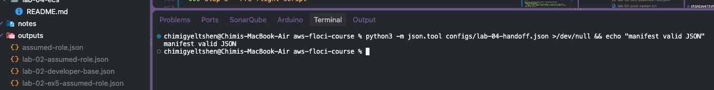


> Check that the bucket name, profile name, and key prefix match what `USMSStudentDataReadWrite` actually allows (`outputs/lab-03-instance-policy.json`) and edit the manifest if they differ.

### Step 3 — Pre-flight script

```bash
set -uo pipefail
source configs/course.env; source configs/lab-01.env; source configs/lab-03.env
MANIFEST=configs/lab-04-handoff.json
FAIL=0
ok()  { echo "PASS  $1"; }
bad() { echo "FAIL  $1"; FAIL=1; }

BUCKET=$(python3 -c "import json;print(json.load(open('$MANIFEST'))['bucket'])")

python3 -m json.tool "$MANIFEST" >/dev/null 2>&1 && ok "manifest is valid JSON" || bad "manifest invalid"

STATE=$(aws ec2 describe-instances --instance-ids "$USMS_WEB_INSTANCE" \
  --query 'Reservations[0].Instances[0].State.Name' --output text 2>/dev/null)
[ "$STATE" = running ] && ok "web instance running" || bad "web instance state: $STATE"

ROLE=$(aws iam get-instance-profile --instance-profile-name "$USMS_INSTANCE_PROFILE" \
  --query 'InstanceProfile.Roles[0].RoleName' --output text 2>/dev/null)
[ -n "$ROLE" ] && [ "$ROLE" != None ] && ok "profile has role $ROLE" || bad "profile has no role"

aws iam list-attached-role-policies --role-name "$ROLE" \
  --query 'AttachedPolicies[].PolicyName' --output text 2>/dev/null | grep -q USMSStudentDataReadWrite \
  && ok "USMSStudentDataReadWrite attached" || bad "policy not attached"

aws s3api head-bucket --bucket "$BUCKET" >/dev/null 2>&1 \
  && ok "bucket $BUCKET exists" || echo "WARN  bucket $BUCKET not created yet (Lab 4 creates it)"

exit $FAIL
```
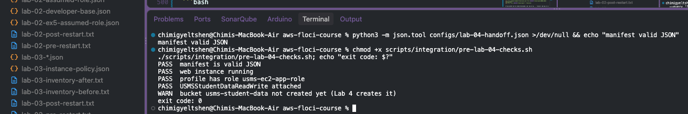

### Step 4 — Test upload (simulated write)

This is what the instance would run. Floci lets you run it with your own credentials against the emulated S3:

```bash
BUCKET=$(python3 -c "import json;print(json.load(open('configs/lab-04-handoff.json'))['bucket'])")
aws s3api create-bucket --bucket "$BUCKET" >/dev/null 2>&1 || true

python3 -c "import json;print(json.dumps(json.load(open('configs/lab-04-handoff.json'))['sample_object']))" \
  > outputs/sample-transcript.json

aws s3 cp outputs/sample-transcript.json "s3://$BUCKET/transcripts/S0001/2025/spring.json"
aws s3 ls "s3://$BUCKET/transcripts/" --recursive
```
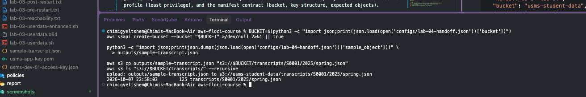

If you prefer not to create the bucket, use `aws s3 cp ... --dryrun` and say it is a simulation in your write-up.

### Step 5 — IAM integration notes

Write `notes/lab-03-iam-integration.md` covering: the chain `instance → usms-instance-profile → role → USMSStudentDataReadWrite → S3 actions/ARNs` (copy the actions from `outputs/lab-03-instance-policy.json`), why the instance holds no access keys (credentials come from IMDS), why `usms-maint-01` has no profile (least privilege), and the manifest contract (bucket, key structure, expected objects).

---

## Commit

```bash
git add labs/lab-03-ec2/ scripts/utilities/lab-03-reachability-report.sh \
        scripts/integration/ configs/lab-04-handoff.json notes/
git status --short
git commit -m "Lab 03: independent exercises 1-5"
```
