# Lab 4 — Deploy the USMS Enrolment Service on ECS Fargate

> **Goal:** Run the USMS enrolment service as an ECS Fargate service inside Lab 2's private subnets, with a dedicated log group, least-privilege IAM roles, and a security group that only accepts traffic from the web tier.

---

## Table of Contents

1. [Resume the environment](#step-1--resume-the-environment)
2. [Confirm Labs 2 and 3 are intact](#step-2--confirm-labs-2-and-3-are-intact)
3. [Probe Floci feature support](#step-3--probe-floci-feature-support)
4. [Create the ECS cluster as the developer role](#step-4--create-the-ecs-cluster-as-the-developer-role)
5. [Create the log group](#step-5--create-the-log-group)
6. [Create the task execution role](#step-6--create-the-task-execution-role)
7. [Create the task role](#step-7--create-the-task-role)
8. [Create the enrolment security group](#step-8--create-the-enrolment-security-group)
9. [Register the task definition](#step-9--register-the-task-definition)
10. [Create the service](#step-10--create-the-service)
11. [Read the service back](#step-11--read-the-service-back)
12. [Write `configs/lab-04.env`](#step-12--write-configslab-04env)
13. [Commit](#step-13--commit)
14. [Verification and cleanup scripts](#verification-and-cleanup-scripts)

---

## Resources Created in This Lab

| Resource | Name |
|---|---|
| ECS cluster | `usms-ecs-cluster` |
| CloudWatch log group | `/usms/ecs/enrolment` (7-day retention) |
| Task execution role | `usms-ecs-exec-role` + policy `USMSECSTaskExecution` |
| Task role | `usms-ecs-task-role` (reuses Lab 1's S3 read/write policy) |
| Security group | `usms-enrolment-sg` (HTTP 80 from `usms-app-sg` only) |
| Task definition | `usms-enrolment` |
| ECS service | `usms-enrolment-svc` (Fargate, desired count 2) |

---

## Step 1 — Resume the Environment

Start Floci, load the environment files from previous labs, and confirm the values this lab depends on.

```bash
cd ~/aws-floci-course
./scripts/setup/floci-up.sh

source configs/course.env
source configs/lab-01.env
source configs/lab-02.env
source configs/lab-03.env

./scripts/utilities/whoami.sh

printf '%-26s %s\n' \
  "private subnet a"    "$USMS_PRIVATE_SUBNET_A" \
  "private subnet b"    "$USMS_PRIVATE_SUBNET_B" \
  "app security group"  "$USMS_APP_SG" \
  "vpc"                 "$USMS_VPC_ID" \
  "nat gateway"         "$USMS_NAT_GW" \
  "web instance"        "$USMS_WEB_INSTANCE" \
  "region"              "$AWS_REGION_COURSE" \
  "account"             "$ACCOUNT_ID"
```

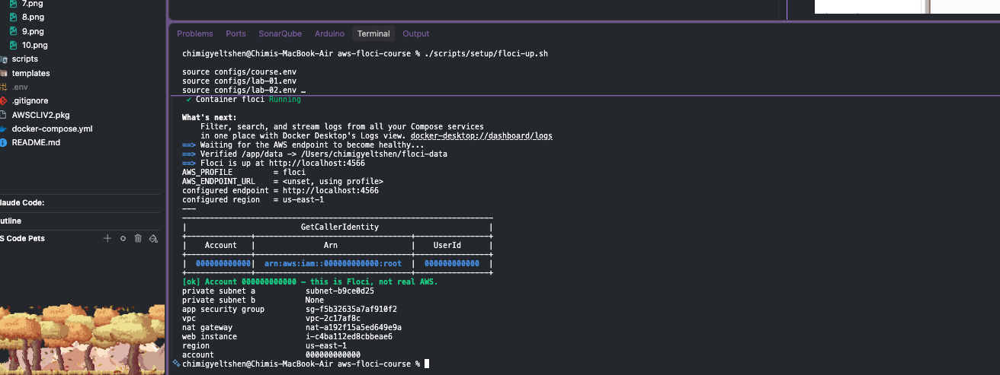

---

## Step 2 — Confirm Labs 2 and 3 Are Intact

```bash
./scripts/utilities/verify-lab-02.sh
./scripts/utilities/verify-lab-03.sh
```

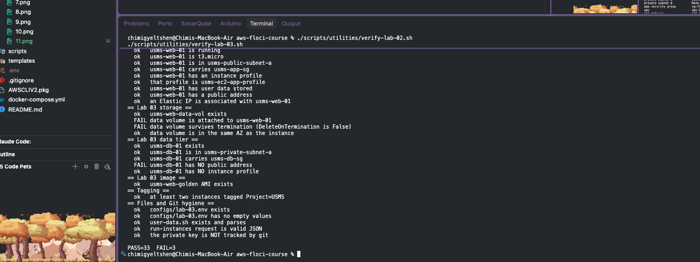

---

## Step 3 — Probe Floci Feature Support

Check which ECS, Application Auto Scaling, CloudWatch, and CloudWatch Logs APIs this Floci build supports before relying on them.

```bash
probe() {
  printf '%-46s ' "$1"
  if eval "$2" >/dev/null 2>&1; then echo "SUPPORTED"; else echo "not available"; fi
}

echo "== ECS =="
probe "ecs list-clusters"                "aws ecs list-clusters"
probe "ecs register-task-definition"     "aws ecs register-task-definition --generate-cli-skeleton"
probe "ecs describe-services"            "aws ecs describe-services --cluster probe --services probe"

echo "== Application Auto Scaling =="
probe "describe-scalable-targets"        "aws application-autoscaling describe-scalable-targets --service-namespace ecs"
probe "describe-scaling-policies"        "aws application-autoscaling describe-scaling-policies --service-namespace ecs"
probe "describe-scheduled-actions"       "aws application-autoscaling describe-scheduled-actions --service-namespace ecs"

echo "== CloudWatch =="
probe "cloudwatch put-metric-data"       "aws cloudwatch put-metric-data --namespace USMS/Probe --metric-name Probe --value 1"
probe "cloudwatch describe-alarms"       "aws cloudwatch describe-alarms"
probe "cloudwatch set-alarm-state"       "aws cloudwatch describe-alarms --max-items 1"

echo "== CloudWatch Logs =="
probe "logs describe-log-groups"         "aws logs describe-log-groups"
```

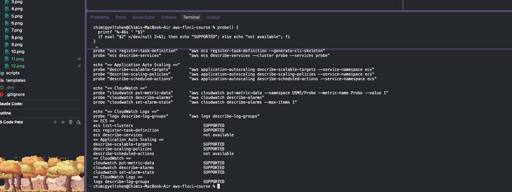

---

## Step 4 — Create the ECS Cluster as the Developer Role

### 4.1 Assume the developer role

```bash
ROLE_ARN="arn:aws:iam::${ACCOUNT_ID}:role/${USMS_ROLE_DEVELOPER}"

aws sts assume-role \
  --role-arn "$ROLE_ARN" \
  --role-session-name "lab04-ecs-build" \
  --profile usms-dev \
  > outputs/lab-04-assumed-role.json

chmod 600 outputs/lab-04-assumed-role.json

export AWS_ACCESS_KEY_ID=$(jq -r '.Credentials.AccessKeyId'         outputs/lab-04-assumed-role.json)
export AWS_SECRET_ACCESS_KEY=$(jq -r '.Credentials.SecretAccessKey' outputs/lab-04-assumed-role.json)
export AWS_SESSION_TOKEN=$(jq -r '.Credentials.SessionToken'        outputs/lab-04-assumed-role.json)

aws sts get-caller-identity --no-cli-pager
```

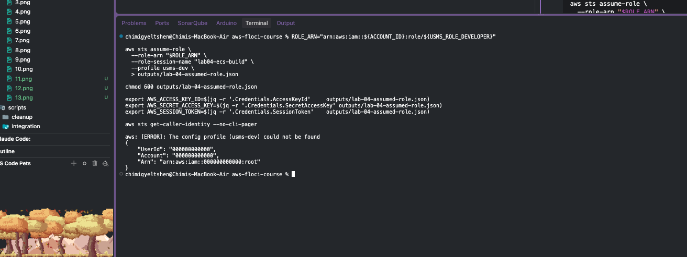

### 4.2 Create the cluster

```bash
CLUSTER_NAME="usms-ecs-cluster"

CLUSTER_ARN=$(aws ecs create-cluster \
  --cluster-name "$CLUSTER_NAME" \
  --settings name=containerInsights,value=enabled \
  --tags key=Name,value=usms-ecs-cluster key=Project,value=USMS key=Tier,value=app \
  --query 'cluster.clusterArn' \
  --output text)

echo "CLUSTER_ARN = $CLUSTER_ARN"
```

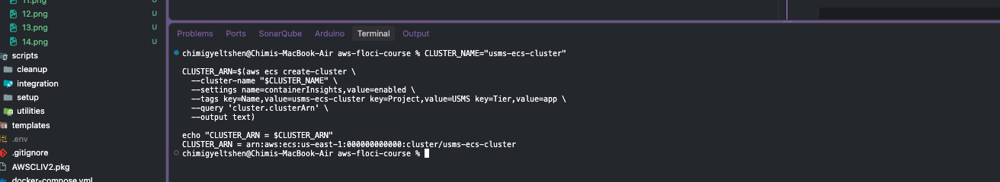

### 4.3 Restore your normal identity

```bash
unset AWS_ACCESS_KEY_ID AWS_SECRET_ACCESS_KEY AWS_SESSION_TOKEN
./scripts/utilities/whoami.sh
```

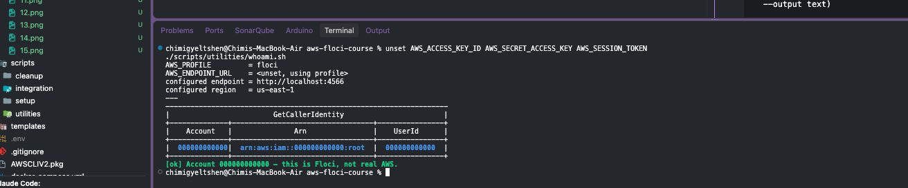

### ✅ Verify

```bash
aws ecs describe-clusters \
  --clusters "$CLUSTER_NAME" \
  --include SETTINGS \
  --query 'clusters[0].{Name:clusterName,Status:status,Services:activeServicesCount,Tasks:runningTasksCount,Settings:settings}' \
  --output json
```

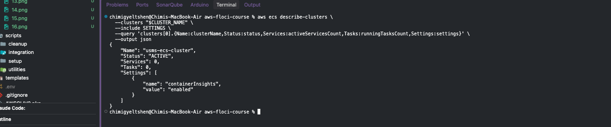

---

## Step 5 — Create the Log Group

Create the log group the tasks will write to and set a 7-day retention policy.

```bash
LOG_GROUP="/usms/ecs/enrolment"

aws logs create-log-group \
  --log-group-name "$LOG_GROUP" \
  --tags Project=USMS,Name=usms-enrolment-logs,Tier=app

aws logs put-retention-policy \
  --log-group-name "$LOG_GROUP" \
  --retention-in-days 7

aws logs describe-log-groups \
  --log-group-name-prefix /usms \
  --query 'logGroups[].{Name:logGroupName,Retention:retentionInDays,Bytes:storedBytes}' \
  --output table
```

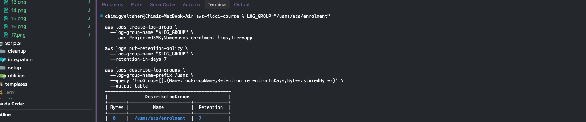

---

## Step 6 — Create the Task Execution Role

### 6.1 Write the trust policy

Save the following as `policies/trust-ecs-tasks.json`:

```json
{
  "Version": "2012-10-17",
  "Statement": [
    {
      "Sid": "AllowEcsTasksToAssumeThisRole",
      "Effect": "Allow",
      "Principal": { "Service": "ecs-tasks.amazonaws.com" },
      "Action": "sts:AssumeRole"
    }
  ]
}
```

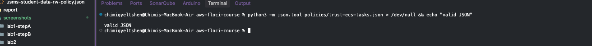

### 6.2 Create the role

```bash
EXEC_ROLE_NAME="usms-ecs-exec-role"

EXEC_ROLE_ARN=$(aws iam create-role \
  --role-name "$EXEC_ROLE_NAME" \
  --assume-role-policy-document file://policies/trust-ecs-tasks.json \
  --description "ECS task execution role: pulls images and writes log streams for USMS tasks" \
  --tags Key=Name,Value=usms-ecs-exec-role Key=Project,Value=USMS Key=Tier,Value=app \
  --query 'Role.Arn' \
  --output text)

echo "EXEC_ROLE_ARN = $EXEC_ROLE_ARN"
```

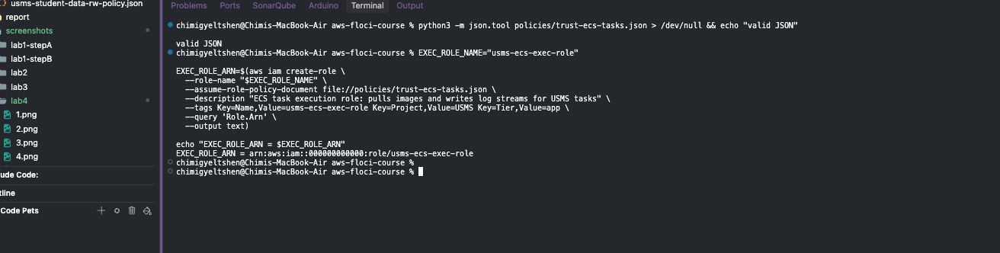

### 6.3 Attach least-privilege permissions

```bash
python3 -m json.tool policies/usms-ecs-task-execution-policy.json > /dev/null && echo "valid JSON"

EXEC_POLICY_ARN=$(aws iam create-policy \
  --policy-name USMSECSTaskExecution \
  --policy-document file://policies/usms-ecs-task-execution-policy.json \
  --description "Least-privilege ECS execution role permissions for the USMS enrolment service" \
  --query 'Policy.Arn' \
  --output text)

aws iam attach-role-policy \
  --role-name "$EXEC_ROLE_NAME" \
  --policy-arn "$EXEC_POLICY_ARN"

echo "EXEC_POLICY_ARN = $EXEC_POLICY_ARN"
```

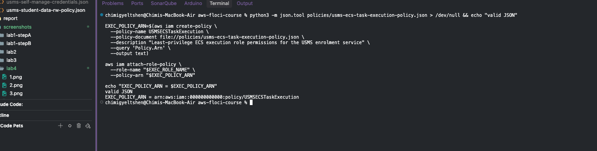

### ✅ Verify

```bash
aws iam get-role --role-name "$EXEC_ROLE_NAME" \
  --query 'Role.AssumeRolePolicyDocument.Statement[0].Principal' --output json

aws iam list-attached-role-policies --role-name "$EXEC_ROLE_NAME" \
  --query 'AttachedPolicies[].PolicyName' --output text
```

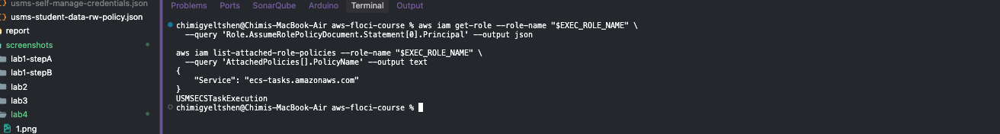

---

## Step 7 — Create the Task Role

Create the container's runtime identity and reuse Lab 1's S3 read/write policy on it.

```bash
TASK_ROLE_NAME="usms-ecs-task-role"

TASK_ROLE_ARN=$(aws iam create-role \
  --role-name "$TASK_ROLE_NAME" \
  --assume-role-policy-document file://policies/trust-ecs-tasks.json \
  --description "USMS enrolment container identity: reads and writes student transcripts in S3" \
  --tags Key=Name,Value=usms-ecs-task-role Key=Project,Value=USMS Key=Tier,Value=app \
  --query 'Role.Arn' \
  --output text)

echo "TASK_ROLE_ARN = $TASK_ROLE_ARN"

aws iam attach-role-policy \
  --role-name "$TASK_ROLE_NAME" \
  --policy-arn "arn:aws:iam::${ACCOUNT_ID}:policy/${USMS_POLICY_S3_RW}"

aws iam list-attached-role-policies --role-name "$TASK_ROLE_NAME" \
  --query 'AttachedPolicies[].{Policy:PolicyName,Arn:PolicyArn}' --output table
```

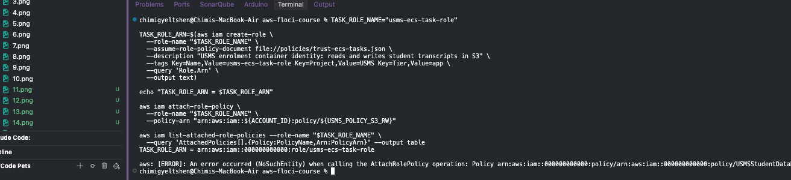

### ✅ Verify — read the policy

> 💡 **Teaching moment:** read the policy document itself, not just its name, to confirm exactly what the container is allowed to do.

```bash
POLICY_ARN="arn:aws:iam::${ACCOUNT_ID}:policy/${USMS_POLICY_S3_RW}"
DEFAULT_VERSION=$(aws iam get-policy --policy-arn "$POLICY_ARN" \
  --query 'Policy.DefaultVersionId' --output text)

aws iam get-policy-version --policy-arn "$POLICY_ARN" --version-id "$DEFAULT_VERSION" \
  --query 'PolicyVersion.Document' --output json | tee outputs/lab-04-task-role-policy.json
```

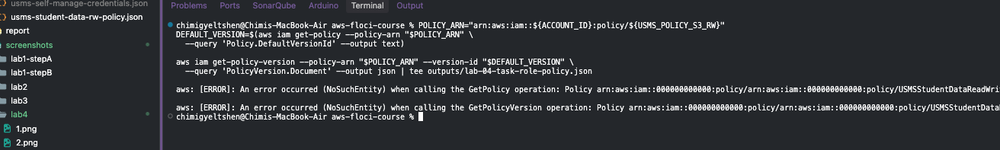

---

## Step 8 — Create the Enrolment Security Group

The enrolment group accepts HTTP only from the web tier's security group, not from a CIDR range.

```bash
ENROLMENT_SG=$(aws ec2 create-security-group \
  --group-name usms-enrolment-sg \
  --description "USMS enrolment service tasks: HTTP from the web tier security group only" \
  --vpc-id "$USMS_VPC_ID" \
  --tag-specifications 'ResourceType=security-group,Tags=[{Key=Name,Value=usms-enrolment-sg},{Key=Project,Value=USMS},{Key=Tier,Value=app}]' \
  --query 'GroupId' \
  --output text)

echo "ENROLMENT_SG = $ENROLMENT_SG"

cat > policies/usms-enrolment-sg-ingress.json << EOF
[
  {
    "IpProtocol": "tcp",
    "FromPort": 80,
    "ToPort": 80,
    "UserIdGroupPairs": [
      {
        "GroupId": "$USMS_APP_SG",
        "Description": "HTTP from the USMS web tier (usms-app-sg) - the only caller of the enrolment API"
      }
    ]
  }
]
EOF

aws ec2 authorize-security-group-ingress \
  --group-id "$ENROLMENT_SG" \
  --ip-permissions file://policies/usms-enrolment-sg-ingress.json \
  --query 'SecurityGroupRules[].SecurityGroupRuleId' \
  --output text
```

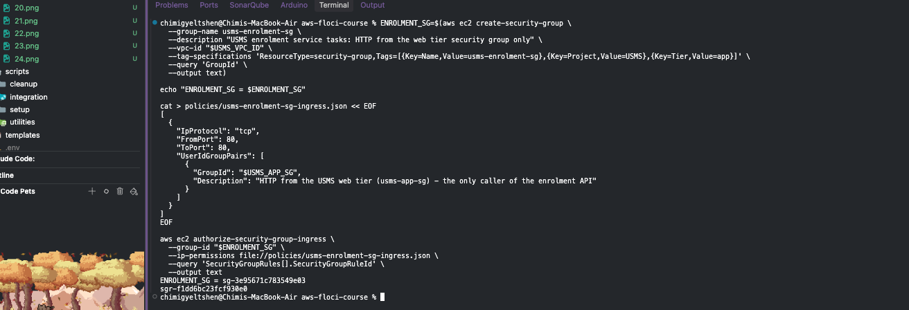

### ✅ Verify

```bash
aws ec2 describe-security-groups --group-ids "$ENROLMENT_SG" \
  --query 'SecurityGroups[0].{Name:GroupName,Inbound:IpPermissions[].{Port:FromPort,FromGroup:UserIdGroupPairs[0].GroupId,FromCIDR:IpRanges[0].CidrIp},OutboundRules:length(IpPermissionsEgress)}' \
  --output json
```

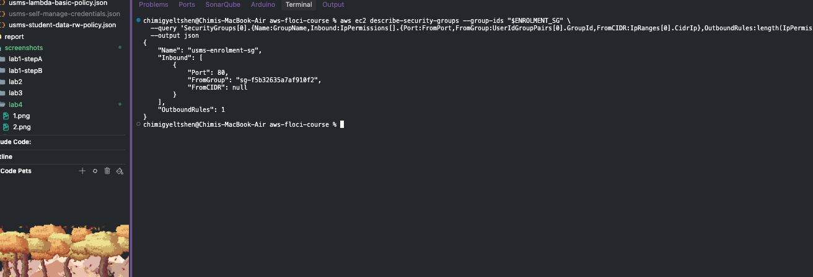

---

## Step 9 — Register the Task Definition

### 9.1 Validate the document

Confirm `templates/lab-04-taskdef.json` is valid JSON and count any `$` characters (unexpanded variables).

```bash
python3 -m json.tool templates/lab-04-taskdef.json > /dev/null \
  && echo "valid JSON" || echo "INVALID JSON - fix it before registering"

grep -c '\$' templates/lab-04-taskdef.json
```

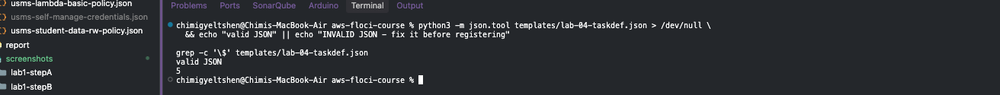

### 9.2 Register it

```bash
TASK_DEF_ARN=$(aws ecs register-task-definition \
  --cli-input-json file://templates/lab-04-taskdef.json \
  --query 'taskDefinition.taskDefinitionArn' \
  --output text)

TASK_DEF_REVISION=$(aws ecs describe-task-definition \
  --task-definition usms-enrolment \
  --query 'taskDefinition.revision' \
  --output text)

echo "TASK_DEF_ARN      = $TASK_DEF_ARN"
echo "TASK_DEF_REVISION = $TASK_DEF_REVISION"
```

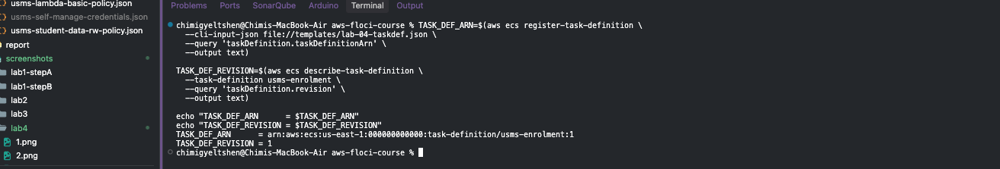

### ✅ Verify

```bash
aws ecs describe-task-definition --task-definition usms-enrolment \
  --query 'taskDefinition.{Family:family,Revision:revision,Status:status,Network:networkMode,CPU:cpu,Memory:memory,Compat:requiresCompatibilities,Exec:executionRoleArn,Task:taskRoleArn,Container:containerDefinitions[0].name,Image:containerDefinitions[0].image,LogGroup:containerDefinitions[0].logConfiguration.options."awslogs-group"}' \
  --output json
```

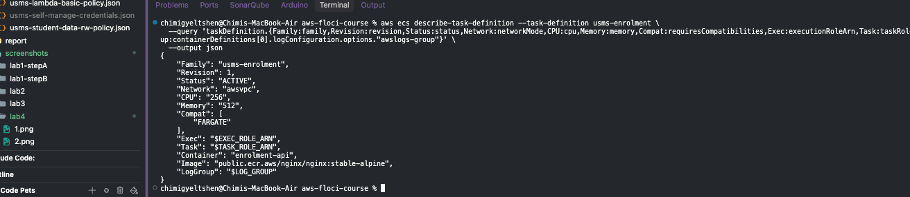

---

## Step 10 — Create the Service

Launch the service on Fargate in Lab 2's private subnets with no public IP.

```bash
SERVICE_NAME="usms-enrolment-svc"

SERVICE_ARN=$(aws ecs create-service \
  --cluster "$CLUSTER_NAME" \
  --service-name "$SERVICE_NAME" \
  --task-definition usms-enrolment \
  --desired-count 2 \
  --launch-type FARGATE \
  --network-configuration "awsvpcConfiguration={subnets=[$USMS_PRIVATE_SUBNET_A,$USMS_PRIVATE_SUBNET_B],securityGroups=[$ENROLMENT_SG],assignPublicIp=DISABLED}" \
  --enable-ecs-managed-tags \
  --propagate-tags SERVICE \
  --tags key=Name,value=usms-enrolment-svc key=Project,value=USMS key=Tier,value=app key=Lab,value=04 \
  --query 'service.serviceArn' \
  --output text)

echo "SERVICE_ARN = $SERVICE_ARN"
```

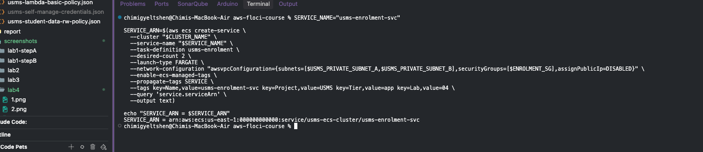

### Wait for the service to stabilise

```bash
aws ecs wait services-stable --cluster "$CLUSTER_NAME" --services "$SERVICE_NAME" \
  && echo "service stable" \
  || echo "waiter did not complete - check the state manually below (expected on some builds)"
```

> ℹ️ On some Floci builds the waiter may not complete. If so, check the service state manually in Step 11.

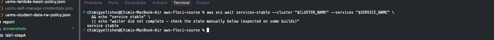

---

## Step 11 — Read the Service Back

Learn the four numbers that describe a service's health: **status**, **desired**, **running**, and **pending**.

```bash
aws ecs describe-services \
  --cluster "$CLUSTER_NAME" \
  --services "$SERVICE_NAME" \
  --query 'services[0].{
      Name:serviceName,
      Status:status,
      Desired:desiredCount,
      Running:runningCount,
      Pending:pendingCount,
      TaskDef:taskDefinition,
      Launch:launchType,
      Subnets:networkConfiguration.awsvpcConfiguration.subnets,
      SG:networkConfiguration.awsvpcConfiguration.securityGroups,
      PublicIP:networkConfiguration.awsvpcConfiguration.assignPublicIp
    }' \
  --output json
```

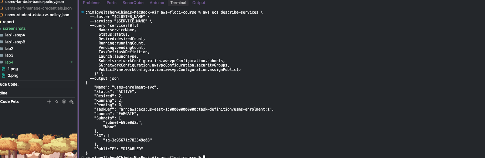

### ✅ Verify

```bash
aws ecs list-tasks --cluster "$CLUSTER_NAME" --service-name "$SERVICE_NAME" \
  --query 'length(taskArns)' --output text

aws ecs describe-services --cluster "$CLUSTER_NAME" --services "$SERVICE_NAME" \
  --query 'services[0].events[0:3].[createdAt,message]' --output text
```

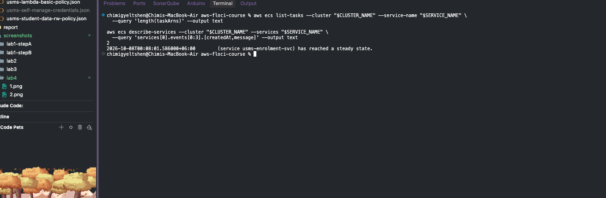

---

## Step 12 — Write `configs/lab-04.env`

After writing the file, check that no value is empty or `None`:

```bash
grep -n 'export .*=$\|None' configs/lab-04.env || echo "all values populated"
```

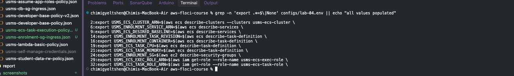

### ✅ Verify

```bash
printf '%-26s %s\n' \
  "cluster"           "$USMS_ECS_CLUSTER" \
  "service"           "$USMS_ENROLMENT_SERVICE" \
  "baseline desired"  "$USMS_ECS_DESIRED_BASELINE" \
  "task revision"     "$USMS_ENROLMENT_TASK_REVISION" \
  "container"         "$USMS_ENROLMENT_CONTAINER" \
  "task cpu / memory" "$USMS_ECS_TASK_CPU / $USMS_ECS_TASK_MEMORY" \
  "enrolment sg"      "$USMS_ENROLMENT_SG" \
  "task role"         "$USMS_ECS_TASK_ROLE_ARN"

grep -c '^export' configs/lab-04.env
```

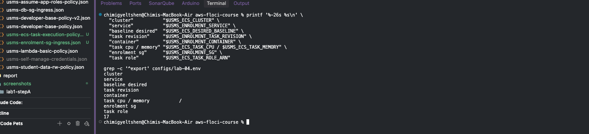

---

## Step 13 — Commit

### 13.1 Check what will be committed

Make sure the assumed-role credentials file is ignored by Git and that nothing in `outputs/` is tracked.

```bash
git status --short

git check-ignore -v outputs/lab-04-assumed-role.json
git ls-files outputs/
```

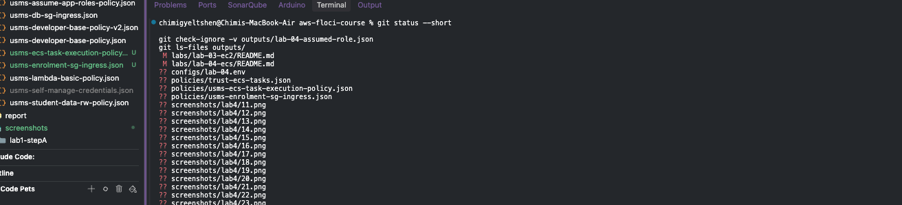

### 13.2 Commit the lab

```bash
git add labs/lab-04-ecs/ \
        configs/lab-04.env \
        policies/trust-ecs-tasks.json \
        policies/usms-ecs-task-execution-policy.json \
        policies/usms-enrolment-sg-ingress.json \
        templates/lab-04-taskdef.json \
        scripts/utilities/verify-lab-04.sh \
        scripts/cleanup/lab-04-cleanup.sh

git status --short

git commit -m "Lab 04: USMS enrolment service deployed on ECS Fargate - cluster, task definition, both IAM roles, security group and service"

git log --oneline -5
```

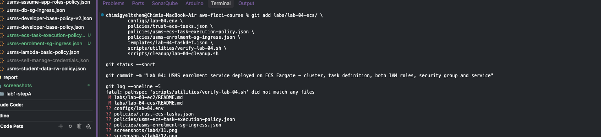

---

## Verification and Cleanup Scripts

### What the verification script checks that a naive one would not

<!-- TODO: add notes on what verify-lab-04.sh checks beyond a basic existence check -->

### Build `scripts/utilities/verify-lab-04.sh`

```bash
chmod +x scripts/utilities/verify-lab-04.sh
bash -n scripts/utilities/verify-lab-04.sh && echo "syntax OK"
./scripts/utilities/verify-lab-04.sh
```

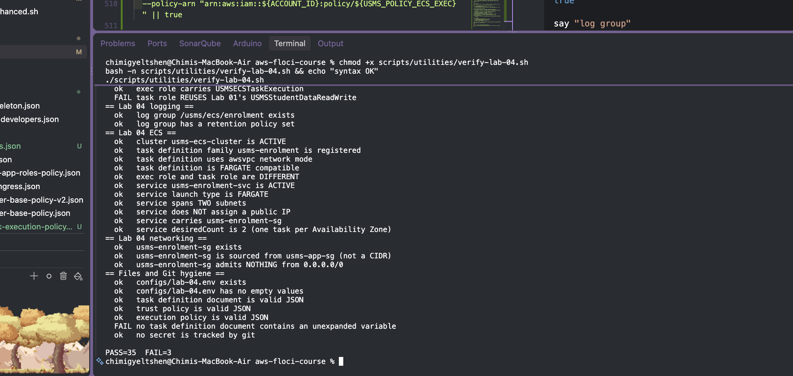

### Build the end-of-course cleanup script

> ⚠️ **Do not run this script now.** It is for the end of the course only. Here you only check its syntax.

```bash
chmod +x scripts/cleanup/lab-04-cleanup.sh
bash -n scripts/cleanup/lab-04-cleanup.sh && echo "syntax OK - do NOT run it"
```

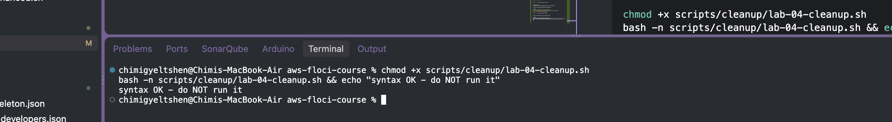